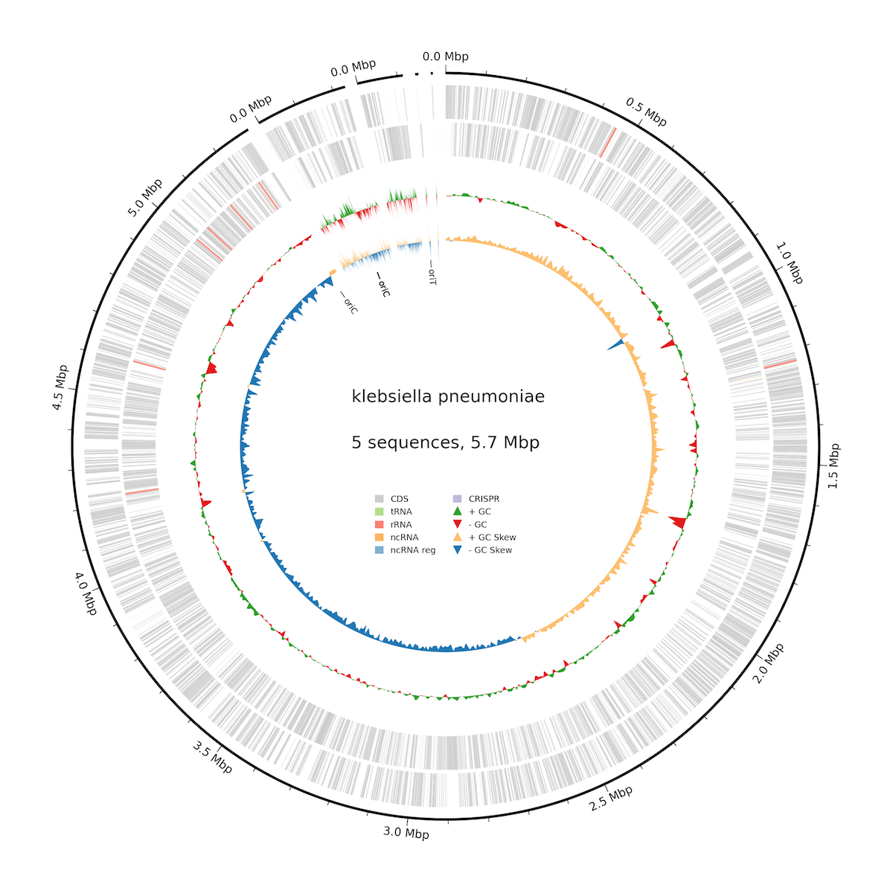

## Genome Annotation and Visualization

One of the last and arguably most important pieces of the puzzle when it comes to bioinformatics is learning how to represent your data.

After assembling genomes (or my favorite metagenome-assembled genomes, which require a little more effort) we want to show off our hard work!


### Functional annotation with bakta

Bakta is a tool that takes in genomic assemblies and through the use of a custom SQLite database can rapidly annotate genes using an approach known as alignment-free sequence identification (AFSI). This method is where bakta is made faster for commonly found CDS and ORFs than the standard homology searching tools, more info on how bakta works can be found in their paper [here](https://www.microbiologyresearch.org/content/journal/mgen/10.1099/mgen.0.000685#tab2).

### So how do we run bakta?

There are two main ways you can run bakta, either through the command line or through their [GUI](https://bakta.computational.bio/). Both will give you a similar output but for submission of genomes to NCBI/ENA it's better to use their __full__ database (~89 Gb uncompressed).

Extra arguments:

* `--complete` if your genome is complete
* `--compliant` to make NCBI happy
* `--meta` if input is metagenomic sample

```
# Make conda env and install bakta
conda create -n bakta -c bioconda bakta

# Run bakta with pre-installed database 
bakta --db /scratch/hpc39/bakta_db/db-light --threads 8 --gram - --species "Klebsiella pneumoniae" --compliant --output ARLG-4673 /scratch/hpc39/ARLG-4673_assembly.fasta
```

__Results!__

This will create many output files for you to which the .gff3 is the annotated genome file that BCM Dan talked about. It also outputs a .png of what the genome looked like




## Genome Visualization with ProkSee

We can also use [ProkSee](https://proksee.ca/) to get a nice visualization through an online GUI.

Download the file [assembled genome link](Akkermansia_muciniphila_ABX.fna)

And the reference [reference link](GCF_000020225.1_ASM2022v1_genomic.fna)

Now go to the website at [proksee.ca](https://proksee.ca/)

Now just follow along with me!
