# Session 1 - Sampling, Sequencing, Quality Assessment and Control, and Assembly
*by Blake Hanson, MS, PhD*

<details>
 <summary>
  
  # Session Summary</summary>
 <p></p>

 * [Introduction to the Unix Shell](#introduction-to-the-unix-shell)
 	* [Unix shell learning resources](#unix-shell-learning-resources)
 	* [Accessing the workshop computational environment](#accessing-the-workshop-computational-environment)
 	* [Enough commands to make you dangerous](#enough-commands-to-make-you-dangerous)
 	* [Zsh as compared to bash](#zsh-as-compared-to-bash)
 	* [Cheat sheets are your friends](#cheat-sheets-are-your-friends)
    
 * [Sampling and study design](#sampling-and-study-design)
 	* [Determine your goals](#determine-your-goals)
 	* [Sampling](#sampling-considerations-for-microbial-genomics)
 		* [Working with reference isolates](#collecting-samples)
 		* [Clinical isolate sampling](#clinical-isolates)
 		* [Environmental isolate sampling](#environmental-isolates)
 		* [Isolates from animal models](#isolates-from-animal-models)
 		* [Culturing/Purifying Isolates](#culturingpurifying-isolates)
 		* [Preparing for Sequencing](#preparing-for-sequencing)
 
 * [Sequencing](#sequencing)
 	* [A brief history](#a-brief-history-of-microbial-sequencing)
 	* [Currently available technologies](#currently-available-technologies)
 		* [Short read sequencing technologies](#short-read-sequencing-technologies)
 			* [Illumina](#illumina-sequencing-next-generation-sequencing---ngs)
 			* [Ion Torrent](#ion-torrent-sequencing)
 			* [Sanger](#sanger-sequencing)
 		* [Long read sequencing technologies](#long-read-sequencing-technologies)
 			* [Oxford Nanopore](#oxford-nanopore-technologies-ont)
 			* [PacBio](#pacbio-sequencing)  
 	* [How do I pick which one to use?](#how-do-i-pick-which-one-to-use)
 
 * [Sequencing quality assessment and control](#sequencing-quality-assessment-and-control)
 	* [Short read QC/QA](#short-read-qcqa)
 		* [FastQC](#fastqc)
 		* [FastQC Alternatives](#fastqc-alternatives)
 			* [Raspberry](#raspberry)
 		* [MultiQC](#multiqc)
 	* [Long read QC/QA](#long-read-qcqa)
 		* [NanoPlot and associated scripts](#nanoplot-and-associated-scripts)
 		* [pycoQC](#pycoqc)
 
 * [Assembly](#assembly)
 	* [Short read assembly](#short-read-assembly)
 		* [Spades](#spades)
 	* [Long read assembly](#long-read-assembly)
 		* [Flye](#flye)

 * [Assembly QC/QA](#assembly-qcqa)
 	* [Quast](#quast)
 	* [Bandage](#bandage)
 	* [Busco and CheckM](#busco-and-checkm)

</details>


#  Introduction to the Unix Shell

## Unix shell learning resources

There are many fantastic resources that can help you start your journey using Unix and bash/zsh or help you take your skills to the next level.  A few are listed here:
 * [Happy Belly Bioinformatics](https://astrobiomike.github.io/unix/unix-intro) (Which will be used in this boot camp)
 * [Software Carpentry - The Unix Shell](https://swcarpentry.github.io/shell-novice/)
 * [Bioinformatics Workbook](https://bioinformaticsworkbook.org/Appendix/Unix/unix-basics-1.html#gsc.tab=0)

As a gentile introduction for the sessions during this workshop, we will loosely follow the [Happy Belly Bioinformatics](https://astrobiomike.github.io/unix/unix-intro) guide with some abbreviated sections to better fit our workshop.

## A few notes before we start

In Unix-based systems, spaces in file names can often lead to confusion and scripting errors, as the space character is a delimiter that separates command line arguments. To avoid these issues, it's recommended to use dashes (-) or underscores (_) instead of spaces in file names.

These characters provide visual separation between words in a file name while ensuring the name is interpreted as a single entity by the shell and other command-line tools. 

For instance, instead of naming a file `My Document.txt`, you would name it `My-Document.txt` (using dashes) or `My_Document.txt` (using underscores). 

This naming convention enhances readability and makes it easier to handle files in scripts or command-line operations. When typing commands, you can simply refer to the file without needing to wrap the name in quotes or escape the spaces. Adopting this practice is especially beneficial in scripting and programming, where consistency and predictability in file names are essential.

It is equally important to adopt this practice for folder names in addition to file names. Spaces in folder names, like in file names, can lead to unexpected behavior or errors in various scripts, software programs, and command-line operations. By using dashes or underscores in folder names, you avoid potential complications that arise from spaces being misinterpreted as argument separators or requiring additional handling such as escape characters or quotes. 

## Accessing the workshop computational environment

To access the workshop computational resources, we will utilize the `ssh` command, which stands for secure shell. 

On MacOS, this can be accessed using Terminal, which can be found two ways: 
 * Opening spotlight and typing "terminal", then selecting the option called "Terminal"

<p align="center">
 
</p>
 
 * Navigating to Applications -> Utilities -> Terminal
 
On Windows, this can be accomplished by opening PowerShell:
 * From the start menu, enter "powershell" in the search bar
 <p align="center">
 
 </p>
 	
Once you have accessed either Terminal or PowerShell, you then need to enter the following command, making sure to swap in your user name in place of "username".

``` 
ssh username@radmicrobes.rice.edu
```

As an example, my username for our workshop is `hpc3` so my login command is:

```
ssh hpc3@radmicrobes.rice.edu
```

Once you hit enter, the connection between your computer and the radmicrobes.rice.edu server will be established and you will be greeted with the interactive command line. This server is called a gateway server, or a jump station, and acts as our portal to the workshop infrastructure.

<p align="center">
 
</p>


Note, that the first time you log in, you may see details on the key fingerprint for the server asking you if you are sure you want to continue connecting. This is normal behavior for the first time you log into a new server using ssh, and is OK to inter "yes" to confirm your login. Once you do that, you can enter in your password and will be greeted with the interactive command line of the server. 

<p align="center">

</p>
	
	  
**Your unique credentials for the server will be distributed via the workshop slack channel.**

Once you have logged into the radmicrobes.rice.edu server, you will need to connect one step further to access our NOTS cluster where we will be running our analyses. To accomplish this, you will enter the following command:

```
ssh nots
```

<p align="center">
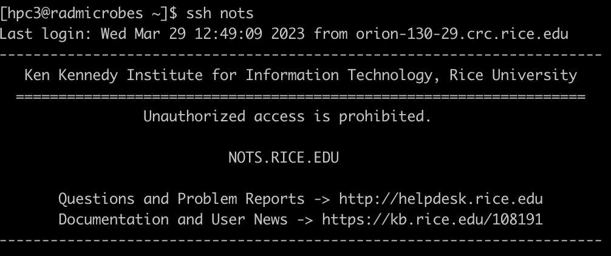
</p>


Congratulations! You now have access to our workshop computational infrastructure. Let's get started. 

## Enough commands to make you dangerous

### Useful commands for our workshop

#### Navigating the Filesystem:

1. `pwd` (Print Working Directory)
   - **Description:** Shows the current directory path.
   - **Example:** 
     ```
     pwd
     ```

2. `ls` (List)
   - **Description:** Lists files and directories in the current directory.
   - **Examples:** 
     ```
     #If you want to list files with associated details
     ls -l
     
     #If you want to list files without associated details (often useful to see more file names in less space)
     ls -s
     ```

3. `cd` (Change Directory)
   - **Description:** Changes the current directory.
   - **Example:** To change to a directory named `Documents`:
     ```
     cd Documents
     ```

4. `mkdir` (Make Directory)
   - **Description:** Creates a new directory.
   - **Example:** To create a new directory named `NewFolder`:
     ```
     mkdir NewFolder
     ```

5. `rmdir` (Remove Directory)
   - **Description:** Deletes an empty directory.
   - **Example:** To remove a directory named `OldFolder`:
     ```
     rmdir OldFolder
     ```

6. `touch`
   - **Description:** Creates an empty file or updates the timestamp of an existing file.
   - **Example:** To create a new file named `example.txt`:
     ```
     touch example.txt
     ```

#### File Manipulation:

1. `cp` (Copy)
   - **Description:** Copies files or directories.
   - **Example:** To copy a file named `file1.txt` to `file2.txt`:
     ```
     #Create a copy in the same directory
     cp file1.txt file2.txt
     #Create a copy in a different directory (assumes different directory exists)
     cp file1.txt new_directory/file1.txt
     OR
     cp file1.txt new_directory/file2.txt
     ```

2. `mv` (Move)
   - **Description:** Moves or renames files or directories.
   - **Example:** To rename `file1.txt` to `file2.txt`:
     ```
     #Move the file within the same directory (works as renaming the file)
     mv file1.txt file2.txt
     #Move the file to a different directory (assumes different directory exists)
     mv file1.txt new_directory/file1.txt
     OR
     mv file1.txt new_directory/file2.txt
     ```

3. `rm` (Remove)
   - **Description:** Removes files or directories.
   - **Example:** To remove a file named `file.txt`:
     ```
     rm file.txt
     ```

4. `cat` (Concatenate)
   - **Description:** Displays file content, combines files.
   - **Example:** To display the contents of `file.txt`:
   - **Note:** If this is a large file, it will print the entire thing to your screen, which may be slow or unwieldy. In that situation, consider the options of `head`, `tail`, `less`, and `grep`.
     ```
     cat file.txt
     ```

5. `head`
   - **Description:** Shows the first few lines of a file.
   - **Example:** To show the first 10 lines of `file.txt`:
     ```
     head file.txt
     #If you want to show a different number of lines, use the -n command
     head -n 50 file.txt
     ```

6. `tail`
   - **Description:** Shows the last few lines of a file.
   - **Example:** To show the last 10 lines of `file.txt`:
     ```
     tail file.txt
     #If you want to show a different number of lines, use the -n command
     tail -n 50 file.txt
     ```

7. `less`
   - **Description:** Allows backward and forward navigation through the content of a file.
   - **Example:** To open `file.txt` in `less`:
     ```
     less file.txt
     ```

8. `grep`
   - **Description:** Searches for patterns within files. This supports a wide range of patterns such as regular expressions, which are beyond the scope of this workshop. 
   - **Example:** To search for the word "example" in `file.txt`:
     ```
     grep "example" file.txt
     ```

9. `find`
   - **Description:** Searches for files and directories within the file system.
   - **Example:** To find files named `file.txt` in the current directory and subdirectories:
   - **Note:** The period in this sentence tells find to search starting in the current directory. 
   	 ```
     find . -name "file.txt"
     ```

10. `wc` (Word Count)
   - **Description:** Counts lines, words, and characters in a file.
   - **Example:** To count the number of lines, words, and characters in `file.txt`:
     ```
     wc file.txt
     ```

#### Scripting and Automation 

1. `nano`, `vi`, `emacs`
   - **Description:** Text editors for writing scripts or editing files.
   - **Example:** To edit a file named `script.sh` using `nano`:
     ```
     nano script.sh
     ```

2. `bash`
   - **Description:** Executes commands read from a script file.
   - **Example:** To execute a script file named `script.sh`:
     ```
     bash script.sh
     ```

3. `ssh` (Secure Shell)
   - **Description:** Connects to a remote machine securely.
   - **Example:** To connect to a remote host at `example.com` with username `user`:
     ```
     ssh user@example.com
     ```

4. `scp` (Secure Copy)
   - **Description:** Securely transfers files between hosts.
   - **Example:** To copy a file `file.txt` to a remote host `example.com`:
     ```
     #To transfer a file from your local computer to a remote host
     scp file.txt user@example.com:/path/to/destination
     #To transfer a file from a remote host to your local computer
     scp user@example.com:/path/to/file /path/to/local/destination
     ```

5. `tar`
   - **Description:** Archives files.
   - **Example:** To create a tar archive of a directory `folder`:
     ```
     tar -cvf archive.tar folder/
     ```

6. `zip`/`unzip`
   - **Description:** Compresses files and extracts compressed files.
   - **Example:** To zip a directory `folder` into a new file called archive.zip:
     ```
     zip -r archive.zip folder/
     ```
   - **Example:** To unzip an archive `archive.zip`:
     ```
     unzip archive.zip
     ```
     
 7. `echo`
   - **Description:** Displays a line of text.
   - **Example:** To display "Hello World":
     ```
     echo "Hello World"
     ```

#### Networking:

1. `ping`
   - **Description:** Checks network connectivity to another host.
   - **Example:** To ping `google.com`:
     ```
     ping google.com
     ```

2. `curl`
   - **Description:** Transfers data from or to a server.
   - **Example:** To download a webpage from `example.com`:
     ```
     curl http://example.com
     ```

3. `wget`
   - **Description:** Non-interactive network downloader.
   - **Example:** To download a file from `example.com/file.txt`:
     ```
     wget http://example.com/file.txt
     ```


### Navigating the Filesystem:

Let's start with how to move around using unix commands. 

While you are only able to use text commands while using terminal and PowerShell, the same fundamental structure you have on your local computer also applies, and files and folders are stored hierarchically. 

As an example, consider that I am working on the desktop of my laptop, and I want to find a file using terminal that I know is in a folder called `test_folder`. To start with, I can confirm I am in the folder I think I am in using the `pwd` command:

<p align="center">
 
</p>

As you can see, `pwd` tells us we are currently in the folder **Desktop/test_folder**. This is reflected in the finder window below where you can see that on my desktop is a folder called `test_folder`.

Next, we want to look and see what is within `test_folder`. For this, we will use the ls command:

<p align="center">
 
</p>

As you can see, I used three different versions of the ls command, each with differing information:
 * **ls** which simply lists the names of the files and directories, but does not differentiate between the different types clearly 
 * **ls -s** which provides a similar output to ls, but provides information on the size in blocks of the files and directories listed
 * **ls -l** which provides the list of the directories and files, but also provides information on the size of the files, indicates which are files (a dash as the first character in the column to the left) vs directories (the character d is the first character in the column to the left), as well as the [read and write privileges](https://www.tutorialspoint.com/unix/unix-file-permission.htm) for the objects listed. 

Due to the additional information shown, I prefer `ls -l`, but each have their utilities (and there are additional sub-commands you can use to further refine the output).

Now that we have seen within the `test_folder`, I have identified another folder nested within that directory called `test_subfolder`.  I did not find what I was looking for within the current directory, so let's use the `cd` command to change directories and look within the `test_subfolder` directory. 

<p align="center">
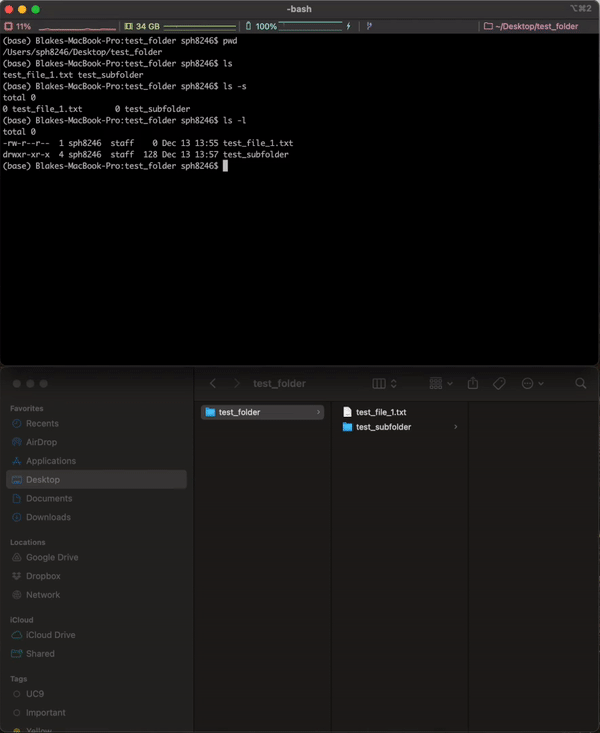 
</p>

Now we see there is a single file within the `test_subfolder` called `test_file_2.txt`. This file is larger than the `test_file_1.txt` that we saw within the previous directory, which we can see using the file size section of the `ls -l` command. That said, while we can see the contents of the file within the finder window when I click on the file name, we cannot see that in our terminal. To see what is within this file, we have a few options:
 * `cat`
 * `head/tail`
 * `nano/vim`
 
 For this example, I am going to use `cat` as my file is not too long, but I encourage you to try the other options after consulting the command descriptions listed above. 
 
<p align="center">
 
</p>
 
After seeing the contents of `test_file_2.txt`, I have identified this is the file I want, but it is not in the location I thought it was in and I want to move the file. To do this, I can use the `mv` command:

<p align="center">
 
</p>

By using the `mv test_file_2.txt ../` command, what I am doing is using a key character `../` to tell the `mv` command that I want to move the file up one directory from where I am, which will move it from `test_subfolder` to `test_folder`. I could have also accomplished this by using the command `mv test_file_2.txt ~/Desktop/test_folder/`, which uses the `~` key character to tell the system to go to my base directory, which on my laptop is my user folder that contains my Desktop, Downloads, and Documents, among other things. 
 
Now that I have moved the file up a directory, I also want to go to that directory. I can do this by using the `cd` command again. 

<p align="center">
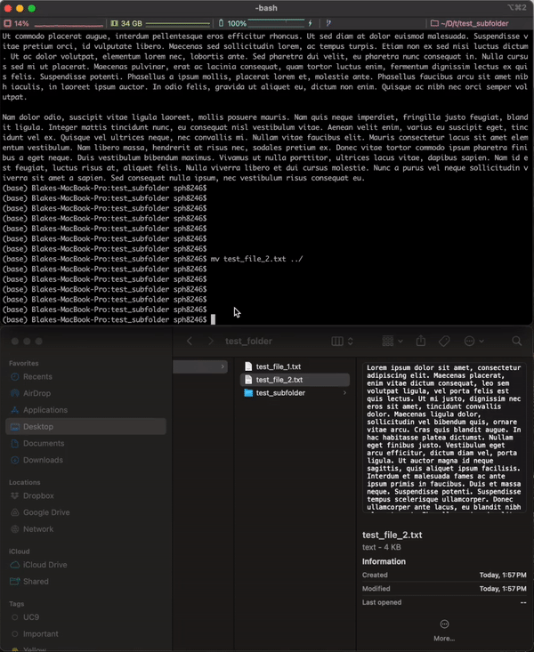 
</p>


Note that I used the `cd ../` command here, which uses the same key character as the last set of commands. I could have also accomplished this via the command `cd ~/Desktop/test_folder`, which would accomplish the same thing using the path names and the `~` key character.

To round out my search for and move of my `test_file_2.txt`, I want to see what is inside of the `test_file_1.txt` file I found first, and if it is empty, delete it using the `rm` command. 

<p align="center">
 
</p>

While I do not show this step here, I may also want to remove the now empty `test_subfolder`that I am no longer using. The safest way to do this is using `rmdir test_subfolder`. I could also use the `rm -r test_subfolder` command, and it would have the same behavior as the `rmdir test_subfolder` command in this example. That said, it is much better to use `rmdir` in this situation as the directory is empty and `rmdir` will only remove empty directories by default. If there is something in the directory being deleted, `rmdir` will generate and error to make sure I don't accidentally delete something I may have wanted/needed. If you are sure you want to remove a directory and all of its contents, `rm -r` is a more powerful command that can accomplish this task, but be careful. 
   
Now you should be ready to go for our workshop and be able to navigate throughout the file structures and everything we need. Remember, if you are ever lost, `pwd`, `cd`, and `ls` are your friends. Additionally, as you continue to learn, there are plenty of cheat sheets online to help you identify and apply new commands and sub-commands. 

## Cheat sheets are your friends

There are many different cheat sheets on the internet that have similar but unique sets of reference commands and details on them. Here are a few cheat sheets I have found useful but please feel free to adopt or create your own.

[FOSSwire Unix/Linux Command Cheat Sheet](https://files.fosswire.com/2007/08/fwunixrefshot.png) 
<p align="center">

</p>

[Bash & zsh Terminal Basics Cheat Sheet](https://images.datacamp.com/image/upload/v1700048361/Bash_Cheat_Sheet_4503e68287.png)
<p align="center">

</p>


## Zsh as compared to bash

`zsh` (Z Shell) is an extended version of `bash` (Bourne Again SHell) with many improvements and additional features. `zsh` includes many of the features of `bash`, but it enhances them with better scriptability, spell check for command entry, extended file globbing, improved variable handling, and more. It also incorporates features from other shells such as `ksh` and `tcsh`. One of the notable features of `zsh` is its themeable and highly customizable prompt. Additionally, `zsh` has a powerful completion system that can be used to create complex command-line completions.

That said, most unix high-performance compute servers and resources come with `bash` as the default shell, and `zsh` scripts are not backwards compatible by default with `bash`. For this reason, I recommend sticking with `bash` for your scripting and if you need advanced computational scripting support, utilizing a more powerful and flexible scripting language such as `python`.

It's also important to note that as of macOS Catalina, `zsh` has replaced `bash` as the default shell, so Mac users may need to adapt to `zsh` going forward or [revert their shell to `bash`](https://www.howtogeek.com/444596/how-to-change-the-default-shell-to-bash-in-macos-catalina/#:~:text=Apple%20now%20uses%20Zsh%20as,in%20Terminal%20and%20reopen%20it.). Users should test their scripts and environment setup when switching between the shells to ensure compatibility.

<details>

<summary>

### Users transitioning from `bash` to `zsh` should be aware of the following changes:

</summary>

 * **Syntax Differences:** While `zsh` is largely compatible with `bash`, there are syntax differences that can affect scripts. For example, `zsh` handles loop syntax and conditionals slightly differently and has different expansion rules for some pattern matches.

 * **Scripting:** Scripts written for `bash` might need adjustments to run on `zsh` due to the differences in shell built-ins and behavior.
 ****Configuration Files:** `zsh` uses different configuration files (`.zshrc`, `.zshenv`, `.zprofile`, and `.zlogin`) compared to `bash` (`.bashrc`, `.bash_profile`, `.bash_login`, and `.profile`).

 * **Startup/Interactive Shells:** `zsh` and `bash` have different rules for which configuration files they read on startup, depending on whether the shell is a login shell or an interactive shell.
- **Completion System:** `zsh`'s autocompletion is more robust and provides better context-sensitive options than `bash`.

</details>

# Sampling and study design

Microbial genomics is a powerful tool in understanding the genetics of microorganisms. This section outlines key considerations in the study design and sampling for various applications in microbial genomics.

## Determine your goals

Determining clear goals before embarking on microbial genomics sequencing and analyses is crucial for several reasons:
1.  Firstly, it guides the choice of sequencing technology, as different platforms offer varying read lengths, accuracies, and throughputs, which can significantly impact the resolution and quality of genomic data. For instance, short-read sequencing might suffice for single nucleotide polymorphism (SNP) analysis, but long-read sequencing is more suitable for resolving complex genomic structures. 
2. Secondly, well-defined objectives help in designing the experiment, including sample collection, preparation, and the depth of sequencing required. This is especially important in microbial genomics where variables like bacterial diversity, genome size, and the presence of plasmids or mobile genetic elements can influence experimental design. Moreover, clear goals ensure that the subsequent data analysis is focused and relevant. Different bioinformatics tools and pipelines are better suited to specific types of analysis, such as gene expression profiling, variant calling, or metagenomic analysis. 
3. Finally, and perhaps most importantly, having a clear understanding of the project's aims ensures efficient use of resources and time, and aids in the interpretation and relevance of the findings, thereby enhancing the scientific value and impact of the research. 

In summary, clear, well-defined goals are the cornerstone of a successful microbial genomics project, ensuring that the right questions are asked, and the most suitable methods are employed to answer them effectively.

Below is a non-exhaustive set of reasons you may want to generate and/or analyze microbial genomics data. 

### Generating a Reference Isolate for a Microbiology Experiment
- **Objective**: To create a well-characterized reference isolate that can be used as a standard for comparison in microbiological studies.
- **Methodology**:
	- Isolate Selection: Choose a representative isolate from a known source.
	- Whole Genome Sequencing (WGS): Perform WGS to obtain a complete genetic profile.
	- Annotation: Annotate the genome to identify genes, operons, regulatory elements, etc.
- **Considerations**:
	- Purity of Culture: Ensure the isolate is pure and not contaminated with other microorganisms.
	- Reproducibility: The isolate should be easy to culture and maintain to ensure reproducibility in experiments.
	- Level of completeness needed: Depending on the planned use of your reference, you may need to consider if short-reads, long-reads, or a combination of both are needed.

### Confirming a Mutation Following Genetic Modification
- **Objective**: To confirm the presence and correctness of introduced mutations, as well as to assess for potential off-target mutations.
- **Methodology**:
	- **PCR and Sanger Sequencing**: For specific, targeted mutations. Does not provide insights for potential off-target mutations.
	- **Whole Genome Sequencing**: For a comprehensive overview and to check for off-target effects.
- **Considerations**:
	- Target Verification: Verify that the mutation occurs at the intended site.
	- Off-target Analysis: Screen for unintended mutations elsewhere in the genome.

### Pathogen Identification and Characterization
- **Objective**: To identify unknown pathogens and characterize known ones, including studying antibiotic resistance mechanisms (AMR).
- **Methodology**:
	- 16S rRNA Sequencing: For bacterial identification.
	- Whole genome sequencing: For bacterial identification as well as genetic content identification. 
	- AMR Gene Analysis: Using WGS to identify resistance genes.
	- Virulence Gene Analysis: Using WGS to identify known virulence genes.
	- Phylogenetics: Using WGS from multiple isolates to characterize a pathogen in terms of known isolates. 
- **Considerations**:
	- Sample Source: Clinical, environmental, or other.
	- Extraction and library preparation methodology. 
	- Data Analysis Plan: Bioinformatics tools for sequence alignment, phylogenetics, and resistance gene identification.

### Outbreak Investigation
- **Objective**: To trace the source and transmission pathway of infectious disease outbreaks.
- **Methodology**:
	- **Same methods as pathogen identification**
	- **Epidemiological Linking**: Combining genomic data with epidemiological information.
	- **Phylogenetic Analysis**: To understand the relationship between isolates.
- **Considerations**
	- Timeliness: Rapid sequencing and analysis are crucial in outbreak settings.
	- Spatial and Temporal Sampling: Important for tracking the spread and evolution of the pathogen.

### Epidemiology Surveillance
- **Objective**: To monitor the population structure of pathogens and identify genomic factors associated with virulence or environmental adaptation.
- **Methodology**:
	- **Same methods as pathogen identification**
	- **Pan-genome Analysis**: To study the core and accessory genomes.
	- **Association Studies**: Correlating genomic features with clinical/environmental factors.
- **Considerations**
	- Population Sampling: Representativeness of the samples to the population.
	- Data Integration: Combining genomic data with clinical, environmental, and other relevant data.

In conclusion, microbial genomics requires careful consideration of study design and sampling, with methodologies tailored to the specific objectives of the study. The integration of genomic data with clinical, environmental, and epidemiological information is key to unlocking the full potential of microbial genomics in understanding and combating microbial diseases.


## Sampling Considerations for Microbial Genomics

Proper sampling is crucial in microbial genomics to ensure that the data obtained accurately represents the bacterial isolate being studied. This process varies depending on the source of the sample, such as clinical isolates, environmental isolates, and isolates from animal models.

### Collecting Samples

#### Clinical Isolates
- **Source**: Typically obtained from human tissues, fluids (like blood, urine), or swabs (throat, skin).
- **Considerations**:
  - Ensure sterile collection to prevent contamination.
  - Timing is crucial, especially in infection outbreaks.
  - Ethical considerations and patient consent are paramount.

#### Environmental Isolates
- **Source**: Soil, water, air, or surfaces in various environments.
- **Considerations**:
  - Diverse microbial community; hence, selective culturing might be necessary.
  - Consider environmental factors (pH, temperature, humidity) at the time of collection.
  - Potential for contamination with foreign material is high.

#### Isolates from Animal Models
- **Source**: Similar to clinical isolates but from animals used in research.
- **Considerations**:
  - Ethical considerations and adherence to animal welfare regulations.
  - Sampling should minimize stress or harm to the animal.
  - Consider the microbiome of the animal and its impact on the isolate.

### Culturing/Purifying Isolates

- **Objective**: To obtain a pure culture of the bacterial isolate.
- **Methods**:
  - Use of selective media to encourage the growth of the target organism.
  - Incubation conditions tailored to the growth requirements of the bacteria (temperature, oxygen levels).
- **Considerations**:
  - Avoid cross-contamination with other microbes.
  - Repeated streaking or single colony isolation might be necessary for purity.
  - Validation of the isolate's identity (e.g., through biochemical tests, PCR).

### Preparing for Sequencing

- **DNA Extraction**: Efficient extraction methods to obtain high-quality, high-purity genomic DNA.
- **Quality Control**: Assessing DNA quality (purity and integrity) before sequencing.
- **Quantification**: Accurate DNA quantification to ensure optimal input for sequencing library preparation.
- **Considerations**:
  - Avoidance of DNA shearing or degradation during extraction.
  - Use of appropriate library preparation kits based on the sequencing platform and the specifics of the isolate.

In conclusion, each step in the sampling process for microbial genomics is critical. Proper handling, culturing, and preparation of bacterial isolates, tailored to their source and characteristics, are essential for ensuring high-quality genomic data that accurately reflects the organism of interest.
 
# Sequencing
## A Brief History of Microbial Sequencing

Microbial sequencing has revolutionized our understanding of microorganisms and their role in health, disease, and the environment. Here's a concise timeline of key milestones in the history of microbial sequencing:

### 1977: Sanger Sequencing
- **Development of Sanger Sequencing**: Fred Sanger and colleagues developed the chain-termination method for DNA sequencing. This method was first applied to sequence the genome of the bacteriophage ΦX174.

### 1995: First Bacterial Genome Sequenced
- **Haemophilus influenzae Sequenced**: The first complete genome of a free-living organism, the bacterium *Haemophilus influenzae*, was sequenced. This milestone was achieved using Sanger sequencing and marked the beginning of genomics.

### Early 2000s: Shotgun Sequencing
- **Advent of Shotgun Sequencing**: This period saw the rise of shotgun sequencing, a method that involves breaking DNA into random fragments and then reassembling the sequences. It was used extensively in microbial genomics.

### 2005: Next-Generation Sequencing
- **Introduction of Next-Generation Sequencing (NGS)**: NGS technologies emerged, allowing massively parallel sequencing. This led to a significant increase in speed and a reduction in cost, revolutionizing microbial sequencing.

### 2010s: Third-Generation Sequencing
- **Third-Generation Sequencing Technologies**: Technologies such as single-molecule real-time sequencing (PacBio) and nanopore sequencing (Oxford Nanopore) provided longer reads and faster turnaround times, further enhancing microbial genomics research.

### Present and Future
- **Ongoing Developments**: Microbial sequencing continues to evolve, with improvements in speed, accuracy, and cost. It's now a cornerstone in research and diagnostics, offering insights into microbial diversity, evolution, and pathogenesis.

The journey of microbial sequencing reflects a broader evolution of genomic sciences, with each technological advance opening new frontiers in research and application.

## Currently available technologies

Microbial genomics has greatly benefited from various sequencing technologies, each offering unique advantages. Below are the key technologies currently in use:

### Short read sequencing technologies

#### Illumina Sequencing (Next-Generation Sequencing - NGS)
- **Overview**: Illumina platforms, known for their high-throughput sequencing, are widely used for microbial genomics. They offer short but highly accurate reads.
- **Key Features**:
  - High accuracy and throughput.
  - Suitable for whole-genome sequencing, metagenomics, and targeted sequencing.
  - Limitations include shorter read lengths, which can be challenging for genome assembly in complex regions.
- **Limitations**:
  - Short Read Length: While highly accurate, Illumina sequencing produces short reads (usually 150-300 base pairs), which can be a challenge in assembling complex genomes or in regions with high repetitive content.
  - Genomic Complexity: Short reads may not fully resolve complex genomic structures like repeats and structural variants.
  - **Library Preparation and Amplification Bias**: The process of preparing DNA for sequencing can introduce biases and errors if library preparation kits with PCR amplification are utilized.
  
#### Ion Torrent Sequencing
- **Overview**: Ion Torrent systems use semiconductor technology for sequencing. They are known for their speed and are useful in various applications.
- **Key Features**:
  - Faster turnaround times.
  - Suitable for rapid sequencing applications like pathogen identification.
  - Lower throughput compared to Illumina and longer reads than traditional NGS but shorter than PacBio or ONT.
- **Limitations**:
  - Homopolymer Errors: Ion Torrent technology is prone to errors in homopolymer regions (stretches of the same DNA base), which can affect accuracy.
  - Throughput Limitations: Lower throughput compared to Illumina, making it less suitable for large-scale genomics projects.
  - Sensitivity to Starting Material: Like other sequencing technologies, the quality and quantity of the starting DNA material can significantly impact the results.
  
#### Sanger Sequencing
There are lots of different companies that offer equipment that can generate sanger sequencing data, and not all technologies are identical. Be sure to check the specifics of the technology you are using if you choose to generate sanger sequencing data. 

- **Overview**: Sanger sequencing is based on the selective incorporation of chain-terminating dideoxynucleotides (ddNTPs) during DNA replication. It results in DNA fragments of varying lengths that can be separated and read to determine the DNA sequence.
- **Key Features**:
	- Accuracy: Sanger sequencing is known for its high accuracy in base calling, making it ideal for confirming specific mutations or modifications.
	- Read Length: It typically provides read lengths of up to 900 base pairs, sufficient for many targeted sequencing applications.
	- Cost-Effectiveness: For small-scale sequencing projects, such as confirming a single genetic modification, Sanger sequencing is cost-effective compared to high-throughput next-generation sequencing (NGS) methods.
 - **Limitations**:
	- Throughput: Not suitable for large-scale sequencing projects due to lower throughput compared to NGS technologies.
	- Fragment Size: Limited to sequencing smaller DNA fragments, which can be a constraint for some applications.

### Long read sequencing technologies 

#### Oxford Nanopore Technologies (ONT)
- **Overview**: ONT offers portable real-time sequencing with their MinION and other devices. They provide long reads and are highly flexible in terms of deployment.
- **Key Features**:
  - Real-time sequencing capability.
  - Portable and flexible, suitable for field-based microbial genomics studies.
  - Long reads are advantageous for complete genome assembly, but with a higher error rate than short-read technologies.
 - **Limitations**:
	- Error Rate: ONT sequencing has a higher error rate compared to both Illumina and PacBio, particularly in base substitution errors. This is partially due to the ability of ONT sequencing to detect methylation and base-modifications, which depending on the model used for base calling, can impact error rates if not included. 
	- Data Quality and Quantity: The quality of the data can be variable across runs and library preparation kits, and throughput may be lower than Illumina sequencing, depending on the specific platform and experiment setup.
	- Dependency on Sample Quality: Long-read technologies like ONT are more sensitive to DNA degradation and require high-quality samples.
  
#### PacBio Sequencing
- **Overview**: Pacific Biosciences (PacBio) provides long-read sequencing, capable of reading longer DNA fragments in a single run.
- **Key Features**:
  - Long reads improve genome assembly and detection of structural variants.
  - Higher error rate compared to Illumina but can be mitigated by increased coverage.
  - Useful in studying complex genomic regions and repeat sequences.
- **Limitations**:
  - Higher Error Rate: PacBio sequencing has a higher raw error rate compared to Illumina, particularly in the form of insertion-deletion errors (though these can be mitigated through consensus sequencing).
  - Cost: Generally more expensive per base than Illumina sequencing, which can be a limiting factor for large-scale projects.
  - Longer Run Times: PacBio machines typically have longer run times, which can delay results.

### How do I pick which one to use? 
Each sequencing technology has its strengths and limitations. The choice of technology depends on the specific requirements of a microbial genomics project, such as read length, accuracy, throughput, and cost.

The continuous evolution of these technologies is expanding the horizons of microbial research, enabling more detailed and comprehensive genomic studies.
 
 
# Sequencing quality assessment and control

The assessment of sequencing data quality is a critical step in microbial genomics. High-quality sequencing data is essential for accurate and reliable genomic analyses and low quality data (including poor sequencing quality, contaminated sequencing results, and low sequencing coverage) can lead to inaccurate or incomplete conclusions. This section discusses why it's important to assess and control the quality of sequencing data.

## Why Quality Assessment is Critical

High quality sequencing data is critical for all downstream purposes. Garbage in, garbage out. Below are a few examples of where and how low-quality data may impact your results. 

Quality assessment and control in microbial genomics are not just about filtering data; they are about ensuring the reliability and accuracy of the entire genomic analysis process. Poor-quality data can lead to misinterpretations, erroneous conclusions, and potentially costly mistakes, especially in clinical and environmental applications. Therefore, investing time and resources in quality control is essential for the success of any microbial genomics project.

### Accurate Genome Assembly and Annotation
- **High-Quality Reads**: Accurate assembly of microbial genomes requires high-quality reads. Low-quality or erroneous reads can lead to misassemblies, gaps, and incorrect annotations.
- **Annotation Accuracy**: The quality of sequencing data directly impacts the accuracy of gene prediction and annotation. Errors in sequencing can lead to misidentification of genes, operons, and regulatory elements.

### Reliable Variant and Mutation Analysis
- **Detecting Variations**: In microbial genomics, identifying mutations and variations is vital, especially for pathogen characterization, antibiotic resistance studies, and outbreak tracking.
- **Error Distinction**: High-quality data ensures that actual biological variations are distinguished from sequencing errors, which is crucial for reliable variant calling.

## Controlling for Low-Quality Data

### Pre-Processing Steps
- **Trimming**: Removing low-quality ends of reads where errors are more frequent.
- **Filtering**: Discarding reads that do not meet quality thresholds.

### Quality Control Tools
- **Quality Metric Assessment**: Utilizing tools like FastQC, MultiQC, or pycoQC for long-read technologies to assess various quality metrics (e.g., Q-scores, GC content, read length distribution).
- **Visualization**: Employing visualization tools to inspect sequencing artifacts or anomalies.

### Post-Processing Validation
- **Assembly Validation**: Using tools like QUAST or Bandage to validate genome assemblies.
- **Read Mapping**: Mapping reads back to reference genomes or assemblies to check for consistency and coverage.


## Short read QC/QA tools
While there are many different tools out there for short- and long-read sequencing QC we have selected popular ones for discussion in this workshop. 

### FastQC

FastQC is a widely used tool for checking the quality of raw sequencing data from short-read sequencing platforms. It provides a quick and easy way to assess the quality of your data and identify potential problems. 

FastQC performs quality control checks on raw sequence data coming from high throughput sequencing instruments. It provides a modular set of analyses which you can use to get a quick impression of whether your data has any problems of which you should be aware before doing any further analysis. Proper interpretation of FastQC reports can guide further preprocessing steps, such as trimming and filtering, to ensure that downstream analyses, like assembly and variant calling, are based on high-quality data.

#### Key Features of FastQC:
- **Per-Base Sequence Quality**: Shows the quality score of each base across all reads.
- **Per-Sequence Quality Scores**: Displays the distribution of average quality scores for reads.
- **Per-Base Sequence Content**: Checks for bias in the composition of bases at each position.
- **Sequence Duplication Levels**: Assesses the level of duplication in the sequence data.

#### Installation

FastQC can be downloaded from [the FastQC website](https://www.bioinformatics.babraham.ac.uk/projects/fastqc/). It's available for Windows, MacOS, and Linux. Follow the installation instructions provided on the website.

#### Running FastQC

##### Command Line Usage
After installation, FastQC can be run from the command line. Here's a basic command:

```
fastqc mydatafile.fastq.gz
```

Replace `mydatafile.fastq.gz` with the name of your actual data file. FastQC can handle both uncompressed `.fastq` and compressed `.fastq.gz` files.

##### Graphical Interface
FastQC also offers a graphical user interface (GUI). You can open the GUI by simply selecting the program from your Applications, or by running `fastqc` without any arguments. Then you can open your sequence files using the GUI.

#### Interpreting FastQC Results

After running FastQC, it will generate an HTML report containing several analysis modules. Key sections to pay attention to:

- **Per Base Sequence Quality**: Look for a drop in quality towards the end of reads. A common issue in Illumina reads.
- **Overrepresented Sequences**: Helps in identifying contamination or highly abundant sequences.
- **Adapter Content**: Important for checking if sequencing adapters remain in the reads.

#### Considerations for Microbial Genomics

- **Sample Diversity**: Microbial samples can be highly diverse. Look out for unusual base composition in initial cycles.
- **GC Content**: Microbial genomes can have varied GC content, which can affect sequencing quality. Generally, bacterial species have fixed GC content and an average GC content other than what is expected may be an indication of other problems such as contamination. 

### FastQC Alternatives

#### Raspberry
While FastQC is an incredibly powerful tool, alternative command-line tools to FastQC, such as [Raspberry](https://github.com/CEG-ICRISAT/Raspberry), provide significant advantages in high-throughput computational pipelines, particularly for their focus on file-based outputs that facilitate automated analysis without the need for HTML or manual visual inspection. Raspberry, while not updated in more than 9 years, exemplifies this approach. It generates comprehensive reports in text or other machine-readable formats, enabling seamless integration into larger automated sequencing pipelines. This capability is particularly valuable in large-scale genomics projects where visual inspection of each sample's quality report is impractical. Tools like Raspberry allow for rapid, automated quality checks, flagging potential issues for further review. This efficiency is crucial in projects with high sample throughput, where prompt quality assessment can significantly accelerate the overall workflow and ensure consistent data quality across large datasets. Such tools extend the utility of quality control steps in sequencing, making them more adaptable to varied and demanding research environments in microbial genomics and beyond.

#### MultiQC 
[MultiQC](https://github.com/ewels/MultiQC), is another tool for handling large-scale sequencing projects, particularly due to its ability to aggregate results from multiple samples into a single, comprehensive report. This aggregation is especially useful in microbial genomics, where researchers often deal with vast datasets comprising numerous samples. MultiQC efficiently compiles data from a variety of quality control tools, including FastQC, into an integrated summary. This consolidated reporting significantly streamlines the quality control process, allowing for quick, at-a-glance evaluation of multiple datasets. This feature is crucial in identifying batch-wide trends or systematic issues that might not be evident when inspecting individual reports. Furthermore, MultiQC's user-friendly interface and interactive graphs enhance the interpretability of complex data, making it easier to communicate findings to collaborators or non-specialists. By enabling efficient, large-scale data processing while ensuring detailed and accessible output, MultiQC becomes an essential tool in modern high-throughput sequencing workflows, aiding in the robust and efficient processing of large microbial genomics datasets.

## Long read QC/QA
Many of the computational tools that enable QC/QA of short-read sequencing data are not useful for assessing long-read sequencing data due to differences in base quality encoding, read length differences present in long-reads, and challenges in visualizing long-read QC/QA data. Below are a few options for assessing the quality of ONT and PacBio data. 

### NanoPlot and associated scripts
[NanoPlot]](https://github.com/wdecoster/NanoPlot), is an excellent tool for quality assessment of long-read sequencing data. Designed specifically to handle the unique characteristics of long-read data, such as those generated by Oxford Nanopore or PacBio sequencing technologies, NanoPlot provides in-depth and insightful analysis of sequencing quality. It generates detailed plots and statistics, giving researchers a comprehensive overview of data attributes like read length distribution, quality scores, and GC content. This level of detail is particularly beneficial for long-read sequencing, where quality parameters can significantly impact downstream applications like genome assembly or structural variant analysis. The ability of NanoPlot to visually represent complex data makes it easier to identify potential issues and ensures that subsequent analyses are based on reliable and high-quality data. In an era where long-read sequencing is becoming increasingly prevalent, tools like NanoPlot are indispensable for ensuring that the full potential of this technology is realized in microbial genomics and other research areas reliant on long-read sequencing data.


### pycoQC	
Similar to the discussion above of MultiQC and Raspberry as compared to FastQC, [pycoQC](https://github.com/a-slide/pycoQC) is particularly useful due to its ability to aggregate results from multiple samples into a single, comprehensive report. This is facilitated by the export of json files for each sample that can then be combined. pycoQC computes a range of metrics from the sequencing run, including read length distribution, read quality scores, output over time, and error rates, which are crucial for assessing the overall quality and yield of Nanopore sequencing experiments. This aids researchers in quickly identifying any issues related to sequencing quality or performance, thereby enabling timely adjustments to sequencing protocols or sample preparations.

# Assessment of our reads

Now that we have a brief overview of why we need to perform QC/QA on microbial genomic sequencing data, let's perform this QC on data from our test sample - ARLG-4673. The files for these analyses can be found within the [Files](Files) section of this repository. 

## Short reads

Let's start with our short reads. To begin with, we are going to use FastQC to assess the quality of our raw Illumina sequencing data. 

### FastqQC

I am going to use the GUI for FastQC to demonstrate how we can utilize this data to assess quality. 

To start with, lets select the files we want to use for our assessment. We are using the raw Illumina sequencing data found within the `Files -> illumina_reads -> raw` folder. I selected both of these files to be read in by using the shift key while I selected the second file in the selection window. 

<p align="center">
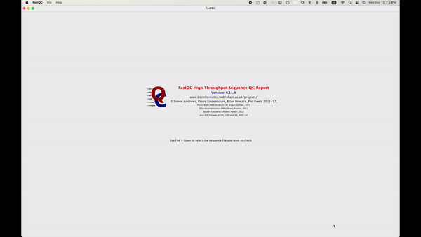 
</p>

Once the files are loaded in, you are able to select either the forward read (R1), or reverse read (R2) from the selection bar on the top of the window. 

Forward read
<p align="center">
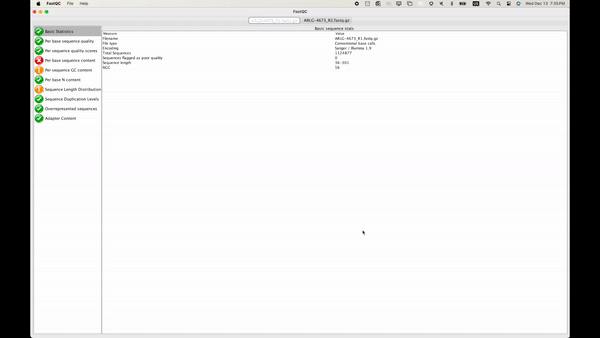 
</p>

Reverse Read
<p align="center">
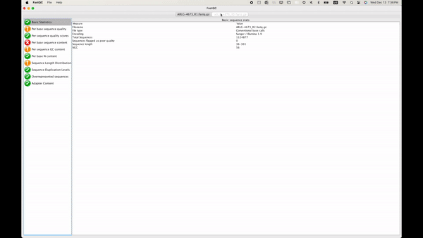 
</p>

Within each of these selections, you have multiple tabs that provide information that you can utilize to assess the quality of your reads. 

#### Basic Statistics

R1 basic statistics
<p align="center">
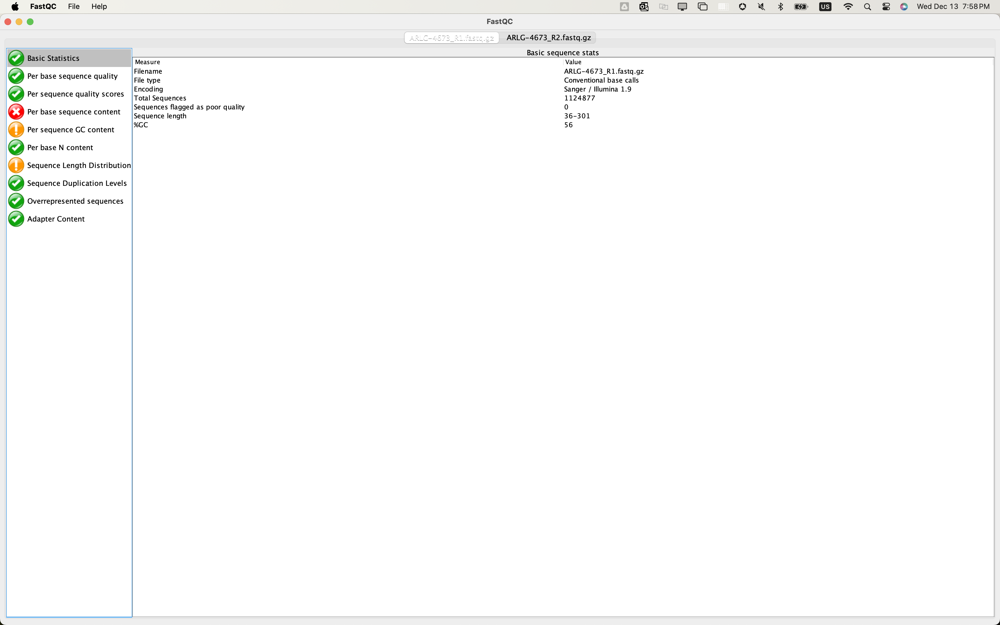 
</p>

R2 basic statistics
<p align="center">
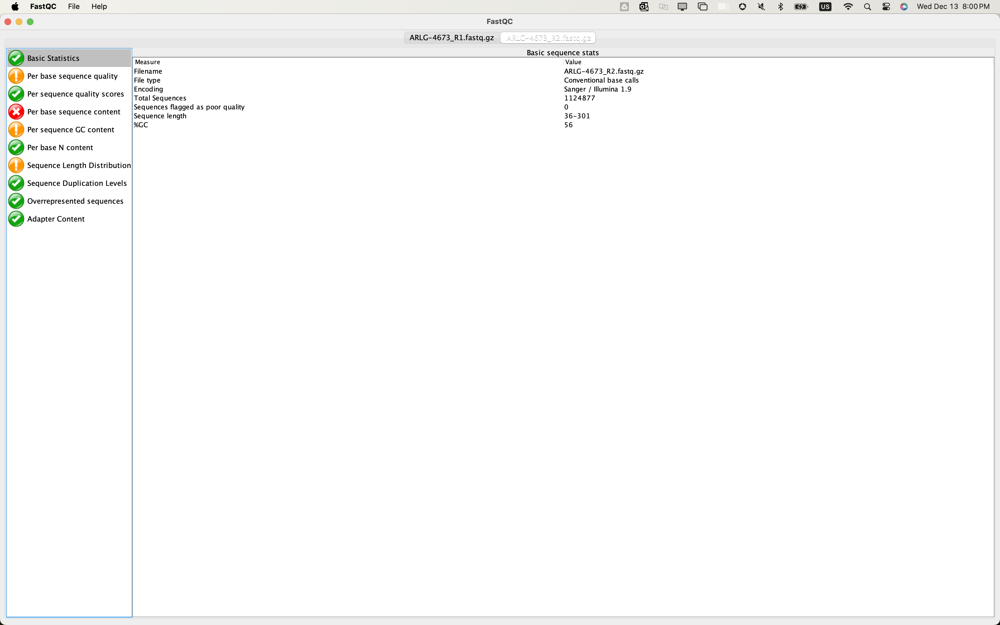 
</p>

This tab displays summary statistics such as the number of reads, the observed sequence length, and the %GC content. These values are generally identical for the total number of reads, and are very similar for the other two values. 

#### Per base sequence quality

This tab is often the most helpful tab for understanding the overall quality of your data, and paired with the `Sequence Length Distribution` tab, provides the most information that can help you assess the quality of your data. 

R1 per base statistics
<p align="center">
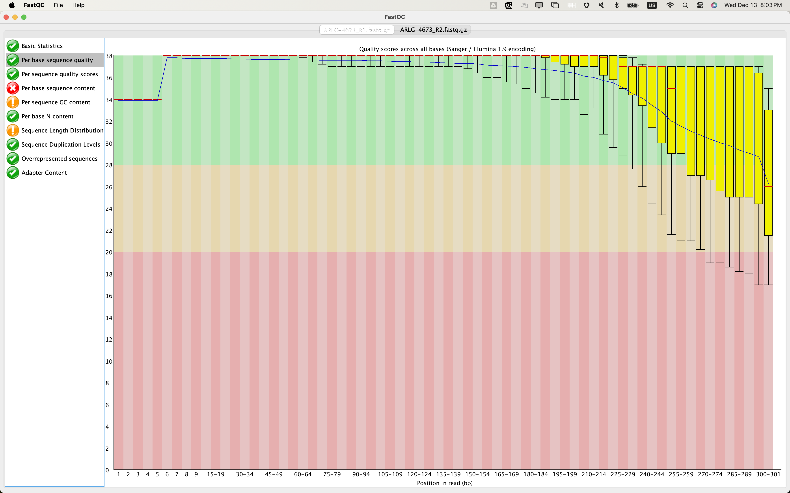 
</p>

R2 per base statistics
<p align="center">
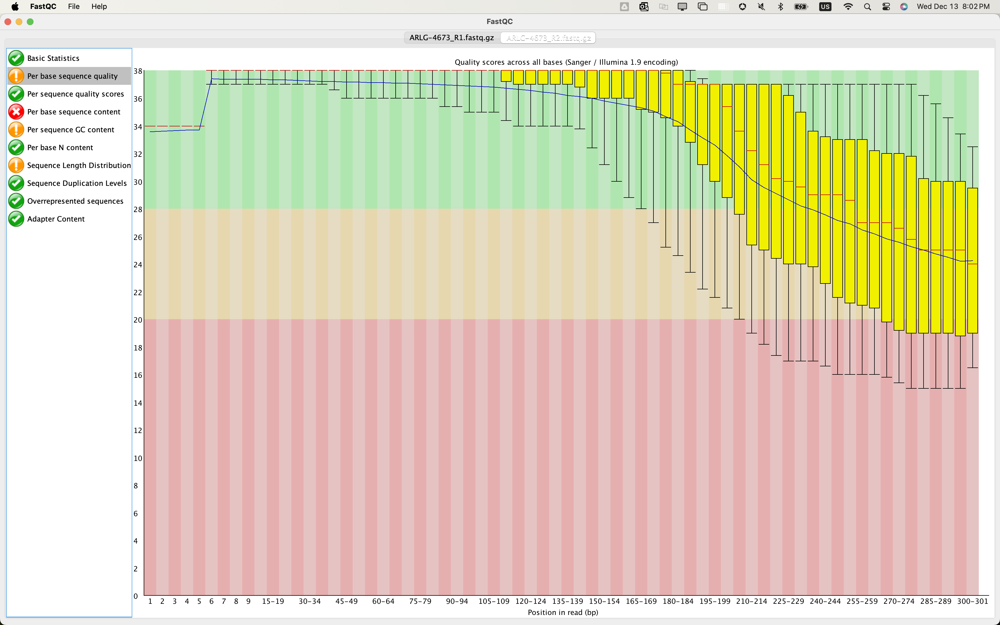 
</p>

Looking at these, there are a few signatures that catch my attention, the first observation is that the read quality at the end of both reads is decreasing (as represented by the emergence of the yellow boxes, and the subsequent movement down the y-axis for the yellow boxes as well as tahe red dashes that denote the mean quality score). The second observation, I see is that there appear to be stepwise decreases in the data quality as denoted by the top of the figures on the right where you see the green background start to show above the yellow boxes. This likely means our read length choice was longer than our average insert size for our library, and there will be sequencing adapter contamination within our data. We will confirm this when we look at the `Sequence Length Distribution` tab. 

#### Per sequence quality scores 

R1 per base statistics
<p align="center">
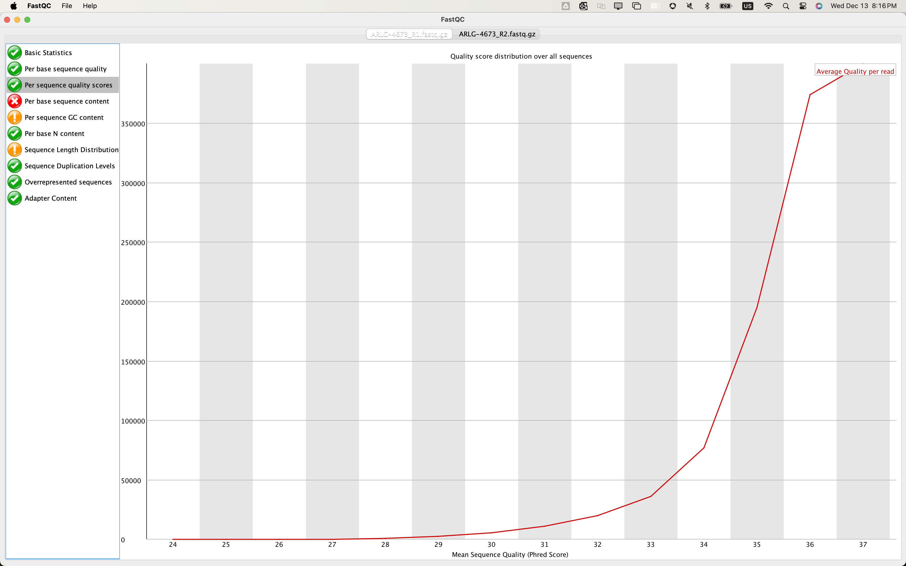 
</p>

R2 per base statistics
<p align="center">
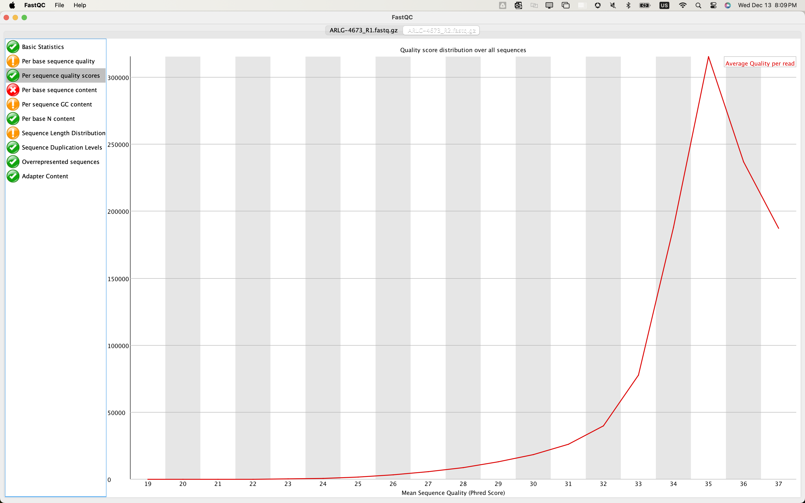 
</p>

This further reinforces that we are seeing a stepwise decrease in our sequencing data as we can see peaks that are not all the way right on the figure. That said, this is better represented in the `Sequence length distribution` tab. 

#### Per base sequence content

R1 per base statistics
<p align="center">
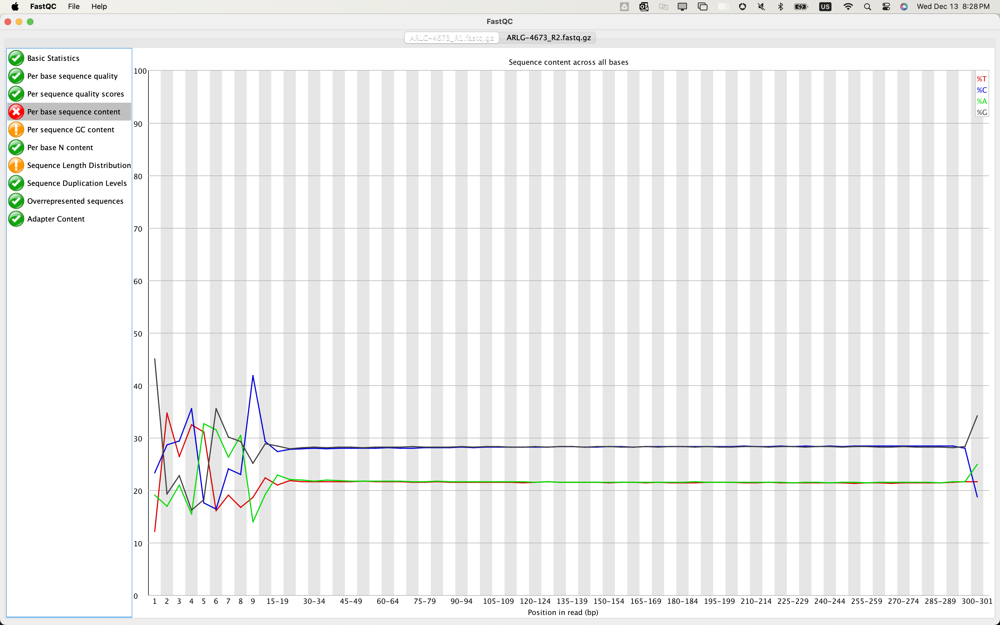 
</p>

R2 per base statistics
<p align="center">
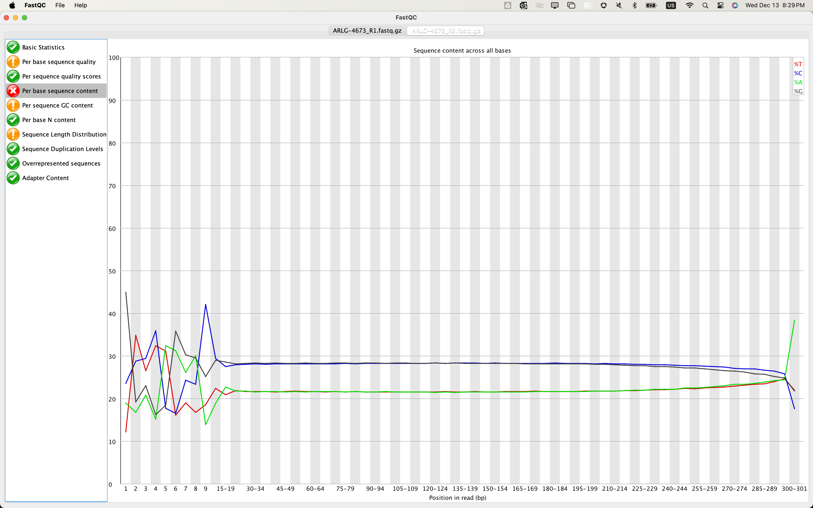 
</p>

This image generally shows the GC content broken down by the four different bases, but this is better represented within the `Per sequence GC content tab`. I find this tab useful to potentially identify adapter read-through that may be present within the sequencing data (which we potentially have), but not as useful as the `Per base sequence quality` and `Sequence length distribution` tabs. 

Note: the strange base spikes are the beginning are normal, and reflect a different interval of the x-axis. Each base in the first 10 bases of each read has its own column, while the rest of the columns are averages across a 5-base sliding window. 

#### Per sequence GC content

R1 per base statistics
<p align="center">
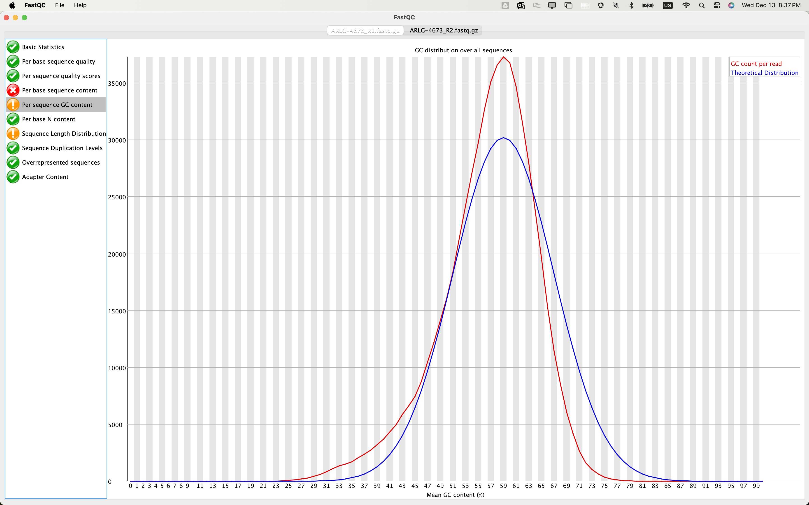 
</p>

R2 per base statistics
<p align="center">
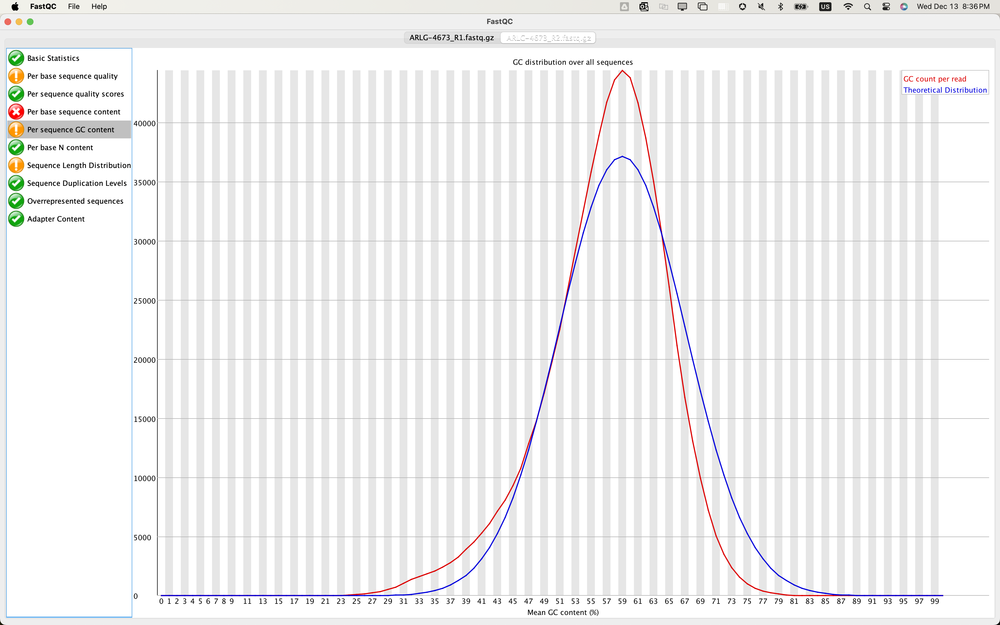 
</p>

The takeaway here is to look at the average GC content and make sure it is consistent with the bacteria you think you have sequenced. If the GC content is different than expected, or if you see a bimodal distribution, this can be a sign of contamination that will need to be assessed later in the bioinformatics process.

#### Sequence length distribution

This is the second most informative tab in my opinion and is very useful in conjunction with the `Per base sequence quality` tab. 

R1 statistics
<p align="center">
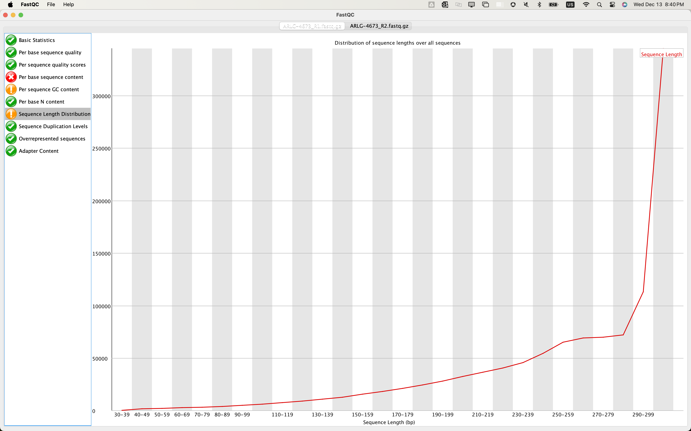 
</p>

R2 statistics
<p align="center">
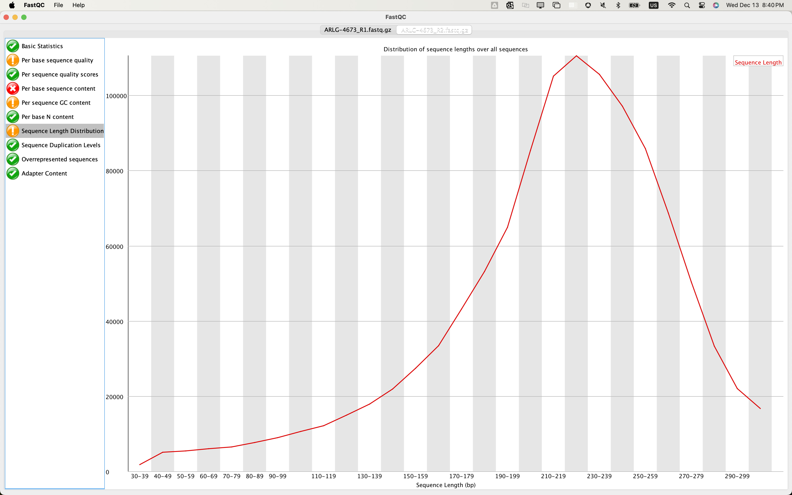 
</p>

This is where the assessment gets interesting. We see different patterns in read 1 vs read 2. If there was adapter contamination and adapter-read-through due to having a shorter insert size than our read length, we would expect these two images to be close to identical. While we do see some plateauing in the data indicating there may be some small amount of adapter contamination, the observation that read 2 is much shorter than read 1 indicates something occurred in the second read that likely impacted sequencing and may have led to a degradation in sequencing quality and length. Thankfully, we trim for this in the `trimmomatic` steps below, so this is not something we need to be overly concerned with given the high-quality of the overall data and our ability to trim low-quality data.  

**For the next three tabs, I am going to forego including the images as these can vary drastically depending on a large number of factors such as library preparation method, and sequencing read length. 

#### Sequence Duplication levels
This tab will be vastly different depending on if you use a PCR-based library preparation method, or if you use a PCR-free based library preparation method. Since we chose a PCR-free library preparation method for our data generation, we see very few duplicated sequences. If you have used a PCR-based library preparation method, this is a critical tab as it will tell you how biased your data is by the same overrepresented PCR fragments, which represent redundant sequencing data that can bias downstream analyses. 


#### Overrepresented sequences
Within WGS data, I have only found this tab useful to identify a large amount of adapter contamination that represents primer dimers and poor library preparation cleanup. 

#### Adapter content
This is a section that should be able to represent adapter content within your sequencing data, but I have found this does not always identify adapter contamination, particularly if you are using a library preparation kit from a third party company. I tend to only open this tab when there is a red X, and I find the `Overrepresented sequences` tab more useful for this as well. 

Overall, our data looks very good, but the sequence length distribution that is shorter than our read length implies there is likely adapter contamination within our sequencing data that has not been caught by FastQC. To remove this contamination, we will utilize the tool `Trimmomatic`.

### Trimmomatic

Now that we have completed our initial assessment of our sequencing results and concluded the sequencing quality is acceptable to move forward, now we move on to `Trimmomatic` to remove any adapter contamination, low-complexity regions, and poor sequencing quality. 

Note: Even if we do not see signs of adapter contamination in our data, we ALWAYS run our data through `Trimmomatic`. Even if the signs are not prevalent at a high enough level to be visible in `FastQC`, that does not mean there are not reads that require adapter removal. 

The trimmomatic usage is as such:

```
trimmomatic --help
Usage:
       PE [-version] [-threads <threads>] [-phred33|-phred64] [-trimlog <trimLogFile>] [-summary <statsSummaryFile>] [-quiet] [-validatePairs] [-basein <inputBase> | <inputFile1> <inputFile2>] [-baseout <outputBase> | <outputFile1P> <outputFile1U> <outputFile2P> <outputFile2U>] <trimmer1>...
   or:
       SE [-version] [-threads <threads>] [-phred33|-phred64] [-trimlog <trimLogFile>] [-summary <statsSummaryFile>] [-quiet] <inputFile> <outputFile> <trimmer1>...
   or:
       -version
```
Within this command, we are using the `PE` command flag as our data is paired-end Illumina data. While rare, if you are utilizing single-end illumina data, you would use the `SE` flag. 

From there you can set the -threads command if you would like, I use 4 threads below as that is a safe number to use on my laptop while also performing other actions. I then provide the following file details:

- Input Files (the pathing here assumes you are in the session1 workshop directory of the git repository)
	- Read 1 - `Files/illumina_reads/raw/ARLG-4673_R1.fastq.gz`
	- Read 2 - `Files/illumina_reads/raw/ARLG-4673_R2.fastq.gz`

- Output Files (this will write files into the base session1 directory to make sure I don't overwrite existing data)
	- Read 1 paired read output - `ARLG-4673_R1_paired.fastq.gz` (this is one of the files we want as we want to make sure we move forward with paired files for both read 1 and read 2. Utilizing unpaired files, where one read was not removed, but the other was removed can cause issues with downstream bioinformatics tools and thus should be discarded unless very specifically needed)
	- Read 1 unpaired read output - `ARLG-4673_R1_unpaired.fastq.gz` (these are reads where one or both reads were trimmed below our minimum length cutoff or were composed of low-complexity regions only)
	- Read 2 paired read output - `ARLG-4673_R2_paired.fastq.gz `
	- Read 2 unpaired read output - `ARLG-4673_R2_unpaired.fastq.gz`
	
- ILLUMINACLIP parameters
	- This section provides the path for the desired illumina adapters to be trimmed, and provides parameters for quality filtering. 
	- The ILLUMINACLIP flag will remove adapters (ILLUMINACLIP:TruSeq3-PE.fa:2:30:10)
	- The LEADING flag will  remove leading low quality or N bases (below quality 3) (LEADING:3)
	- The TRAILING flag will remove trailing low quality or N bases (below quality 3) (TRAILING:3)
	- The SLIDINGWINDOW flag will scann the read with a 4-base wide sliding window, cutting when the average quality per base drops below 15 (SLIDINGWINDOW:4:15)
	- The MINLEN flag will drop reads below the 36 bases long (MINLEN:36)

The overarching format for the trimmomatic command is broken down as follows:

```
java -jar trimmomatic-0.39.jar PE -threads 4 input_forward.fq.gz input_reverse.fq.gz output_forward_paired.fq.gz output_forward_unpaired.fq.gz output_reverse_paired.fq.gz output_reverse_unpaired.fq.gz ILLUMINACLIP:TruSeq3-PE.fa:2:30:10:2:True LEADING:3 TRAILING:3 MINLEN:36
```

By adding in our file structure and data, this becomes: 
```
trimmomatic PE Files/illumina_reads/raw/ARLG-4673_R1.fastq.gz Files/illumina_reads/raw/ARLG-4673_R2.fastq.gz ARLG-4673_R1_paired.fastq.gz ARLG-4673_R1_unpaired.fastq.gz ARLG-4673_R2_paired.fastq.gz ARLG-4673_R2_unpaired.fastq.gz ILLUMINACLIP:/usr/local/opt/trimmomatic/share/trimmomatic/adapters/NexteraPE-PE.fa:2:30:10:2:True LEADING:3 TRAILING:3 MINLEN:36 
```

<p align="center">
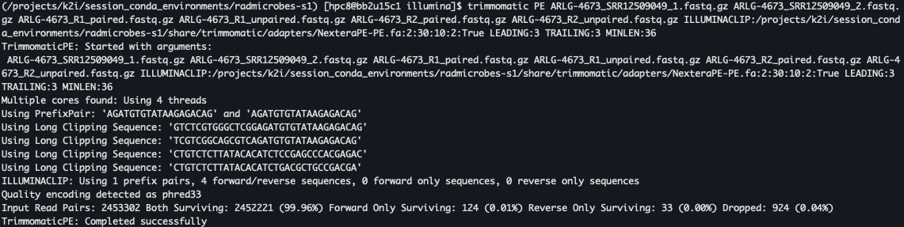 
</p>

Note that if you want to run this yourself, you will have to update the location of the adapters, as well as the adapter choice to match your Illumina sequencing method.  

**The paired reads are what we will utilize moving forward for our short-read assembly walkthrough**

#### FastqQC of our trimmed reads

For the sake of brevity (this section is already getting VERY long), I am not going to run FastQC again on the trimmed reads, but I encourage you to do so, focusing on the `Per base sequence quality` tab, and the `Per sequence quality scores` tabs, which both now reflect the removal of the adapter contamination from our data, which reduces the overall quality of the sequencing data. 

## Long reads
Now let's move onto  our long reads. We are going to use NanoPlot to assess the quality of our raw Illumina sequencing data. 

### NanoPlot	
As we are only assessing the quality of a single ONT sample, NanoPlot is a great choice and it will generate a range of figures, as well as a single HTML report that includes all of those figures. 
		
The usage of NanoPlot is:		
		
```
NanoPlot --help
```

```
usage: NanoPlot [-h] [-v] [-t THREADS] [--verbose] [--store] [--raw] [--huge] [-o OUTDIR] [--no_static] [-p PREFIX] [--tsv_stats] [--only-report]
                [--info_in_report] [--maxlength N] [--minlength N] [--drop_outliers] [--downsample N] [--loglength] [--percentqual] [--alength] [--minqual N]
                [--runtime_until N] [--readtype {1D,2D,1D2}] [--barcoded] [--no_supplementary] [-c COLOR] [-cm COLORMAP]
                [-f [{png,jpg,jpeg,webp,svg,pdf,eps,json} ...]] [--plots [{kde,hex,dot} ...]] [--legacy [{kde,dot,hex} ...]] [--listcolors] [--listcolormaps]
                [--no-N50] [--N50] [--title TITLE] [--font_scale FONT_SCALE] [--dpi DPI] [--hide_stats]
                (--fastq file [file ...] | --fasta file [file ...] | --fastq_rich file [file ...] | --fastq_minimal file [file ...] | --summary file [file ...] | --bam file [file ...] | --ubam file [file ...] | --cram file [file ...] | --pickle pickle | --feather file [file ...])

CREATES VARIOUS PLOTS FOR LONG READ SEQUENCING DATA.

General options:
  -h, --help            show the help and exit
  -v, --version         Print version and exit.
  -t, --threads THREADS
                        Set the allowed number of threads to be used by the script
  --verbose             Write log messages also to terminal.
  --store               Store the extracted data in a pickle file for future plotting.
  --raw                 Store the extracted data in tab separated file.
  --huge                Input data is one very large file.
  -o, --outdir OUTDIR   Specify directory in which output has to be created.
  --no_static           Do not make static (png) plots.
  -p, --prefix PREFIX   Specify an optional prefix to be used for the output files.
  --tsv_stats           Output the stats file as a properly formatted TSV.
  --only-report         Output only the report
  --info_in_report      Add NanoPlot run info in the report.

Options for filtering or transforming input prior to plotting:
  --maxlength N         Hide reads longer than length specified.
  --minlength N         Hide reads shorter than length specified.
  --drop_outliers       Drop outlier reads with extreme long length.
  --downsample N        Reduce dataset to N reads by random sampling.
  --loglength           Additionally show logarithmic scaling of lengths in plots.
  --percentqual         Use qualities as theoretical percent identities.
  --alength             Use aligned read lengths rather than sequenced length (bam mode)
  --minqual N           Drop reads with an average quality lower than specified.
  --runtime_until N     Only take the N first hours of a run
  --readtype {1D,2D,1D2}
                        Which read type to extract information about from summary. Options are 1D, 2D,
                        1D2
  --barcoded            Use if you want to split the summary file by barcode
  --no_supplementary    Use if you want to remove supplementary alignments

Options for customizing the plots created:
  -c, --color COLOR     Specify a valid matplotlib color for the plots
  -cm, --colormap COLORMAP
                        Specify a valid matplotlib colormap for the heatmap
  -f, --format [{png,jpg,jpeg,webp,svg,pdf,eps,json} ...]
                        Specify the output format of the plots, which are in addition to the html files
  --plots [{kde,hex,dot} ...]
                        Specify which bivariate plots have to be made.
  --legacy [{kde,dot,hex} ...]
                        Specify which bivariate plots have to be made (legacy mode).
  --listcolors          List the colors which are available for plotting and exit.
  --listcolormaps       List the colors which are available for plotting and exit.
  --no-N50              Hide the N50 mark in the read length histogram
  --N50                 Show the N50 mark in the read length histogram
  --title TITLE         Add a title to all plots, requires quoting if using spaces
  --font_scale FONT_SCALE
                        Scale the font of the plots by a factor
  --dpi DPI             Set the dpi for saving images
  --hide_stats          Not adding Pearson R stats in some bivariate plots

Input data sources, one of these is required.:
  --fastq file [file ...]
                        Data is in one or more default fastq file(s).
  --fasta file [file ...]
                        Data is in one or more fasta file(s).
  --fastq_rich file [file ...]
                        Data is in one or more fastq file(s) generated by albacore, MinKNOW or guppy
                        with additional information concerning channel and time.
  --fastq_minimal file [file ...]
                        Data is in one or more fastq file(s) generated by albacore, MinKNOW or guppy
                        with additional information concerning channel and time. Is extracted swiftly
                        without elaborate checks.
  --summary file [file ...]
                        Data is in one or more summary file(s) generated by albacore or guppy.
  --bam file [file ...]
                        Data is in one or more sorted bam file(s).
  --ubam file [file ...]
                        Data is in one or more unmapped bam file(s).
  --cram file [file ...]
                        Data is in one or more sorted cram file(s).
  --pickle pickle       Data is a pickle file stored earlier.
  --feather, --arrow file [file ...]
                        Data is in one or more feather file(s).

EXAMPLES:
    NanoPlot --summary sequencing_summary.txt --loglength -o summary-plots-log-transformed
    NanoPlot -t 2 --fastq reads1.fastq.gz reads2.fastq.gz --maxlength 40000 --plots hex dot
    NanoPlot --color yellow --bam alignment1.bam alignment2.bam alignment3.bam --downsample 10000
```	
		
While there are a LOT of options to customize the output of this tool, we are keeping it simple and running the following command:

```
NanoPlot --fastq Files/oxford_nanopore_reads/ARLG-4673_ONT.fastq.gz -o ARLG-4673_NanoPlot_output
```

Below is the NanoPlot output that gives us information on the general quality of the data we are utilizing. 

NanoPlot Summary Statistics
<p align="center">
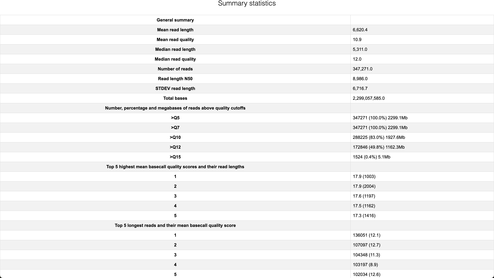 
</p>	
		
		
We can see from these summary statistics, that we have a LOT fewer reads as compared to our Illumina sequencing data (347,271 vs 1,124,877) but our average read length of 6,620.4 is much longer than our short-read maximum length of 300 bases. Additionally, our longest reads in this dataset are longer than 100,000 reads and will provide excellent scaffolding for our assembly. 

NanoPlot Read Length
<p align="center">
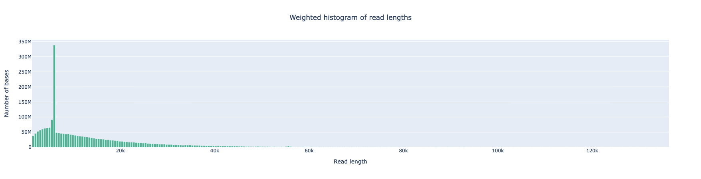 
</p>
		
As is shown in the summary statistics tab, we have a very nice distribution of long reads, with a long, but low tail of ultra long reads. 		
		
<p align="center">
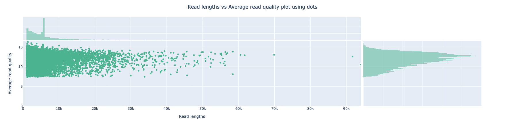 
</p>	
		
Another fantastic benefit of ONT long reads is there is not an association with read-length and quality score. Our ultra-long reads are just as accurate as our mean-length reads, which allows us to make assumptions about average quality and not have to adjust for read length in our assemblies. This is not the case with PacBio long reads where there is an inherent tradeoff between read length and read quality. 

Overarchingly, our data quality is exceptional for an R9.4 flowcell based ONT sequencing run, and because read trimming and quality adjustment are included in the `flye` assembler, we do not have to perform trimming like we do with short reads and `trimmomatic`.
		
		
# Assembly 
## Short read assembly
Short-read assembly is a critical process in genomics, especially pivotal in the analysis of data generated from high-throughput sequencing technologies like Illumina. These technologies produce millions of small DNA fragments, typically ranging from 75 to 300 base pairs, known as "short reads." The challenge in short-read assembly lies in accurately piecing together these reads to reconstruct the original genome sequence. This process is akin to solving a massive jigsaw puzzle, where each read represents a piece of the puzzle. The assembly algorithms work by finding overlaps between reads and merging them to extend into longer sequences, known as contigs. These contigs are then further assembled to reconstruct the entire genomic sequence. Short-read assembly is particularly effective for organisms with relatively small and less complex genomes. However, it can be challenging in genomes with high repetitive content or large structural variations, as short reads may not span these repetitive regions completely. Despite these challenges, short-read assembly is a cornerstone of genomic research, enabling a wide array of applications from identifying genetic variants associated with diseases to understanding microbial diversity in various environments. With advancements in computational algorithms and tools, short-read assembly continues to evolve, offering greater accuracy and efficiency in genomic sequencing and analysis.

### Spades

For our short-read assembly, we will be utilizing the SPAdes genome assembler. This assembler has MANY features, most of which we will not be using in the course of this workshop. SPAdes has been actively developed for many years and has been extended to viruses, plasmids, metagenomics, SARS-CoV-2, and meta-Hi-C. All fantastic, but unnecessary for our use for single bacterial genomes. 

The usage of spades is:

```
spades.py --help
SPAdes genome assembler v3.15.5
```

```
Usage: spades.py [options] -o <output_dir>

Basic options:
  -o <output_dir>             directory to store all the resulting files (required)
  --isolate                   this flag is highly recommended for high-coverage isolate and multi-cell data
  --sc                        this flag is required for MDA (single-cell) data
  --meta                      this flag is required for metagenomic data
  --bio                       this flag is required for biosyntheticSPAdes mode
  --corona                    this flag is required for coronaSPAdes mode
  --rna                       this flag is required for RNA-Seq data
  --plasmid                   runs plasmidSPAdes pipeline for plasmid detection
  --metaviral                 runs metaviralSPAdes pipeline for virus detection
  --metaplasmid               runs metaplasmidSPAdes pipeline for plasmid detection in metagenomic datasets (equivalent for --meta --plasmid)
  --rnaviral                  this flag enables virus assembly module from RNA-Seq data
  --iontorrent                this flag is required for IonTorrent data
  --test                      runs SPAdes on toy dataset
  -h, --help                  prints this usage message
  -v, --version               prints version

Input data:
  --12 <filename>             file with interlaced forward and reverse paired-end reads
  -1 <filename>               file with forward paired-end reads
  -2 <filename>               file with reverse paired-end reads
  -s <filename>               file with unpaired reads
  --merged <filename>         file with merged forward and reverse paired-end reads
  --pe-12 <#> <filename>      file with interlaced reads for paired-end library number <#>.
                              Older deprecated syntax is -pe<#>-12 <filename>
  --pe-1 <#> <filename>       file with forward reads for paired-end library number <#>.
                              Older deprecated syntax is -pe<#>-1 <filename>
  --pe-2 <#> <filename>       file with reverse reads for paired-end library number <#>.
                              Older deprecated syntax is -pe<#>-2 <filename>
  --pe-s <#> <filename>       file with unpaired reads for paired-end library number <#>.
                              Older deprecated syntax is -pe<#>-s <filename>
  --pe-m <#> <filename>       file with merged reads for paired-end library number <#>.
                              Older deprecated syntax is -pe<#>-m <filename>
  --pe-or <#> <or>            orientation of reads for paired-end library number <#>
                              (<or> = fr, rf, ff).
                              Older deprecated syntax is -pe<#>-<or>
  --s <#> <filename>          file with unpaired reads for single reads library number <#>.
                              Older deprecated syntax is --s<#> <filename>
  --mp-12 <#> <filename>      file with interlaced reads for mate-pair library number <#>.
                              Older deprecated syntax is -mp<#>-12 <filename>
  --mp-1 <#> <filename>       file with forward reads for mate-pair library number <#>.
                              Older deprecated syntax is -mp<#>-1 <filename>
  --mp-2 <#> <filename>       file with reverse reads for mate-pair library number <#>.
                              Older deprecated syntax is -mp<#>-2 <filename>
  --mp-s <#> <filename>       file with unpaired reads for mate-pair library number <#>.
                              Older deprecated syntax is -mp<#>-s <filename>
  --mp-or <#> <or>            orientation of reads for mate-pair library number <#>
                              (<or> = fr, rf, ff).
                              Older deprecated syntax is -mp<#>-<or>
  --hqmp-12 <#> <filename>    file with interlaced reads for high-quality mate-pair library number <#>.
                              Older deprecated syntax is -hqmp<#>-12 <filename>
  --hqmp-1 <#> <filename>     file with forward reads for high-quality mate-pair library number <#>.
                              Older deprecated syntax is -hqmp<#>-1 <filename>
  --hqmp-2 <#> <filename>     file with reverse reads for high-quality mate-pair library number <#>.
                              Older deprecated syntax is -hqmp<#>-2 <filename>
  --hqmp-s <#> <filename>     file with unpaired reads for high-quality mate-pair library number <#>.
                              Older deprecated syntax is -hqmp<#>-s <filename>
  --hqmp-or <#> <or>          orientation of reads for high-quality mate-pair library number <#>
                              (<or> = fr, rf, ff).
                              Older deprecated syntax is -hqmp<#>-<or>
  --sanger <filename>         file with Sanger reads
  --pacbio <filename>         file with PacBio reads
  --nanopore <filename>       file with Nanopore reads
  --trusted-contigs <filename>
                              file with trusted contigs
  --untrusted-contigs <filename>
                              file with untrusted contigs

Pipeline options:
  --only-error-correction     runs only read error correction (without assembling)
  --only-assembler            runs only assembling (without read error correction)
  --careful                   tries to reduce number of mismatches and short indels
  --checkpoints <last or all>
                              save intermediate check-points ('last', 'all')
  --continue                  continue run from the last available check-point (only -o should be specified)
  --restart-from <cp>         restart run with updated options and from the specified check-point
                              ('ec', 'as', 'k<int>', 'mc', 'last')
  --disable-gzip-output       forces error correction not to compress the corrected reads
  --disable-rr                disables repeat resolution stage of assembling

Advanced options:
  --dataset <filename>        file with dataset description in YAML format
  -t <int>, --threads <int>   number of threads. [default: 16]
  -m <int>, --memory <int>    RAM limit for SPAdes in Gb (terminates if exceeded). [default: 250]
  --tmp-dir <dirname>         directory for temporary files. [default: <output_dir>/tmp]
  -k <int> [<int> ...]        list of k-mer sizes (must be odd and less than 128)
                              [default: 'auto']
  --cov-cutoff <float>        coverage cutoff value (a positive float number, or 'auto', or 'off')
                              [default: 'off']
  --phred-offset <33 or 64>   PHRED quality offset in the input reads (33 or 64),
                              [default: auto-detect]
  --custom-hmms <dirname>     directory with custom hmms that replace default ones,
                              [default: None]
```

The command we are using is:

```
spades.py -t 8 --isolate --only-assembler -1 ARLG-4673_R1_paired.fastq.gz -2 ARLG-4673_R2_paired.fastq.gz -o ARLG-4673_spades_out
```

This utilizes the following parameters:
- t - Threads. I chose 8 to run relatively quickly on my laptop
- isolate - the setting that tells spades this is a single bacterial genome
- only-assembler - benchmarking of spades has shown that when utilizing `trimmomatic` for adapter contamination removal and quality filtering, it is best to skip the built in steps in spades that address the same issues. This has been shown in benchmark experiments to be the approach with the highest accuracy. 
- 1 - the paired read 1 file
- 2 - the paired read 2 file
-o - the output location for the spades output


## Long read assembly
Long-read assembly is a crucial technique in genomics, particularly valuable for its ability to overcome some of the limitations presented by short-read sequencing technologies. Utilizing platforms such as Oxford Nanopore and PacBio, long-read sequencing generates significantly longer DNA sequences, often exceeding tens of thousands of base pairs in length. This attribute allows long-read assembly methods to more effectively navigate complex genomic regions, such as those with high repetitive content or large structural variations, which are often challenging for short-read assemblies. The extended length of these reads provides greater continuity and can span entire genomic regions, enabling a more accurate and comprehensive reconstruction of the genome. This is particularly beneficial for assembling large and complex genomes, resolving structural variants, and identifying epigenetic modifications. Long-read assembly has also revolutionized the study of microbial genomics, allowing for more detailed insights into microbial diversity and evolution, as well as the comprehensive characterization of pathogen genomes. However, challenges with long-read sequencing include a higher raw error rate and increased cost per base compared to short-read sequencing. Despite these challenges, the continued advancements in long-read sequencing technologies and assembly algorithms are making this approach increasingly accessible and reliable, opening new frontiers in genomics research.

### Flye

```
flye --help
```

```
usage: flye (--pacbio-raw | --pacbio-corr | --pacbio-hifi | --nano-raw |
	     --nano-corr | --subassemblies) file1 [file_2 ...]
	     --out-dir PATH

	     [--genome-size SIZE] [--threads int] [--iterations int]
	     [--meta] [--plasmids] [--trestle] [--polish-target]
	     [--keep-haplotypes] [--debug] [--version] [--help]
	     [--resume] [--resume-from] [--stop-after]
	     [--hifi-error] [--min-overlap SIZE]

Assembly of long reads with repeat graphs

optional arguments:
  -h, --help            show this help message and exit
  --pacbio-raw path [path ...]
                        PacBio raw reads
  --pacbio-corr path [path ...]
                        PacBio corrected reads
  --pacbio-hifi path [path ...]
                        PacBio HiFi reads
  --nano-raw path [path ...]
                        ONT raw reads
  --nano-corr path [path ...]
                        ONT corrected reads
  --subassemblies path [path ...]
                        high-quality contigs input
  -g size, --genome-size size
                        estimated genome size (for example, 5m or 2.6g)
  -o path, --out-dir path
                        Output directory
  -t int, --threads int
                        number of parallel threads [1]
  -i int, --iterations int
                        number of polishing iterations [1]
  -m int, --min-overlap int
                        minimum overlap between reads [auto]
  --asm-coverage int    reduced coverage for initial disjointig assembly [not set]
  --hifi-error float    expected HiFi reads error rate (e.g. 0.01 or 0.001) [0.01]
  --plasmids            rescue short unassembled plasmids
  --meta                metagenome / uneven coverage mode
  --keep-haplotypes     do not collapse alternative haplotypes
  --trestle             enable Trestle [disabled]
  --polish-target path  run polisher on the target sequence
  --resume              resume from the last completed stage
  --resume-from stage_name
                        resume from a custom stage
  --stop-after stage_name
                        stop after the specified stage completed
  --debug               enable debug output
  -v, --version         show program's version number and exit

Input reads can be in FASTA or FASTQ format, uncompressed
or compressed with gz. Currently, PacBio (raw, corrected, HiFi)
and ONT reads (raw, corrected) are supported. Expected error rates are
<30% for raw, <3% for corrected, and <1% for HiFi. Note that Flye
was primarily developed to run on raw reads. Additionally, the
--subassemblies option performs a consensus assembly of multiple
sets of high-quality contigs. You may specify multiple
files with reads (separated by spaces). Mixing different read
types is not yet supported. The --meta option enables the mode
for metagenome/uneven coverage assembly.

Genome size estimate is no longer a required option. You
need to provide an estimate if using --asm-coverage option.

To reduce memory consumption for large genome assemblies,
you can use a subset of the longest reads for initial disjointig
assembly by specifying --asm-coverage and --genome-size options. Typically,
40x coverage is enough to produce good disjointigs.

You can run Flye polisher as a standalone tool using
--polish-target option.
```


The command we are using is:

```
flye --nano-raw Files/oxford_nanopore_reads/ARLG-4673_ONT.fastq.gz --out-dir ARLG-4673_flye --threads 8
```

This utilizes the following parameters:
- nano-raw - the parameter to tell flye we are using raw ONT data
- threads I chose 8 to run relatively quickly on my laptop
-out-dir - the output location for the spades output

# Assembly QC/QA


## Quast
Now, for the sake of time, we are going to do the old put a turkey into an oven, and take an already cooked turkey out of the oven right next to it. We are going to look at the quast results for the flye assembly itself, and then assess the flye assembly generated by Dr. Shropshire's [flye_hybrid_assembly_pipeline_](https://github.com/wshropshire/flye_hybrid_assembly_pipeline) that has been polished to reference quality. 

### Quast of the raw flye generated assembly


The command we are using is:

```
quast.py -t 4 -o ARLG-4673_flye_assembly_quast_output Files/assemblies/flye_long_read_assembly/flye_assembly.fasta.gz
```

<p align="center">
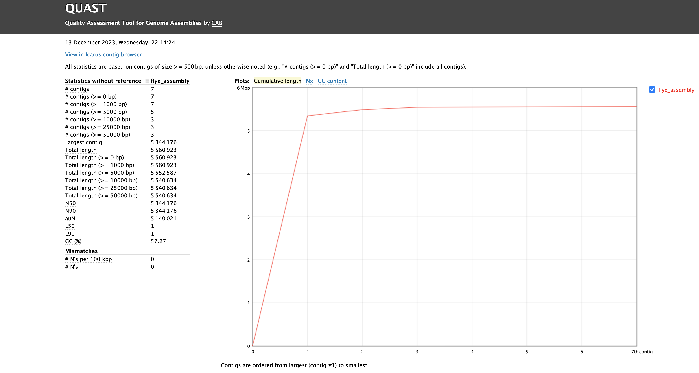 
</p>	

We can see here that we have 7 total contigs for a total genome length of 5,344,176. This is in line with what we expect for full genome size from *Klebsiella pneumoniae* but we are unsure at this time if these contigs are all circularized and if they are circularized or not. To assess that, we need to utilize Bandage (discussed below), and the `flye` assembly_info.txt file. That file gives us the following output:

```
#seq_name	length	cov.	circ.	repeat	mult.	alt_group	graph_path
contig_23	5344176	332	Y	N	1	*	23
contig_24	140863	252	Y	N	1	*	24
contig_25	55595	790	Y	Y	2	*	25
contig_2	6883	142	N	Y	35	*	*,2,*
contig_10	5070	360	N	Y	90	*	*,10,*
contig_21	4582	459	N	Y	114	*	*,21,*
contig_6	3754	138	N	Y	27	*	*,6,*
```

From this we can see that flye does not think the chromosome (the largest contig) is circularized, and we have a number of plasmids that contain repeats. 

If we jump to the end of our assessment of our files following Dr. Shropshire's [flye_hybrid_assembly_pipeline_](https://github.com/wshropshire/flye_hybrid_assembly_pipeline), we cut these numbers down to the chromosome and 4 plasmids (some of the plasmids in the initial flye output were duplications, which is a known issue with flye and high-copy number plasmids). 

<p align="center">
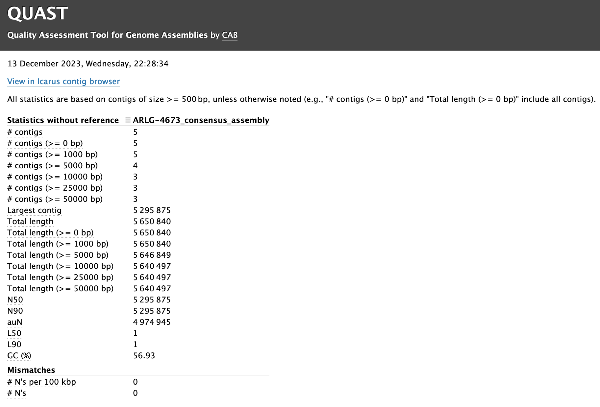 
</p>


Consider this a teaser for next time!  

I recommend you attend the next workshop we offer where I will discuss an updated version of the flye assembly pipeline that Dr. Shropshire and I are working on that directly addresses many of the steps included in Dr. Shropshire's flyest pipeline, and adds a number of new tools to assess genome completeness and correct for genome assembly artifacts. 

### To be discussed in the workshop!
#### [Bandage](https://rrwick.github.io/Bandage/)
#### [Busco](https://busco.ezlab.org/) and [CheckM](https://ecogenomics.github.io/CheckM/)


