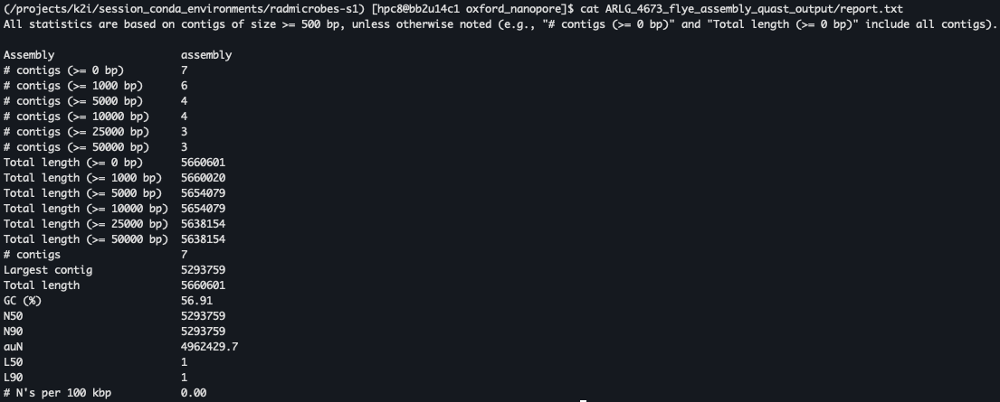
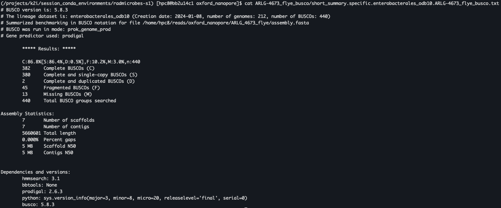

# Session 1 - Sampling, Sequencing, Quality Assessment and Control, and Assembly
*by Blake Hanson, MS, PhD*
 
## Session Summary
 <p></p>

 * [Sampling and study design](#sampling-and-study-design)
 	* [Determine your goals](#determine-your-goals)
 	* [Sampling considerations for microbial genomics](#sampling-considerations-for-microbial-genomics)
 		* [Working with reference isolates](#collecting-samples)
 		* [Clinical isolate sampling](#clinical-isolates)
 		* [Environmental isolate sampling](#environmental-isolates)
 		* [Isolates from animal models](#isolates-from-animal-models)
 		* [Culturing/Purifying Isolates](#culturingpurifying-isolates)
 		* [Preparing for Sequencing](#preparing-for-sequencing)
 
 * [Sequencing](#sequencing)
 	* [A brief history](#a-brief-history-of-microbial-sequencing)
 	* [Currently available technologies](#currently-available-technologies)
 		* [Short read sequencing technologies](#short-read-sequencing-technologies)
 			* [Illumina](#illumina-sequencing-next-generation-sequencing---ngs)
 			* [Ion Torrent](#ion-torrent-sequencing)
 			* [Sanger](#sanger-sequencing)
 		* [Long read sequencing technologies](#long-read-sequencing-technologies)
 			* [Oxford Nanopore](#oxford-nanopore-technologies-ont)
 			* [PacBio](#pacbio-sequencing)  
 	* [How do I pick which one to use?](#how-do-i-pick-which-one-to-use)
 
 * [Preparing for analyses](#preparing-for-analyses)
 	* [Connect to NOTS](#connect-to-nots)
 	* [Enter an interactive compute node](#enter-an-interactive-compute-node)
 	* [Accessing the conda environment](#accessing-the-conda-environment)
 	* [Copying the fastq data](#copying-the-fastq-data)

 * [Sequencing quality assessment and control](#sequencing-quality-assessment-and-control)
 	* [Why Quality Assessment is Critical](#why-quality-assessment-is-critical)
 	* [Controlling for Low-Quality Data](#controlling-for-low-quality-data) 
 	* [Short read QC/QA](#short-read-qcqa)
 		* [FastQC](#fastqc)
 		* [FastQC Alternatives](#fastqc-alternatives)
 			* [Raspberry](#raspberry)
 		* [MultiQC](#multiqc)
 	* [Long read QC/QA](#long-read-qcqa)
 		* [NanoPlot and associated scripts](#nanoplot-and-associated-scripts)
 		* [pycoQC](#pycoqc)
 	* [Assessment of our reads](#assessment-of-our-reads)    
 
 * [Assembly](#assembly)
 	* [Short read assembly](#short-read-assembly)
 		* [SPAdes](#spades)
 	* [Long read assembly](#long-read-assembly)
 		* [Downsampling our Data](downsampling-our-data)
 		* [Flye](#flye)

 * [Assembly QC/QA](#assembly-qcqa)
 	* [Quast](#quast)
 	* [Busco](#busco-assessment-of-the-assemblies)

## Sampling and study design

Microbial genomics is a powerful tool in understanding the genetics of microorganisms. This section outlines key considerations in the study design and sampling for various applications in microbial genomics.

### Determine your goals

Determining clear goals before embarking on microbial genomics sequencing and analyses is crucial for several reasons:
1.  Firstly, it guides the choice of sequencing technology, as different platforms offer varying read lengths, accuracies, and throughputs, which can significantly impact the resolution and quality of genomic data. For instance, short-read sequencing might suffice for single nucleotide polymorphism (SNP) analysis, but long-read sequencing is more suitable for resolving complex genomic structures. 
2. Secondly, well-defined objectives help in designing the experiment, including sample collection, preparation, and the depth of sequencing required. This is especially important in microbial genomics where variables like bacterial diversity, genome size, and the presence of plasmids or mobile genetic elements can influence experimental design. Moreover, clear goals ensure that the subsequent data analysis is focused and relevant. Different bioinformatics tools and pipelines are better suited to specific types of analysis, such as gene expression profiling, variant calling, or metagenomic analysis. 
3. Finally, and perhaps most importantly, having a clear understanding of the project's aims ensures efficient use of resources and time, and aids in the interpretation and relevance of the findings, thereby enhancing the scientific value and impact of the research. 

In summary, clear, well-defined goals are the cornerstone of a successful microbial genomics project, ensuring that the right questions are asked, and the most suitable methods are employed to answer them effectively.

Below is a non-exhaustive set of reasons you may want to generate and/or analyze microbial genomics data. 

#### Generating a Reference Isolate for a Microbiology Experiment
- **Objective**: To create a well-characterized reference isolate that can be used as a standard for comparison in microbiological studies.
- **Methodology**:
	- Isolate Selection: Choose a representative isolate from a known source.
	- Whole Genome Sequencing (WGS): Perform WGS to obtain a complete genetic profile.
	- Annotation: Annotate the genome to identify genes, operons, regulatory elements, etc.
- **Considerations**:
	- Purity of Culture: Ensure the isolate is pure and not contaminated with other microorganisms.
	- Reproducibility: The isolate should be easy to culture and maintain to ensure reproducibility in experiments.
	- Level of completeness needed: Depending on the planned use of your reference, you may need to consider if short-reads, long-reads, or a combination of both are needed.

#### Confirming a Mutation Following Genetic Modification
- **Objective**: To confirm the presence and correctness of introduced mutations, as well as to assess for potential off-target mutations.
- **Methodology**:
	- **PCR and Sanger Sequencing**: For specific, targeted mutations. Does not provide insights for potential off-target mutations.
	- **Whole Genome Sequencing**: For a comprehensive overview and to check for off-target effects.
- **Considerations**:
	- Target Verification: Verify that the mutation occurs at the intended site.
	- Off-target Analysis: Screen for unintended mutations elsewhere in the genome.

#### Pathogen Identification and Characterization
- **Objective**: To identify unknown pathogens and characterize known ones, including studying antibiotic resistance mechanisms (AMR).
- **Methodology**:
	- 16S rRNA Sequencing: For bacterial identification.
	- Whole genome sequencing: For bacterial identification as well as genetic content identification. 
	- AMR Gene Analysis: Using WGS to identify resistance genes.
	- Virulence Gene Analysis: Using WGS to identify known virulence genes.
	- Phylogenetics: Using WGS from multiple isolates to characterize a pathogen in terms of known isolates. 
- **Considerations**:
	- Sample Source: Clinical, environmental, or other.
	- Extraction and library preparation methodology. 
	- Data Analysis Plan: Bioinformatics tools for sequence alignment, phylogenetics, and resistance gene identification.

#### Outbreak Investigation
- **Objective**: To trace the source and transmission pathway of infectious disease outbreaks.
- **Methodology**:
	- **Same methods as pathogen identification**
	- **Epidemiological Linking**: Combining genomic data with epidemiological information.
	- **Phylogenetic Analysis**: To understand the relationship between isolates.
- **Considerations**
	- Timeliness: Rapid sequencing and analysis are crucial in outbreak settings.
	- Spatial and Temporal Sampling: Important for tracking the spread and evolution of the pathogen.

#### Epidemiology Surveillance
- **Objective**: To monitor the population structure of pathogens and identify genomic factors associated with virulence or environmental adaptation.
- **Methodology**:
	- **Same methods as pathogen identification**
	- **Pan-genome Analysis**: To study the core and accessory genomes.
	- **Association Studies**: Correlating genomic features with clinical/environmental factors.
- **Considerations**
	- Population Sampling: Representativeness of the samples to the population.
	- Data Integration: Combining genomic data with clinical, environmental, and other relevant data.

In conclusion, microbial genomics requires careful consideration of study design and sampling, with methodologies tailored to the specific objectives of the study. The integration of genomic data with clinical, environmental, and epidemiological information is key to unlocking the full potential of microbial genomics in understanding and combating microbial diseases.


### Sampling Considerations for Microbial Genomics

Proper sampling is crucial in microbial genomics to ensure that the data obtained accurately represents the bacterial isolate being studied. This process varies depending on the source of the sample, such as clinical isolates, environmental isolates, and isolates from animal models.

#### Collecting Samples

##### Clinical Isolates
- **Source**: Typically obtained from human tissues, fluids (like blood, urine), or swabs (throat, skin).
- **Considerations**:
  - Ensure sterile collection to prevent contamination.
  - Timing is crucial, especially in infection outbreaks.
  - Ethical considerations and patient consent are paramount.

##### Environmental Isolates
- **Source**: Soil, water, air, or surfaces in various environments.
- **Considerations**:
  - Diverse microbial community; hence, selective culturing might be necessary.
  - Consider environmental factors (pH, temperature, humidity) at the time of collection.
  - Potential for contamination with foreign material is high.

##### Isolates from Animal Models
- **Source**: Similar to clinical isolates but from animals used in research.
- **Considerations**:
  - Ethical considerations and adherence to animal welfare regulations.
  - Sampling should minimize stress or harm to the animal.
  - Consider the microbiome of the animal and its impact on the isolate.

#### Culturing/Purifying Isolates

- **Objective**: To obtain a pure culture of the bacterial isolate.
- **Methods**:
  - Use of selective media to encourage the growth of the target organism.
  - Incubation conditions tailored to the growth requirements of the bacteria (temperature, oxygen levels).
- **Considerations**:
  - Avoid cross-contamination with other microbes.
  - Repeated streaking or single colony isolation might be necessary for purity.
  - Validation of the isolate's identity (e.g., through biochemical tests, PCR).

#### Preparing for Sequencing

- **DNA Extraction**: Efficient extraction methods to obtain high-quality, high-purity genomic DNA.
- **Quality Control**: Assessing DNA quality (purity and integrity) before sequencing.
- **Quantification**: Accurate DNA quantification to ensure optimal input for sequencing library preparation.
- **Considerations**:
  - Avoidance of DNA shearing or degradation during extraction.
  - Use of appropriate library preparation kits based on the sequencing platform and the specifics of the isolate.

In conclusion, each step in the sampling process for microbial genomics is critical. Proper handling, culturing, and preparation of bacterial isolates, tailored to their source and characteristics, are essential for ensuring high-quality genomic data that accurately reflects the organism of interest.
 
## Sequencing
### A Brief History of Microbial Sequencing

Microbial sequencing has revolutionized our understanding of microorganisms and their role in health, disease, and the environment. Here's a concise timeline of key milestones in the history of microbial sequencing:

#### 1977: Sanger Sequencing
- **Development of Sanger Sequencing**: Fred Sanger and colleagues developed the chain-termination method for DNA sequencing. This method was first applied to sequence the genome of the bacteriophage ΦX174.

#### 1995: First Bacterial Genome Sequenced
- **Haemophilus influenzae Sequenced**: The first complete genome of a free-living organism, the bacterium *Haemophilus influenzae*, was sequenced. This milestone was achieved using Sanger sequencing and marked the beginning of genomics.

#### Early 2000s: Shotgun Sequencing
- **Advent of Shotgun Sequencing**: This period saw the rise of shotgun sequencing, a method that involves breaking DNA into random fragments and then reassembling the sequences. It was used extensively in microbial genomics.

#### 2005: Next-Generation Sequencing
- **Introduction of Next-Generation Sequencing (NGS)**: NGS technologies emerged, allowing massively parallel sequencing. This led to a significant increase in speed and a reduction in cost, revolutionizing microbial sequencing.

#### 2010s: Third-Generation Sequencing
- **Third-Generation Sequencing Technologies**: Technologies such as single-molecule real-time sequencing (PacBio) and nanopore sequencing (Oxford Nanopore) provided longer reads and faster turnaround times, further enhancing microbial genomics research.

#### Present and Future
- **Ongoing Developments**: Microbial sequencing continues to evolve, with improvements in speed, accuracy, and cost. It's now a cornerstone in research and diagnostics, offering insights into microbial diversity, evolution, and pathogenesis.

The journey of microbial sequencing reflects a broader evolution of genomic sciences, with each technological advance opening new frontiers in research and application.

### Currently available technologies

Microbial genomics has greatly benefited from various sequencing technologies, each offering unique advantages. Below are the key technologies currently in use:

#### Short read sequencing technologies

##### Illumina Sequencing (Next-Generation Sequencing - NGS)
- **Overview**: Illumina platforms, known for their high-throughput sequencing, are widely used for microbial genomics. They offer short but highly accurate reads.
- **Key Features**:
  - High accuracy and throughput.
  - Suitable for whole-genome sequencing, metagenomics, and targeted sequencing.
  - Limitations include shorter read lengths, which can be challenging for genome assembly in complex regions.
- **Limitations**:
  - Short Read Length: While highly accurate, Illumina sequencing produces short reads (usually 150-300 base pairs), which can be a challenge in assembling complex genomes or in regions with high repetitive content.
  - Genomic Complexity: Short reads may not fully resolve complex genomic structures like repeats and structural variants.
  - **Library Preparation and Amplification Bias**: The process of preparing DNA for sequencing can introduce biases and errors if library preparation kits with PCR amplification are utilized.
  
##### Ion Torrent Sequencing
- **Overview**: Ion Torrent systems use semiconductor technology for sequencing. They are known for their speed and are useful in various applications.
- **Key Features**:
  - Faster turnaround times.
  - Suitable for rapid sequencing applications like pathogen identification.
  - Lower throughput compared to Illumina and longer reads than traditional NGS but shorter than PacBio or ONT.
- **Limitations**:
  - Homopolymer Errors: Ion Torrent technology is prone to errors in homopolymer regions (stretches of the same DNA base), which can affect accuracy.
  - Throughput Limitations: Lower throughput compared to Illumina, making it less suitable for large-scale genomics projects.
  - Sensitivity to Starting Material: Like other sequencing technologies, the quality and quantity of the starting DNA material can significantly impact the results.
  
##### Sanger Sequencing
There are lots of different companies that offer equipment that can generate sanger sequencing data, and not all technologies are identical. Be sure to check the specifics of the technology you are using if you choose to generate sanger sequencing data. 

- **Overview**: Sanger sequencing is based on the selective incorporation of chain-terminating dideoxynucleotides (ddNTPs) during DNA replication. It results in DNA fragments of varying lengths that can be separated and read to determine the DNA sequence.
- **Key Features**:
	- Accuracy: Sanger sequencing is known for its high accuracy in base calling, making it ideal for confirming specific mutations or modifications.
	- Read Length: It typically provides read lengths of up to 900 base pairs, sufficient for many targeted sequencing applications.
	- Cost-Effectiveness: For small-scale sequencing projects, such as confirming a single genetic modification, Sanger sequencing is cost-effective compared to high-throughput next-generation sequencing (NGS) methods.
 - **Limitations**:
	- Throughput: Not suitable for large-scale sequencing projects due to lower throughput compared to NGS technologies.
	- Fragment Size: Limited to sequencing smaller DNA fragments, which can be a constraint for some applications.

#### Long read sequencing technologies 

##### Oxford Nanopore Technologies (ONT)
- **Overview**: ONT offers portable real-time sequencing with their MinION and other devices. They provide long reads and are highly flexible in terms of deployment.
- **Key Features**:
  - Real-time sequencing capability.
  - Portable and flexible, suitable for field-based microbial genomics studies.
  - Long reads are advantageous for complete genome assembly, but with a higher error rate than short-read technologies.
 - **Limitations**:
	- Error Rate: ONT sequencing has a higher error rate compared to both Illumina and PacBio, particularly in base substitution errors. This is partially due to the ability of ONT sequencing to detect methylation and base-modifications, which depending on the model used for base calling, can impact error rates if not included. 
	- Data Quality and Quantity: The quality of the data can be variable across runs and library preparation kits, and throughput may be lower than Illumina sequencing, depending on the specific platform and experiment setup.
	- Dependency on Sample Quality: Long-read technologies like ONT are more sensitive to DNA degradation and require high-quality samples.
  
##### PacBio Sequencing
- **Overview**: Pacific Biosciences (PacBio) provides long-read sequencing, capable of reading longer DNA fragments in a single run.
- **Key Features**:
  - Long reads improve genome assembly and detection of structural variants.
  - Higher error rate compared to Illumina but can be mitigated by increased coverage.
  - Useful in studying complex genomic regions and repeat sequences.
- **Limitations**:
  - Higher Error Rate: PacBio sequencing has a higher raw error rate compared to Illumina, particularly in the form of insertion-deletion errors (though these can be mitigated through consensus sequencing).
  - Cost: Generally more expensive per base than Illumina sequencing, which can be a limiting factor for large-scale projects.
  - Longer Run Times: PacBio machines typically have longer run times, which can delay results.

#### How do I pick which one to use? 
Each sequencing technology has its strengths and limitations. The choice of technology depends on the specific requirements of a microbial genomics project, such as read length, accuracy, throughput, and cost.

The continuous evolution of these technologies is expanding the horizons of microbial research, enabling more detailed and comprehensive genomic studies.
 
## Preparing for analyses

Now that you are comfortable using ssh and navigating through file structures using the terminal, we will proceed with accessing our workshop comute environment and accessing the necessary software tools. 

### Connect to NOTS

First you will ssh into the NOTS server through the jumpstation. 

```
## Connect to the jumpstation, then immediately ssh into NOTS
ssh -tY hpc2@radmicrobes.rice.edu ssh nots
 ```

Once you are connected to NOTS, clone the workshop repository into your home directory. This will give you access to all the files and scripts needed for this session.

```
## Clone the radmicrobes repository
git clone https://github.com/treangenlab/radmicrobes.git
```

### Enter an interactive compute node

Since we are working on a SLURM-managed cluster, we need to request an interactive compute node. This ensures we use dedicated compute resources without overloading the login node.

```
## Request an interactive session
srun --partition=commons --pty --export=ALL --ntasks=1 --reservation=workshop --cpus-per-task=8 --mem=15GB --time=04:00:00 /bin/bash
```

This command:
 - Requests 8 CPU cores and 15 GB of RAM
 - Reserves the session for 4 hours
 - Utilizes the commons partition with a workshop reservation
 - Once the session starts, you will have a full interactive environment ready for analysis.

### Accessing the conda environment

Most of the bioinformatics tools we will use are already pre-packaged within a Conda environment on the cluster.
First, load the mamba module:

```
## Load the mamba module
module load Mamba/23.11.0-0
```

Then, activate the provided Conda environment:

```
## Activate the environment
conda activate /projects/k2i/session_conda_environments/radmicrobes-s1

```

Once activated, you can verify that the environment is properly configured by checking that one of the installed tools, such as mlst, is available:

```
## Test to see if SPAdes is accessible
SPAdes.py -h
```

If SPAdes prints the following output, you are good to go. If not, please flag down a TA. 

```
Usage: SPAdes.py [options] -o <output_dir>

Basic options:
  -o <output_dir>             directory to store all the resulting files (required)
  --isolate                   this flag is highly recommended for high-coverage isolate and multi-cell data
  --sc                        this flag is required for MDA (single-cell) data
  --meta                      this flag is required for metagenomic data
  --bio                       this flag is required for biosyntheticSPAdes mode
  --corona                    this flag is required for coronaSPAdes mode
  --rna                       this flag is required for RNA-Seq data
  --plasmid                   runs plasmidSPAdes pipeline for plasmid detection
  --metaviral                 runs metaviralSPAdes pipeline for virus detection
  --metaplasmid               runs metaplasmidSPAdes pipeline for plasmid detection in metagenomic datasets (equivalent for --meta --plasmid)
  --rnaviral                  this flag enables virus assembly module from RNA-Seq data
  --iontorrent                this flag is required for IonTorrent data
  --test                      runs SPAdes on toy dataset
  -h, --help                  prints this usage message
  -v, --version               prints version

Input data:
  --12 <filename>             file with interlaced forward and reverse paired-end reads
  -1 <filename>               file with forward paired-end reads
  -2 <filename>               file with reverse paired-end reads
  -s <filename>               file with unpaired reads
  --merged <filename>         file with merged forward and reverse paired-end reads
  --pe-12 <#> <filename>      file with interlaced reads for paired-end library number <#>.
                              Older deprecated syntax is -pe<#>-12 <filename>
  --pe-1 <#> <filename>       file with forward reads for paired-end library number <#>.
                              Older deprecated syntax is -pe<#>-1 <filename>
  --pe-2 <#> <filename>       file with reverse reads for paired-end library number <#>.
                              Older deprecated syntax is -pe<#>-2 <filename>
  --pe-s <#> <filename>       file with unpaired reads for paired-end library number <#>.
                              Older deprecated syntax is -pe<#>-s <filename>
  --pe-m <#> <filename>       file with merged reads for paired-end library number <#>.
                              Older deprecated syntax is -pe<#>-m <filename>
  --pe-or <#> <or>            orientation of reads for paired-end library number <#>
                              (<or> = fr, rf, ff).
                              Older deprecated syntax is -pe<#>-<or>
  --s <#> <filename>          file with unpaired reads for single reads library number <#>.
                              Older deprecated syntax is --s<#> <filename>
  --mp-12 <#> <filename>      file with interlaced reads for mate-pair library number <#>.
                              Older deprecated syntax is -mp<#>-12 <filename>
  --mp-1 <#> <filename>       file with forward reads for mate-pair library number <#>.
                              Older deprecated syntax is -mp<#>-1 <filename>
  --mp-2 <#> <filename>       file with reverse reads for mate-pair library number <#>.
                              Older deprecated syntax is -mp<#>-2 <filename>
  --mp-s <#> <filename>       file with unpaired reads for mate-pair library number <#>.
                              Older deprecated syntax is -mp<#>-s <filename>
  --mp-or <#> <or>            orientation of reads for mate-pair library number <#>
                              (<or> = fr, rf, ff).
                              Older deprecated syntax is -mp<#>-<or>
  --hqmp-12 <#> <filename>    file with interlaced reads for high-quality mate-pair library number <#>.
                              Older deprecated syntax is -hqmp<#>-12 <filename>
  --hqmp-1 <#> <filename>     file with forward reads for high-quality mate-pair library number <#>.
                              Older deprecated syntax is -hqmp<#>-1 <filename>
  --hqmp-2 <#> <filename>     file with reverse reads for high-quality mate-pair library number <#>.
                              Older deprecated syntax is -hqmp<#>-2 <filename>
  --hqmp-s <#> <filename>     file with unpaired reads for high-quality mate-pair library number <#>.
                              Older deprecated syntax is -hqmp<#>-s <filename>
  --hqmp-or <#> <or>          orientation of reads for high-quality mate-pair library number <#>
                              (<or> = fr, rf, ff).
                              Older deprecated syntax is -hqmp<#>-<or>
  --sanger <filename>         file with Sanger reads
  --pacbio <filename>         file with PacBio reads
  --nanopore <filename>       file with Nanopore reads
  --trusted-contigs <filename>
                              file with trusted contigs
  --untrusted-contigs <filename>
                              file with untrusted contigs

Pipeline options:
  --only-error-correction     runs only read error correction (without assembling)
  --only-assembler            runs only assembling (without read error correction)
  --careful                   tries to reduce number of mismatches and short indels
  --checkpoints <last or all>
                              save intermediate check-points ('last', 'all')
  --continue                  continue run from the last available check-point (only -o should be specified)
  --restart-from <cp>         restart run with updated options and from the specified check-point
                              ('ec', 'as', 'k<int>', 'mc', 'last')
  --disable-gzip-output       forces error correction not to compress the corrected reads
  --disable-rr                disables repeat resolution stage of assembling

Advanced options:
  --dataset <filename>        file with dataset description in YAML format
  -t <int>, --threads <int>   number of threads. [default: 16]
  -m <int>, --memory <int>    RAM limit for SPAdes in Gb (terminates if exceeded). [default: 250]
  --tmp-dir <dirname>         directory for temporary files. [default: <output_dir>/tmp]
  -k <int> [<int> ...]        list of k-mer sizes (must be odd and less than 128)
                              [default: 'auto']
  --cov-cutoff <float>        coverage cutoff value (a positive float number, or 'auto', or 'off')
                              [default: 'off']
  --phred-offset <33 or 64>   PHRED quality offset in the input reads (33 or 64),
                              [default: auto-detect]
  --custom-hmms <dirname>     directory with custom hmms that replace default ones,
                              [default: None]
```

A note for the future, when you are finished with the session, deactivate the environment:

```
## Deactivate the environment
conda deactivate
```

## Copying the fastq data

For this session, we will be using a single sample that has been sequenced on both Illumina and Oxford Nanopore sequencers: sample ARLG-4673. This sample and its linked data can be found here: https://www.ncbi.nlm.nih.gov/biosample/15869132/. For the purposes of our workshop, we have already downloaded the data onto NOTS here: 
  * Illumina data - /projects/k2i/data/fastq_files/illumina/ARLG-4673_SRR12509049_?.fastq.gz
  * Oxford Nanopore data - /projects/k2i/data/fastq_files/oxford-nanopore/ARLG-4673_SRR12509049_2.fastq.gz

To copy this data into your home directory on NOTS, run the following commands:

```
# Make a session 1 folder in your home directory
mkdir session_1

# Change your directory to the new session_1 folder
cd session_1

# Copy the folder containing the Illumina reads and Oxford Nanopore reads into your session 1 directory
cp -r /projects/k2i/data/fastq_files/session_1/illumina/ ./
cp -r /projects/k2i/data/fastq_files/session_1/oxford_nanopore/ ./
```

Now we are ready to start our analyses! 

## Sequencing quality assessment and control

The assessment of sequencing data quality is a critical step in microbial genomics. High-quality sequencing data is essential for accurate and reliable genomic analyses and low quality data (including poor sequencing quality, contaminated sequencing results, and low sequencing coverage) can lead to inaccurate or incomplete conclusions. This section discusses why it's important to assess and control the quality of sequencing data.

### Why Quality Assessment is Critical

High quality sequencing data is critical for all downstream purposes. Garbage in, garbage out. Below are a few examples of where and how low-quality data may impact your results. 

Quality assessment and control in microbial genomics are not just about filtering data; they are about ensuring the reliability and accuracy of the entire genomic analysis process. Poor-quality data can lead to misinterpretations, erroneous conclusions, and potentially costly mistakes, especially in clinical and environmental applications. Therefore, investing time and resources in quality control is essential for the success of any microbial genomics project.

#### Accurate Genome Assembly and Annotation
- **High-Quality Reads**: Accurate assembly of microbial genomes requires high-quality reads. Low-quality or erroneous reads can lead to misassemblies, gaps, and incorrect annotations.
- **Annotation Accuracy**: The quality of sequencing data directly impacts the accuracy of gene prediction and annotation. Errors in sequencing can lead to misidentification of genes, operons, and regulatory elements.

#### Reliable Variant and Mutation Analysis
- **Detecting Variations**: In microbial genomics, identifying mutations and variations is vital, especially for pathogen characterization, antibiotic resistance studies, and outbreak tracking.
- **Error Distinction**: High-quality data ensures that actual biological variations are distinguished from sequencing errors, which is crucial for reliable variant calling.

### Controlling for Low-Quality Data

#### Pre-Processing Steps
- **Trimming**: Removing low-quality ends of reads where errors are more frequent.
- **Filtering**: Discarding reads that do not meet quality thresholds.

#### Quality Control Tools
- **Quality Metric Assessment**: Utilizing tools like FastQC, MultiQC, or pycoQC for long-read technologies to assess various quality metrics (e.g., Q-scores, GC content, read length distribution).
- **Visualization**: Employing visualization tools to inspect sequencing artifacts or anomalies.

#### Post-Processing Validation
- **Assembly Validation**: Using tools like QUAST or Bandage to validate genome assemblies.
- **Read Mapping**: Mapping reads back to reference genomes or assemblies to check for consistency and coverage.


### Short read QC/QA tools
While there are many different tools out there for short- and long-read sequencing QC we have selected popular ones for discussion in this workshop. 

#### FastQC

This is the tool we will be utilizing for our hands-on section. 

FastQC is a widely used tool for checking the quality of raw sequencing data from short-read sequencing platforms. It provides a quick and easy way to assess the quality of your data and identify potential problems. 

FastQC performs quality control checks on raw sequence data coming from high throughput sequencing instruments. It provides a modular set of analyses which you can use to get a quick impression of whether your data has any problems of which you should be aware before doing any further analysis. Proper interpretation of FastQC reports can guide further preprocessing steps, such as trimming and filtering, to ensure that downstream analyses, like assembly and variant calling, are based on high-quality data.

##### Key Features of FastQC:
- **Per-Base Sequence Quality**: Shows the quality score of each base across all reads.
- **Per-Sequence Quality Scores**: Displays the distribution of average quality scores for reads.
- **Per-Base Sequence Content**: Checks for bias in the composition of bases at each position.
- **Sequence Duplication Levels**: Assesses the level of duplication in the sequence data.

##### Installation

FastQC can be downloaded from [the FastQC website](https://www.bioinformatics.babraham.ac.uk/projects/fastqc/). It's available for Windows, MacOS, and Linux. Follow the installation instructions provided on the website.

##### Running FastQC

###### Command Line Usage
After installation, FastQC can be run from the command line. Here's a basic command:

```
fastqc mydatafile.fastq.gz
```

Replace `mydatafile.fastq.gz` with the name of your actual data file. FastQC can handle both uncompressed `.fastq` and compressed `.fastq.gz` files.

###### Graphical Interface
FastQC also offers a graphical user interface (GUI). You can open the GUI by simply selecting the program from your Applications, or by running `fastqc` without any arguments. Then you can open your sequence files using the GUI.

##### Interpreting FastQC Results

After running FastQC, it will generate an HTML report containing several analysis modules. Key sections to pay attention to:

- **Per Base Sequence Quality**: Look for a drop in quality towards the end of reads. A common issue in Illumina reads.
- **Overrepresented Sequences**: Helps in identifying contamination or highly abundant sequences.
- **Adapter Content**: Important for checking if sequencing adapters remain in the reads.

##### Considerations for Microbial Genomics

- **Sample Diversity**: Microbial samples can be highly diverse. Look out for unusual base composition in initial cycles.
- **GC Content**: Microbial genomes can have varied GC content, which can affect sequencing quality. Generally, bacterial species have fixed GC content and an average GC content other than what is expected may be an indication of other problems such as contamination. 

#### FastQC Alternatives

##### Raspberry
While FastQC is an incredibly powerful tool, alternative command-line tools to FastQC, such as [Raspberry](https://github.com/CEG-ICRISAT/Raspberry), provide significant advantages in high-throughput computational pipelines, particularly for their focus on file-based outputs that facilitate automated analysis without the need for HTML or manual visual inspection. Raspberry, while not updated in more than 9 years, exemplifies this approach. It generates comprehensive reports in text or other machine-readable formats, enabling seamless integration into larger automated sequencing pipelines. This capability is particularly valuable in large-scale genomics projects where visual inspection of each sample's quality report is impractical. Tools like Raspberry allow for rapid, automated quality checks, flagging potential issues for further review. This efficiency is crucial in projects with high sample throughput, where prompt quality assessment can significantly accelerate the overall workflow and ensure consistent data quality across large datasets. Such tools extend the utility of quality control steps in sequencing, making them more adaptable to varied and demanding research environments in microbial genomics and beyond.

##### MultiQC 
[MultiQC](https://github.com/ewels/MultiQC), is another tool for handling large-scale sequencing projects, particularly due to its ability to aggregate results from multiple samples into a single, comprehensive report. This aggregation is especially useful in microbial genomics, where researchers often deal with vast datasets comprising numerous samples. MultiQC efficiently compiles data from a variety of quality control tools, including FastQC, into an integrated summary. This consolidated reporting significantly streamlines the quality control process, allowing for quick, at-a-glance evaluation of multiple datasets. This feature is crucial in identifying batch-wide trends or systematic issues that might not be evident when inspecting individual reports. Furthermore, MultiQC's user-friendly interface and interactive graphs enhance the interpretability of complex data, making it easier to communicate findings to collaborators or non-specialists. By enabling efficient, large-scale data processing while ensuring detailed and accessible output, MultiQC becomes an essential tool in modern high-throughput sequencing workflows, aiding in the robust and efficient processing of large microbial genomics datasets. MultiQC can also aggregate reports from QUAST, BUSCO, and many other tools.

### Long read QC/QA
Many of the computational tools that enable QC/QA of short-read sequencing data are not useful for assessing long-read sequencing data due to differences in base quality encoding, read length differences present in long-reads, and challenges in visualizing long-read QC/QA data. Below are a few options for assessing the quality of ONT and PacBio data. 

#### NanoPlot and associated scripts
[NanoPlot](https://github.com/wdecoster/NanoPlot), is an excellent tool for quality assessment of long-read sequencing data. Designed specifically to handle the unique characteristics of long-read data, such as those generated by Oxford Nanopore or PacBio sequencing technologies, NanoPlot provides in-depth and insightful analysis of sequencing quality. It generates detailed plots and statistics, giving researchers a comprehensive overview of data attributes like read length distribution, quality scores, and GC content. This level of detail is particularly beneficial for long-read sequencing, where quality parameters can significantly impact downstream applications like genome assembly or structural variant analysis. The ability of NanoPlot to visually represent complex data makes it easier to identify potential issues and ensures that subsequent analyses are based on reliable and high-quality data. In an era where long-read sequencing is becoming increasingly prevalent, tools like NanoPlot are indispensable for ensuring that the full potential of this technology is realized in microbial genomics and other research areas reliant on long-read sequencing data.


#### pycoQC	
Similar to the discussion above of MultiQC and Raspberry as compared to FastQC, [pycoQC](https://github.com/a-slide/pycoQC) is particularly useful due to its ability to aggregate results from multiple samples into a single, comprehensive report. This is facilitated by the export of json files for each sample that can then be combined. pycoQC computes a range of metrics from the sequencing run, including read length distribution, read quality scores, output over time, and error rates, which are crucial for assessing the overall quality and yield of Nanopore sequencing experiments. This aids researchers in quickly identifying any issues related to sequencing quality or performance, thereby enabling timely adjustments to sequencing protocols or sample preparations.

## Assessment of our reads

Now that we have a brief overview of why we need to perform QC/QA on microbial genomic sequencing data, let's perform this QC on data from our test sample - ARLG-4673.

### Short reads

Let's start with our short reads. To begin with, we are going to use FastQC to assess the quality of our raw Illumina sequencing data. 

#### FastqQC

For our workshop, we will be running the following commands:

```
# Change your directory
cd illumina/

# Make an output directory for fastqc to use
mkdir ARLG-4673_fastqc

# Run fastqc 
fastqc -o ARLG-4673_fastqc *fastq.gz
```

This will run fastqc on both R1 and R2 for the sample, and put the output into our defined output folder - ARLG-4673_fastqc

If we look in that directory we can see the output:

```
#List the contents of the output folder
ls -l ARLG-4673_fastqc/
```

This lists the following files:
  * ARLG-4673_SRR12509049_1_fastqc.html
  * ARLG-4673_SRR12509049_1_fastqc.zip
  * ARLG-4673_SRR12509049_2_fastqc.html
  * ARLG-4673_SRR12509049_2_fastqc.zip

The HTML files are what we would usually look at if this were being run on our laptop or desktop computer, but for now we will be looking at the fastqc output within the zip file. 

To access this data, we want to change our directory to the file output and then unzip the files.

```
# Change your directory
cd ARLG-4673_fastqc/

# Unzip the two fastqc output files
unzip ARLG-4673_SRR12509049_1_fastqc.zip
unzip ARLG-4673_SRR12509049_2_fastqc.zip
```

If you print the output of the data.txt files in each of these directories, they will show you information on the quality of your samples. Within the workshop, we will go through this data using the graphical user interface (GUI) to further demonstrate how we perform QC. 

I am going to use the GUI for FastQC to demonstrate how we can utilize this data to assess quality. 

##### Fastqc graphical user interface

The standalone software can be used to analyze the fastq files directly, or you can run fastqc by commandline and open up the .html files. We will be using the HTML files, but if you want to use the standalone software, you can do so as follows: 

###### Using the Fastqc standalone software

To start with, lets select the files we want to use for our assessment. We are using the raw Illumina sequencing data found within the `Files -> illumina_reads -> raw` folder. I selected both of these files to be read in by using the shift key while I selected the second file in the selection window. 

<p align="center">
 
</p>

Once the files are loaded in, you are able to select either the forward read (R1), or reverse read (R2) from the selection bar on the top of the window. 

Forward read
<p align="center">
 
</p>

Reverse Read
<p align="center">
 
</p>

Within each of these selections, you have multiple tabs that provide information that you can utilize to assess the quality of your reads. 

If we are using the HTML files, we just have to open the files using a web browser such as FireFox to view the output.

##### Basic Statistics

R1 basic statistics
<p align="center">
 
</p>

R2 basic statistics
<p align="center">
 
</p>

This tab displays summary statistics such as the number of reads, the observed sequence length, and the %GC content. These values are generally identical for the total number of reads, and are very similar for the other two values. 

##### Per base sequence quality

This tab is often the most helpful tab for understanding the overall quality of your data, and paired with the `Sequence Length Distribution` tab, provides the most information that can help you assess the quality of your data. 

R1 per base statistics
<p align="center">
 
</p>

R2 per base statistics
<p align="center">
 
</p>

Looking at these, there are a few signatures that catch my attention, the first observation is that the read quality at the end of both reads is decreasing (as represented by the emergence of the yellow boxes, and the subsequent movement down the y-axis for the yellow boxes as well as the red dashes that denote the mean quality score). The second observation, I see is that there appear to be stepwise decreases in the data quality as denoted by the top of the figures on the right where you see the green background start to show above the yellow boxes. This likely means our read length choice was longer than our average insert size for our library, and there will be sequencing adapter contamination within our data. We will confirm this when we look at the `Sequence Length Distribution` tab. 

##### Per sequence quality scores 

R1 per base statistics
<p align="center">
 
</p>

R2 per base statistics
<p align="center">
 
</p>

This further reinforces that we are seeing a stepwise decrease in our sequencing data as we can see peaks that are not all the way right on the figure. That said, this is better represented in the `Sequence length distribution` tab. 

##### Per base sequence content

R1 per base statistics
<p align="center">
 
</p>

R2 per base statistics
<p align="center">
 
</p>

This image generally shows the GC content broken down by the four different bases, but this is better represented within the `Per sequence GC content tab`. I find this tab useful to potentially identify adapter read-through that may be present within the sequencing data (which we potentially have), but not as useful as the `Per base sequence quality` and `Sequence length distribution` tabs. 

Note: the strange base spikes are the beginning are normal, and reflect a different interval of the x-axis. Each base in the first 10 bases of each read has its own column, while the rest of the columns are averages across a 5-base sliding window. 

##### Per sequence GC content

R1 per base statistics
<p align="center">
 
</p>

R2 per base statistics
<p align="center">
 
</p>

The takeaway here is to look at the average GC content and make sure it is consistent with the bacteria you think you have sequenced. If the GC content is different than expected, or if you see a bimodal distribution, this can be a sign of contamination that will need to be assessed later in the bioinformatics process.

##### Sequence length distribution

This is the second most informative tab in my opinion and is very useful in conjunction with the `Per base sequence quality` tab. 

R1 statistics
<p align="center">
 
</p>

R2 statistics
<p align="center">
 
</p>

This is where the assessment gets interesting. We see different patterns in read 1 vs read 2. If there was adapter contamination and adapter-read-through due to having a shorter insert size than our read length, we would expect these two images to be close to identical. While we do see some plateauing in the data indicating there may be some small amount of adapter contamination, the observation that read 2 is much shorter than read 1 indicates something occurred in the second read that likely impacted sequencing and may have led to a degradation in sequencing quality and length. Thankfully, we trim for this in the `trimmomatic` steps below, so this is not something we need to be overly concerned with given the high-quality of the overall data and our ability to trim low-quality data.  

**For the next three tabs, I am going to forego including the images as these can vary drastically depending on a large number of factors such as library preparation method, and sequencing read length. 

##### Sequence Duplication levels
This tab will be vastly different depending on if you use a PCR-based library preparation method, or if you use a PCR-free based library preparation method. Since we chose a PCR-free library preparation method for our data generation, we see very few duplicated sequences. If you have used a PCR-based library preparation method, this is a critical tab as it will tell you how biased your data is by the same overrepresented PCR fragments, which represent redundant sequencing data that can bias downstream analyses. 


##### Overrepresented sequences
Within WGS data, I have only found this tab useful to identify a large amount of adapter contamination that represents primer dimers and poor library preparation cleanup. 

##### Adapter content
This is a section that should be able to represent adapter content within your sequencing data, but I have found this does not always identify adapter contamination, particularly if you are using a library preparation kit from a third party company. I tend to only open this tab when there is a red X, and I find the `Overrepresented sequences` tab more useful for this as well. 

Overall, our data looks very good, but the sequence length distribution that is shorter than our read length implies there is likely adapter contamination within our sequencing data that has not been caught by FastQC. To remove this contamination, we will utilize the tool `Trimmomatic`.

#### Trimmomatic

Now that we have completed our initial assessment of our sequencing results and concluded the sequencing quality is acceptable to move forward, now we move on to `Trimmomatic` to remove any adapter contamination, low-complexity regions, and poor sequencing quality. 

Note: Even if we do not see signs of adapter contamination in our data, we ALWAYS run our data through `Trimmomatic`. Even if the signs are not prevalent at a high enough level to be visible in `FastQC`, that does not mean there are not reads that require adapter removal. 

The trimmomatic usage is as such:

```
trimmomatic --help
Usage:
       PE [-version] [-threads <threads>] [-phred33|-phred64] [-trimlog <trimLogFile>] [-summary <statsSummaryFile>] [-quiet] [-validatePairs] [-basein <inputBase> | <inputFile1> <inputFile2>] [-baseout <outputBase> | <outputFile1P> <outputFile1U> <outputFile2P> <outputFile2U>] <trimmer1>...
   or:
       SE [-version] [-threads <threads>] [-phred33|-phred64] [-trimlog <trimLogFile>] [-summary <statsSummaryFile>] [-quiet] <inputFile> <outputFile> <trimmer1>...
   or:
       -version
```
Within this command, we are using the `PE` command flag as our data is paired-end Illumina data. While rare, if you are utilizing single-end illumina data, you would use the `SE` flag. 

From there you can set the -threads command if you would like, I use 4 threads below as that is a safe number to use on my laptop while also performing other actions. I then provide the following file details:

- Input Files (the pathing here assumes you are in the session1 workshop directory of the git repository)
	- Read 1 - `Files/illumina_reads/raw/ARLG-4673_R1.fastq.gz`
	- Read 2 - `Files/illumina_reads/raw/ARLG-4673_R2.fastq.gz`

- Output Files (this will write files into the base session1 directory to make sure I don't overwrite existing data)
	- Read 1 paired read output - `ARLG-4673_R1_paired.fastq.gz` (this is one of the files we want as we want to make sure we move forward with paired files for both read 1 and read 2. Utilizing unpaired files, where one read was not removed, but the other was removed can cause issues with downstream bioinformatics tools and thus should be discarded unless very specifically needed)
	- Read 1 unpaired read output - `ARLG-4673_R1_unpaired.fastq.gz` (these are reads where one or both reads were trimmed below our minimum length cutoff or were composed of low-complexity regions only)
	- Read 2 paired read output - `ARLG-4673_R2_paired.fastq.gz `
	- Read 2 unpaired read output - `ARLG-4673_R2_unpaired.fastq.gz`
	
- ILLUMINACLIP parameters
	- This section provides the path for the desired illumina adapters to be trimmed, and provides parameters for quality filtering. 
	- The ILLUMINACLIP flag will remove adapters (ILLUMINACLIP:TruSeq3-PE.fa:2:30:10)
	- The LEADING flag will  remove leading low quality or N bases (below quality 3) (LEADING:3)
	- The TRAILING flag will remove trailing low quality or N bases (below quality 3) (TRAILING:3)
	- The SLIDINGWINDOW flag will scann the read with a 4-base wide sliding window, cutting when the average quality per base drops below 15 (SLIDINGWINDOW:4:15)
	- The MINLEN flag will drop reads below the 36 bases long (MINLEN:36)

The overarching format for the trimmomatic command is broken down as follows:

```
java -jar trimmomatic-0.39.jar PE -threads 4 input_forward.fq.gz input_reverse.fq.gz output_forward_paired.fq.gz output_forward_unpaired.fq.gz output_reverse_paired.fq.gz output_reverse_unpaired.fq.gz ILLUMINACLIP:TruSeq3-PE.fa:2:30:10:2:True LEADING:3 TRAILING:3 MINLEN:36
```

By adding in our file structure and data, this becomes: 
```
trimmomatic PE ARLG-4673_SRR12509049_1.fastq.gz ARLG-4673_SRR12509049_2.fastq.gz ARLG-4673_R1_paired.fastq.gz ARLG-4673_R1_unpaired.fastq.gz ARLG-4673_R2_paired.fastq.gz ARLG-4673_R2_unpaired.fastq.gz ILLUMINACLIP:/projects/k2i/session_conda_environments/radmicrobes-s1/share/trimmomatic/adapters/NexteraPE-PE.fa:2:30:10:2:True LEADING:3 TRAILING:3 MINLEN:36 
```

<p align="center">
 
</p>

Note that if you want to run this outside of this workshop on your own data, you will have to update the location of the adapters, as well as the adapter choice to match your Illumina sequencing method. Adapter files (like NexteraPE-PE.fa) are usually included in Trimmomatic install under adapters/. 

**The trimmomatic processed paired reads are what we will utilize moving forward for our short-read assembly walkthrough**

##### FastqQC of our trimmed reads

For the sake of brevity (this section is already getting VERY long), I am not going to run FastQC again on the trimmed reads, but I encourage you to do so, focusing on the `Per base sequence quality` tab, and the `Per sequence quality scores` tabs, which both now reflect the removal of the adapter contamination from our data, which reduces the overall quality of the sequencing data. 

### Long reads
Now let's move onto  our long reads. We are going to use NanoPlot to assess the quality of our raw Illumina sequencing data. 

#### NanoPlot	
As we are only assessing the quality of a single ONT sample, NanoPlot is a great choice and it will generate a range of figures, as well as a single HTML report that includes all of those figures. 
		
The usage of NanoPlot is:		
		
```
NanoPlot --help
```

```
usage: NanoPlot [-h] [-v] [-t THREADS] [--verbose] [--store] [--raw] [--huge] [-o OUTDIR] [--no_static] [-p PREFIX] [--tsv_stats] [--only-report]
                [--info_in_report] [--maxlength N] [--minlength N] [--drop_outliers] [--downsample N] [--loglength] [--percentqual] [--alength] [--minqual N]
                [--runtime_until N] [--readtype {1D,2D,1D2}] [--barcoded] [--no_supplementary] [-c COLOR] [-cm COLORMAP]
                [-f [{png,jpg,jpeg,webp,svg,pdf,eps,json} ...]] [--plots [{kde,hex,dot} ...]] [--legacy [{kde,dot,hex} ...]] [--listcolors] [--listcolormaps]
                [--no-N50] [--N50] [--title TITLE] [--font_scale FONT_SCALE] [--dpi DPI] [--hide_stats]
                (--fastq file [file ...] | --fasta file [file ...] | --fastq_rich file [file ...] | --fastq_minimal file [file ...] | --summary file [file ...] | --bam file [file ...] | --ubam file [file ...] | --cram file [file ...] | --pickle pickle | --feather file [file ...])

CREATES VARIOUS PLOTS FOR LONG READ SEQUENCING DATA.

General options:
  -h, --help            show the help and exit
  -v, --version         Print version and exit.
  -t, --threads THREADS
                        Set the allowed number of threads to be used by the script
  --verbose             Write log messages also to terminal.
  --store               Store the extracted data in a pickle file for future plotting.
  --raw                 Store the extracted data in tab separated file.
  --huge                Input data is one very large file.
  -o, --outdir OUTDIR   Specify directory in which output has to be created.
  --no_static           Do not make static (png) plots.
  -p, --prefix PREFIX   Specify an optional prefix to be used for the output files.
  --tsv_stats           Output the stats file as a properly formatted TSV.
  --only-report         Output only the report
  --info_in_report      Add NanoPlot run info in the report.

Options for filtering or transforming input prior to plotting:
  --maxlength N         Hide reads longer than length specified.
  --minlength N         Hide reads shorter than length specified.
  --drop_outliers       Drop outlier reads with extreme long length.
  --downsample N        Reduce dataset to N reads by random sampling.
  --loglength           Additionally show logarithmic scaling of lengths in plots.
  --percentqual         Use qualities as theoretical percent identities.
  --alength             Use aligned read lengths rather than sequenced length (bam mode)
  --minqual N           Drop reads with an average quality lower than specified.
  --runtime_until N     Only take the N first hours of a run
  --readtype {1D,2D,1D2}
                        Which read type to extract information about from summary. Options are 1D, 2D,
                        1D2
  --barcoded            Use if you want to split the summary file by barcode
  --no_supplementary    Use if you want to remove supplementary alignments

Options for customizing the plots created:
  -c, --color COLOR     Specify a valid matplotlib color for the plots
  -cm, --colormap COLORMAP
                        Specify a valid matplotlib colormap for the heatmap
  -f, --format [{png,jpg,jpeg,webp,svg,pdf,eps,json} ...]
                        Specify the output format of the plots, which are in addition to the html files
  --plots [{kde,hex,dot} ...]
                        Specify which bivariate plots have to be made.
  --legacy [{kde,dot,hex} ...]
                        Specify which bivariate plots have to be made (legacy mode).
  --listcolors          List the colors which are available for plotting and exit.
  --listcolormaps       List the colors which are available for plotting and exit.
  --no-N50              Hide the N50 mark in the read length histogram
  --N50                 Show the N50 mark in the read length histogram
  --title TITLE         Add a title to all plots, requires quoting if using spaces
  --font_scale FONT_SCALE
                        Scale the font of the plots by a factor
  --dpi DPI             Set the dpi for saving images
  --hide_stats          Not adding Pearson R stats in some bivariate plots

Input data sources, one of these is required.:
  --fastq file [file ...]
                        Data is in one or more default fastq file(s).
  --fasta file [file ...]
                        Data is in one or more fasta file(s).
  --fastq_rich file [file ...]
                        Data is in one or more fastq file(s) generated by albacore, MinKNOW or guppy
                        with additional information concerning channel and time.
  --fastq_minimal file [file ...]
                        Data is in one or more fastq file(s) generated by albacore, MinKNOW or guppy
                        with additional information concerning channel and time. Is extracted swiftly
                        without elaborate checks.
  --summary file [file ...]
                        Data is in one or more summary file(s) generated by albacore or guppy.
  --bam file [file ...]
                        Data is in one or more sorted bam file(s).
  --ubam file [file ...]
                        Data is in one or more unmapped bam file(s).
  --cram file [file ...]
                        Data is in one or more sorted cram file(s).
  --pickle pickle       Data is a pickle file stored earlier.
  --feather, --arrow file [file ...]
                        Data is in one or more feather file(s).

EXAMPLES:
    NanoPlot --summary sequencing_summary.txt --loglength -o summary-plots-log-transformed
    NanoPlot -t 2 --fastq reads1.fastq.gz reads2.fastq.gz --maxlength 40000 --plots hex dot
    NanoPlot --color yellow --bam alignment1.bam alignment2.bam alignment3.bam --downsample 10000
```	
		
While there are a LOT of options to customize the output of this tool, we are keeping it simple and running the following command:

```
NanoPlot --fastq Files/oxford_nanopore_reads/ARLG-4673_ONT.fastq.gz -o ARLG-4673_NanoPlot_output
```

Below is the NanoPlot output that gives us information on the general quality of the data we are utilizing. 

NanoPlot Summary Statistics
<p align="center">
 
</p>	
		
		
We can see from these summary statistics, that we have a LOT fewer reads as compared to our Illumina sequencing data (347,271 vs 1,124,877) but our average read length of 6,620.4 is much longer than our short-read maximum length of 300 bases. Additionally, our longest reads in this dataset are longer than 100,000 reads and will provide excellent scaffolding for our assembly. 

NanoPlot Read Length
<p align="center">
 
</p>
		
As is shown in the summary statistics tab, we have a very nice distribution of long reads, with a long, but low tail of ultra long reads. 		
		
<p align="center">
 
</p>	
		
Another fantastic benefit of ONT long reads is there is not an association with read-length and quality score. Our ultra-long reads are just as accurate as our mean-length reads, which allows us to make assumptions about average quality and not have to adjust for read length in our assemblies. This is not the case with PacBio long reads where there is an inherent tradeoff between read length and read quality. 

Overarchingly, our data quality is exceptional for an R9.4 flowcell based ONT sequencing run, and because read trimming and quality adjustment are included in the `flye` assembler, we do not have to perform trimming like we do with short reads and `trimmomatic`.
		
		
## Assembly 
### Short read assembly
Short-read assembly is a critical process in genomics, especially pivotal in the analysis of data generated from high-throughput sequencing technologies like Illumina. These technologies produce millions of small DNA fragments, typically ranging from 75 to 300 base pairs, known as "short reads." The challenge in short-read assembly lies in accurately piecing together these reads to reconstruct the original genome sequence. This process is akin to solving a massive jigsaw puzzle, where each read represents a piece of the puzzle. The assembly algorithms work by finding overlaps between reads and merging them to extend into longer sequences, known as contigs. These contigs are then further assembled to reconstruct the entire genomic sequence. Short-read assembly is particularly effective for organisms with relatively small and less complex genomes. However, it can be challenging in genomes with high repetitive content or large structural variations, as short reads may not span these repetitive regions completely. Despite these challenges, short-read assembly is a cornerstone of genomic research, enabling a wide array of applications from identifying genetic variants associated with diseases to understanding microbial diversity in various environments. With advancements in computational algorithms and tools, short-read assembly continues to evolve, offering greater accuracy and efficiency in genomic sequencing and analysis.

#### SPAdes

For our short-read assembly, we will be utilizing the SPAdes genome assembler. This assembler has MANY features, most of which we will not be using in the course of this workshop. SPAdes has been actively developed for many years and has been extended to viruses, plasmids, metagenomics, SARS-CoV-2, and meta-Hi-C. All fantastic, but unnecessary for our use for single bacterial genomes. 

The usage of SPAdes is:

```
SPAdes.py --help
SPAdes genome assembler v3.15.5
```

```
Usage: SPAdes.py [options] -o <output_dir>

Basic options:
  -o <output_dir>             directory to store all the resulting files (required)
  --isolate                   this flag is highly recommended for high-coverage isolate and multi-cell data
  --sc                        this flag is required for MDA (single-cell) data
  --meta                      this flag is required for metagenomic data
  --bio                       this flag is required for biosyntheticSPAdes mode
  --corona                    this flag is required for coronaSPAdes mode
  --rna                       this flag is required for RNA-Seq data
  --plasmid                   runs plasmidSPAdes pipeline for plasmid detection
  --metaviral                 runs metaviralSPAdes pipeline for virus detection
  --metaplasmid               runs metaplasmidSPAdes pipeline for plasmid detection in metagenomic datasets (equivalent for --meta --plasmid)
  --rnaviral                  this flag enables virus assembly module from RNA-Seq data
  --iontorrent                this flag is required for IonTorrent data
  --test                      runs SPAdes on toy dataset
  -h, --help                  prints this usage message
  -v, --version               prints version

Input data:
  --12 <filename>             file with interlaced forward and reverse paired-end reads
  -1 <filename>               file with forward paired-end reads
  -2 <filename>               file with reverse paired-end reads
  -s <filename>               file with unpaired reads
  --merged <filename>         file with merged forward and reverse paired-end reads
  --pe-12 <#> <filename>      file with interlaced reads for paired-end library number <#>.
                              Older deprecated syntax is -pe<#>-12 <filename>
  --pe-1 <#> <filename>       file with forward reads for paired-end library number <#>.
                              Older deprecated syntax is -pe<#>-1 <filename>
  --pe-2 <#> <filename>       file with reverse reads for paired-end library number <#>.
                              Older deprecated syntax is -pe<#>-2 <filename>
  --pe-s <#> <filename>       file with unpaired reads for paired-end library number <#>.
                              Older deprecated syntax is -pe<#>-s <filename>
  --pe-m <#> <filename>       file with merged reads for paired-end library number <#>.
                              Older deprecated syntax is -pe<#>-m <filename>
  --pe-or <#> <or>            orientation of reads for paired-end library number <#>
                              (<or> = fr, rf, ff).
                              Older deprecated syntax is -pe<#>-<or>
  --s <#> <filename>          file with unpaired reads for single reads library number <#>.
                              Older deprecated syntax is --s<#> <filename>
  --mp-12 <#> <filename>      file with interlaced reads for mate-pair library number <#>.
                              Older deprecated syntax is -mp<#>-12 <filename>
  --mp-1 <#> <filename>       file with forward reads for mate-pair library number <#>.
                              Older deprecated syntax is -mp<#>-1 <filename>
  --mp-2 <#> <filename>       file with reverse reads for mate-pair library number <#>.
                              Older deprecated syntax is -mp<#>-2 <filename>
  --mp-s <#> <filename>       file with unpaired reads for mate-pair library number <#>.
                              Older deprecated syntax is -mp<#>-s <filename>
  --mp-or <#> <or>            orientation of reads for mate-pair library number <#>
                              (<or> = fr, rf, ff).
                              Older deprecated syntax is -mp<#>-<or>
  --hqmp-12 <#> <filename>    file with interlaced reads for high-quality mate-pair library number <#>.
                              Older deprecated syntax is -hqmp<#>-12 <filename>
  --hqmp-1 <#> <filename>     file with forward reads for high-quality mate-pair library number <#>.
                              Older deprecated syntax is -hqmp<#>-1 <filename>
  --hqmp-2 <#> <filename>     file with reverse reads for high-quality mate-pair library number <#>.
                              Older deprecated syntax is -hqmp<#>-2 <filename>
  --hqmp-s <#> <filename>     file with unpaired reads for high-quality mate-pair library number <#>.
                              Older deprecated syntax is -hqmp<#>-s <filename>
  --hqmp-or <#> <or>          orientation of reads for high-quality mate-pair library number <#>
                              (<or> = fr, rf, ff).
                              Older deprecated syntax is -hqmp<#>-<or>
  --sanger <filename>         file with Sanger reads
  --pacbio <filename>         file with PacBio reads
  --nanopore <filename>       file with Nanopore reads
  --trusted-contigs <filename>
                              file with trusted contigs
  --untrusted-contigs <filename>
                              file with untrusted contigs

Pipeline options:
  --only-error-correction     runs only read error correction (without assembling)
  --only-assembler            runs only assembling (without read error correction)
  --careful                   tries to reduce number of mismatches and short indels
  --checkpoints <last or all>
                              save intermediate check-points ('last', 'all')
  --continue                  continue run from the last available check-point (only -o should be specified)
  --restart-from <cp>         restart run with updated options and from the specified check-point
                              ('ec', 'as', 'k<int>', 'mc', 'last')
  --disable-gzip-output       forces error correction not to compress the corrected reads
  --disable-rr                disables repeat resolution stage of assembling

Advanced options:
  --dataset <filename>        file with dataset description in YAML format
  -t <int>, --threads <int>   number of threads. [default: 16]
  -m <int>, --memory <int>    RAM limit for SPAdes in Gb (terminates if exceeded). [default: 250]
  --tmp-dir <dirname>         directory for temporary files. [default: <output_dir>/tmp]
  -k <int> [<int> ...]        list of k-mer sizes (must be odd and less than 128)
                              [default: 'auto']
  --cov-cutoff <float>        coverage cutoff value (a positive float number, or 'auto', or 'off')
                              [default: 'off']
  --phred-offset <33 or 64>   PHRED quality offset in the input reads (33 or 64),
                              [default: auto-detect]
  --custom-hmms <dirname>     directory with custom hmms that replace default ones,
                              [default: None]
```

The command we are using is:

```
SPAdes.py -t 8 --isolate --only-assembler -1 ARLG-4673_R1_paired.fastq.gz -2 ARLG-4673_R2_paired.fastq.gz -o ARLG-4673_SPAdes_out
```

This utilizes the following parameters:
- t - Threads. I chose 8 to run relatively quickly on my laptop
- isolate - the setting that tells SPAdes this is a single bacterial genome
- only-assembler - benchmarking of SPAdes has shown that when utilizing `trimmomatic` for adapter contamination removal and quality filtering, it is best to skip the built in steps in SPAdes that address the same issues. This has been shown in benchmark experiments to be the approach with the highest accuracy. 
- 1 - the paired read 1 file
- 2 - the paired read 2 file
-o - the output location for the SPAdes output


### Long read assembly
Long-read assembly is a crucial technique in genomics, particularly valuable for its ability to overcome some of the limitations presented by short-read sequencing technologies. Utilizing platforms such as Oxford Nanopore and PacBio, long-read sequencing generates significantly longer DNA sequences, often exceeding tens of thousands of base pairs in length. This attribute allows long-read assembly methods to more effectively navigate complex genomic regions, such as those with high repetitive content or large structural variations, which are often challenging for short-read assemblies. The extended length of these reads provides greater continuity and can span entire genomic regions, enabling a more accurate and comprehensive reconstruction of the genome. This is particularly beneficial for assembling large and complex genomes, resolving structural variants, and identifying epigenetic modifications. Long-read assembly has also revolutionized the study of microbial genomics, allowing for more detailed insights into microbial diversity and evolution, as well as the comprehensive characterization of pathogen genomes. However, challenges with long-read sequencing include a higher raw error rate and increased cost per base compared to short-read sequencing. Despite these challenges, the continued advancements in long-read sequencing technologies and assembly algorithms are making this approach increasingly accessible and reliable, opening new frontiers in genomics research.

#### Downsampling our data

Before we move into the assembly step, we currently have ~572x coverage in our long read data (based upon the NanoPlot output). This is WAY more than we need for this workshop, and the vast majority of microbial genomics purposes. While having ultra-deep coverage can seem advantageous, it often leads to increased memory usage, longer run times, and assembly graph complexity without improving assembly quality.

To address this, we can downsample the reads to a reasonable coverage depth prior to assembly.

Rasusa is a command-line tool designed to randomly subsample reads from FASTQ files to a specified genome coverage or target number of bases.

It is particularly useful for ONT datasets that often exceed several hundred times genome coverage.
  * Downsampling helps:
  * Reduce memory requirements for assembly
  * Decrease runtime
  * Simplify assembly graphs without sacrificing accuracy

We will run rasusa using the following command: 

```
# Running rasusa to downsample the data to 50x coverage
rasusa reads --coverage 50 --genome-size 5.5m --output ARLG-4673_subsampled.fastq.gz ARLG-4673_SRR13289850.fastq.g
```

Where:

  * --coverage specifies the target coverage (e.g., 50x)
  * --genome-size estimates the genome size (e.g., 5.5m for Klebsiella pneumoniae)
  * --input is your full ONT FASTQ file
  * --output specifies the output FASTQ file containing the subsampled reads

Now that we have reduced the sequencing depth, we can move on to our Flye assembly. 

#### Flye

```
flye --help
```

```
usage: flye (--pacbio-raw | --pacbio-corr | --pacbio-hifi | --nano-raw |
	     --nano-corr | --subassemblies) file1 [file_2 ...]
	     --out-dir PATH

	     [--genome-size SIZE] [--threads int] [--iterations int]
	     [--meta] [--plasmids] [--trestle] [--polish-target]
	     [--keep-haplotypes] [--debug] [--version] [--help]
	     [--resume] [--resume-from] [--stop-after]
	     [--hifi-error] [--min-overlap SIZE]

Assembly of long reads with repeat graphs

optional arguments:
  -h, --help            show this help message and exit
  --pacbio-raw path [path ...]
                        PacBio raw reads
  --pacbio-corr path [path ...]
                        PacBio corrected reads
  --pacbio-hifi path [path ...]
                        PacBio HiFi reads
  --nano-raw path [path ...]
                        ONT raw reads
  --nano-corr path [path ...]
                        ONT corrected reads
  --subassemblies path [path ...]
                        high-quality contigs input
  -g size, --genome-size size
                        estimated genome size (for example, 5m or 2.6g)
  -o path, --out-dir path
                        Output directory
  -t int, --threads int
                        number of parallel threads [1]
  -i int, --iterations int
                        number of polishing iterations [1]
  -m int, --min-overlap int
                        minimum overlap between reads [auto]
  --asm-coverage int    reduced coverage for initial disjointig assembly [not set]
  --hifi-error float    expected HiFi reads error rate (e.g. 0.01 or 0.001) [0.01]
  --plasmids            rescue short unassembled plasmids
  --meta                metagenome / uneven coverage mode
  --keep-haplotypes     do not collapse alternative haplotypes
  --trestle             enable Trestle [disabled]
  --polish-target path  run polisher on the target sequence
  --resume              resume from the last completed stage
  --resume-from stage_name
                        resume from a custom stage
  --stop-after stage_name
                        stop after the specified stage completed
  --debug               enable debug output
  -v, --version         show program's version number and exit

Input reads can be in FASTA or FASTQ format, uncompressed
or compressed with gz. Currently, PacBio (raw, corrected, HiFi)
and ONT reads (raw, corrected) are supported. Expected error rates are
<30% for raw, <3% for corrected, and <1% for HiFi. Note that Flye
was primarily developed to run on raw reads. Additionally, the
--subassemblies option performs a consensus assembly of multiple
sets of high-quality contigs. You may specify multiple
files with reads (separated by spaces). Mixing different read
types is not yet supported. The --meta option enables the mode
for metagenome/uneven coverage assembly.

Genome size estimate is no longer a required option. You
need to provide an estimate if using --asm-coverage option.

To reduce memory consumption for large genome assemblies,
you can use a subset of the longest reads for initial disjointig
assembly by specifying --asm-coverage and --genome-size options. Typically,
40x coverage is enough to produce good disjointigs.

You can run Flye polisher as a standalone tool using
--polish-target option.
```

The command we are using is:

```
flye --nano-raw ARLG-4673_subsampled.fastq.gz --out-dir ARLG_4673_flye --threads 8
```

This utilizes the following parameters:
- nano-raw - the parameter to tell flye we are using raw ONT data (**this parameter can be update to newer models with data generated with more recent flowcells**)
- threads I chose 8 to run relatively quickly on my laptop
-out-dir - the output location for the SPAdes output

## Assembly QC/QA

### Quast
QUAST (Quality Assessment Tool for Genome Assemblies) is a critical tool for evaluating the quality of microbial genome assemblies. It provides a wide range of metrics including total genome length, number of contigs, N50/L50 values, GC content, and — when a reference is provided — misassemblies and genome fraction coverage.
We will use QUAST to assess the assemblies we generated from:
  * Short-read data (SPAdes assembly)
  * Long-read data (Flye assembly)

#### Quast for the short-read assembly

First, we will assess the short-read-only assembly created by SPAdes.

```
# Call quast on the short-read assembly
quast -t 8 -o ARLG-4673_SPAdes_assembly_quast_output ARLG-4673_SPAdes_out/contigs.fasta
```

Where:
  * -t 8 specifies 8 threads
  * -o ARLG-4673_SPAdes_quast_output sets the output directory

ARLG-4673_SPAdes_out/scaffolds.fasta is the assembled genome file generated by SPAdes
This will generate an output folder (ARLG-4673_SPAdes_quast_output) containing a summary text file and an interactive HTML report.

There are multiple output files you can look at but we will check the report.txt file under the QUAST output directory.  

Quast Summary Statistics
<p align="center">
 
</p>	
		
From this report, we can see that there are 443 contigs, which is a bit more than we want, but is within the acceptable range. We can aslo see that the total assembly size is 5.6Mb, which is what we expect for *Klebsiella pneumoniae*. 

#### Quast for the long-read assembly

Next, we will assess the long-read-only assembly created by Flye.

```
# Call quast on the long-read assembly
quast -t 8 -o ARLG_4673_flye_assembly_quast_output ARLG_4673_flye/assembly.fasta
```

There are multiple output files you can look at but we will check the report.txt file. 

Quast Summary Statistics
<p align="center">
 
</p>	
		
From this report, we can see that there are 7 contigs, which is much better than our SPAdes assembly. As forshadowing, that number of contigs comes with a tradeoff in accuracy of the assembly (to be further described in later sessions). We can aslo see that the total assembly size is 5.6Mb, which is what we expect for *Klebsiella pneumoniae*. 

### BUSCO assessment of the assemblies

BUSCO (Benchmarking Universal Single-Copy Orthologs) is a widely used tool to assess genome completeness by checking for the presence of a curated set of genes expected to be single-copy and present in near-universal form across related organisms.

BUSCO can be used on both:
  * Short-read assemblies (e.g., SPAdes output)
  * Long-read assemblies (e.g., Flye output)
  * BUSCO searches for:
  * Complete genes (single-copy)
  * Duplicated genes (indicating possible contamination or assembly artifacts)
  * Fragmented genes (incomplete assemblies)
  * Missing genes (gaps, misassemblies)

#### Running BUSCO

BUSCO can be run using the following command:

```
busco -i your_assembly.fasta -o busco_output_folder -m genome -l enterobacterales_odb10 -c 8
```

Where:
-i = input file (your assembled genome)
-o = output directory
-m = mode (we're using "genome" because we're evaluating a genome assembly)
-l = lineage dataset (use a dataset appropriate for your organism, here Enterobacterales for K. pneumoniae)
-c = number of threads

##### BUSCO on our assemblies

For the SPAdes short-read assembly:
```
busco -i ARLG-4673_SPAdes_out/scaffolds.fasta -o ARLG-4673_SPAdes_busco -m genome -l enterobacterales_odb10 -c 8
```

BUSCO Summary Statistics - SPAdes assembly
<p align="center">
 
</p>	

While there are no strict cutoffs for BUSCO scores, we are looking for high 90% values for completeness to assure we have a high quality assembly. We can see from the output that our assembly is 98.9% complete, indicating our short-read assembly is high quality. 

For the Flye long-read assembly
```
busco -i ARLG_4673_flye/assembly.fasta -o ARLG-4673_flye_busco -m genome -l enterobacterales_odb10 -c 8
```

BUSCO Summary Statistics - Flye assembly
<p align="center">
 
</p>	

As described above, there are no strict cutoffs for BUSCO scores, we are looking for high 90% values for completeness to assure we have a high quality assembly. We can see from the output that our assembly is 98.9% complete, indicating our short-read assembly is high quality. 

This value is potentially misleading though, as it is only off of an unpolished long-read assembly. Come back next time and we will have additional details on how to perform polishing to ensure the highest accuracy possible for long-read based assemblies. This often includes the need for short-read polishing, but as the technology continues to advance this is becoming less necessary. 


