# Genome Assembly to Multiple Genome Alignment to SNPs

<details>
 <summary>
  
 ## Session Summary</summary>
 <p></p>

* Kick-off (Todd)
       
* Bespoke Strain-level analyses (lecture: Mike, Todd)

   * Core Genome Alignment

   * Whole Genome Alignment
     
* Multiple Genome Alignment (hands on: Mike, Rossie)

   * Running Parsnp 
 
   * Visualization with Gingr

* Bonus: Fantastic reference genomes and where to find them
     
</details>

 <details>
 <summary> 
  

## Bespoke Strain-Level Analysis of Bacterial Genomes (lecture)
 
</summary>

## Michael Nute and Todd Treangen

RAD Microbes
April 28th, 2025

### Whole-Genome Alignment

Idea: align specifically the  _shared \(“core”\)_  portion of several genomes\.

Use these aligned segments to identify phylogenetic relationships\, etc…

Visualize what exactly is similar and different…

_Tools:_

Parsnp

Mauve

SibeliaZ

\(others…\)


#### Whole Genome Alignment: Quick How-To with Parsnp

* Get  _assembled_  genomes from individual organisms
  * Isolates are nice\, MAGs will do
  * Contigs are fine for this\, doesn’t have to be complete
  * Helps to have at least 1 high\-quality\, annotated reference genome
  * Useful to run QUAST to QC the assembly
* Run Parsnp:

  * contig\_repo=\./parsnp\_contigs
  * parsnp\_out=\./parsnp\_output\_13
  * ref\_genbank=\./ref\_assembly\_GCF\_008121495/Ref\_ATCC\_29149\.gbff
  * parsnp \-g $ref\_genbank \-d $contig\_repo \-p 15 \-o $parsnp\_out

_Annotated Reference Genome \(\._  _gbff_  _ format\)_

_Folder with 1 _  _fasta_  _ file for each assembly \(containing all contigs\)_

__What can we learn?__

Assembly Quality Issues?

Issues with Reference?

### Interlude: QC-ing an Assembly with QUAST

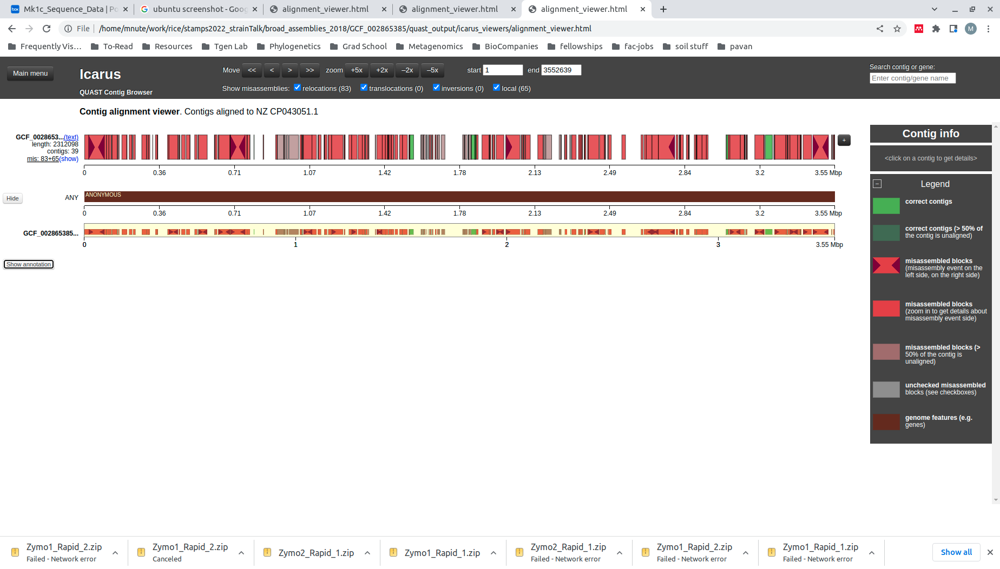

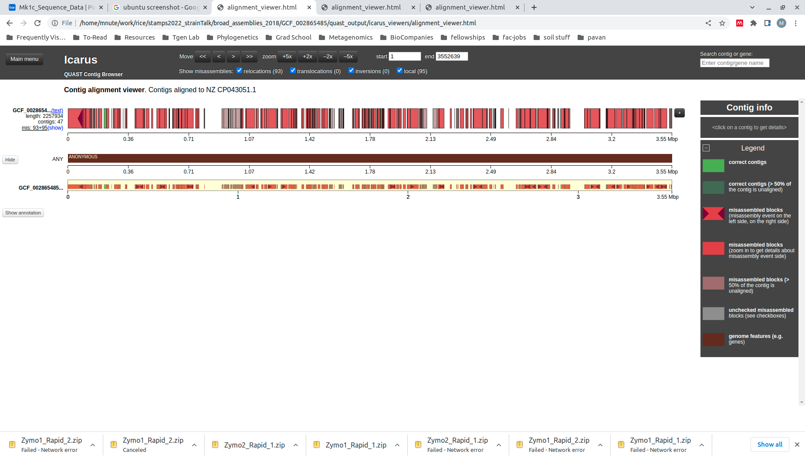

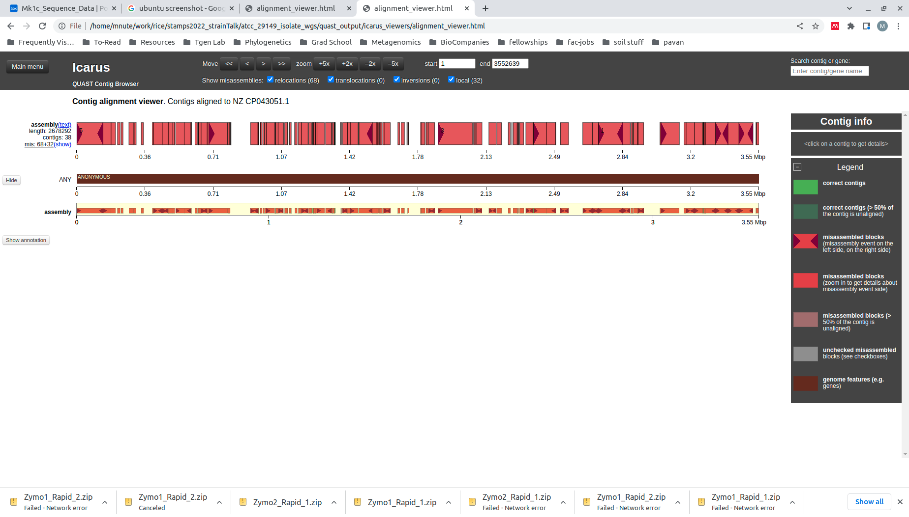

### Case-Study: C. difficile Genomes

Gingr Data Visualization:

Color = % mutation compared to reference

_RT078 – Originated in animal host\, crossed over_

_RT027 – Known hypervirulent strain\. More recurrent\, nastier patient outcomes\._

WGA of 720 assembled C\. difficile genomes

Spot the strains…

### Case-Study: C. difficile Genomes (excluding RT078 samples)

### Subset of Genomes w/ST annotation


__Q__ : What makes RT027 different?

__A__ : Pockets of heavy mutation

#### Digging Deeper…

_This particular region is precisely the coding locus for Toxin B\. _

_RT027 carries a variant _  _tcdB_  _ gene with altered function that contributes to its virulence\._

_Note_  _: not all of the _  _tcdB_  _ gene was aligned by Parsnp\, so this table represents the aligned length \(5\,103bp\) vs total \(7\,101bp\)\._

_Gene: _  _tcdB_  _ \(toxin B\)_

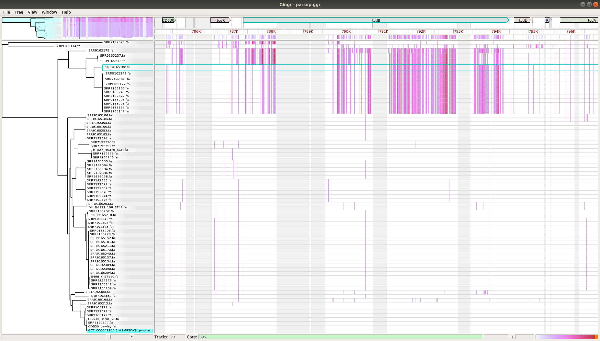

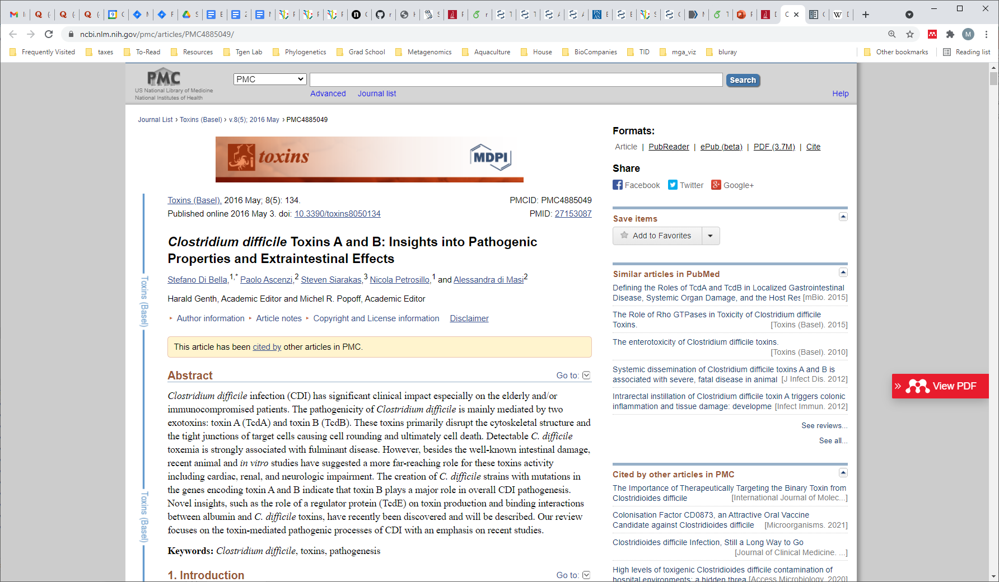

#### Comparing Reference Genomes for Some Strains

_Note_  _: RT027 is in the top row\. CD630 is a lab strain used as a common reference\._

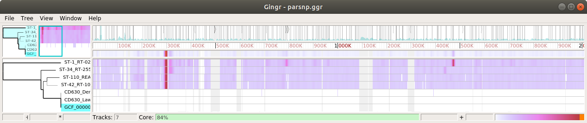

__Segment 1 __

\(positions 0\-2mbp\)

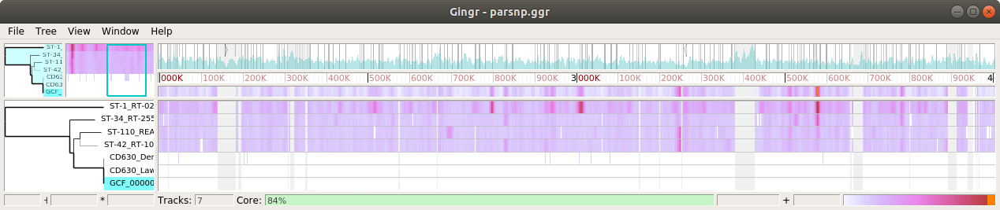

__Segment 2 __

\(positions 2\-4mbp\)

_Here the mutation pockets are much clearer\._

#### Digging Deeper Again…

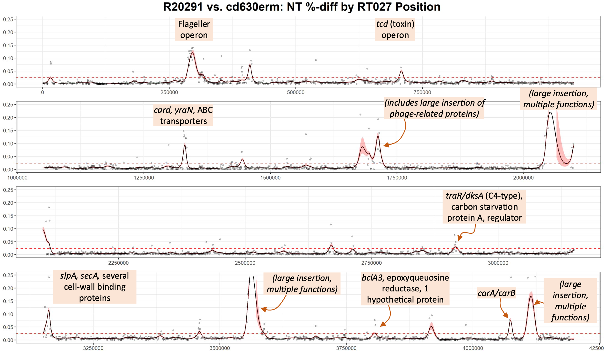

### Comparing Location of Homologous Genes

* Scatter Plot
  * Each point shows position in genome for CD630 & RT027\, for a single shared gene
  * Color indicates %\-AA\-similarity
* Despite differences\, genomes are highly colinear
  * Many short indels throughout
  * No major rearrangements except a few small segments\.
  * Small rearrangements coincide with locations of high\-mutation


_For C\. diff\, even across a huge number of isolates\, very little rearrangement shows up \(outliers here are reference genomes with single contig\, likely a different starting point _  _on the circular genome\._  _\)_

### Synteny Comparison: C. difficile Isolates

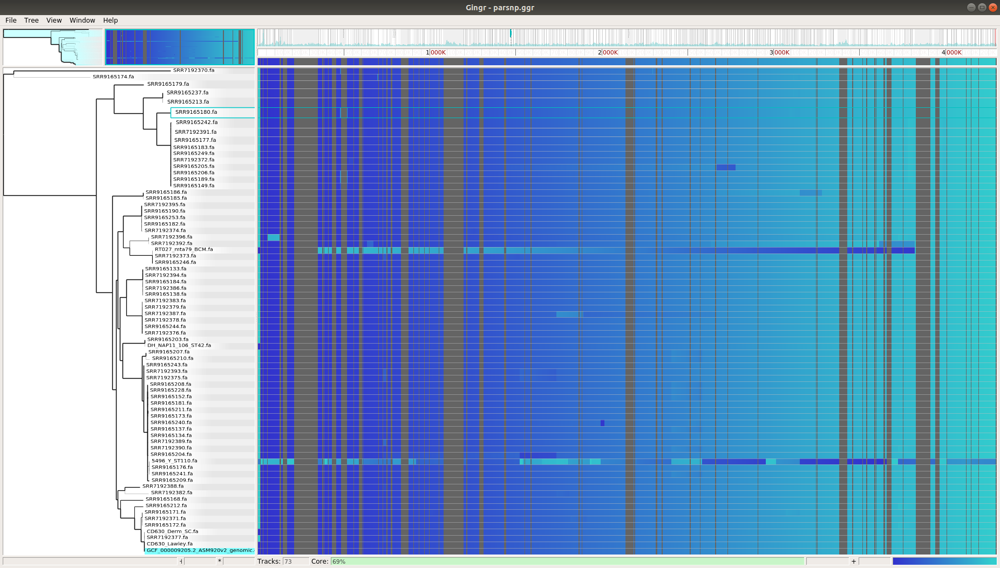

### Alignment of RT027 isolates (and near relatives) to RT027 ref.

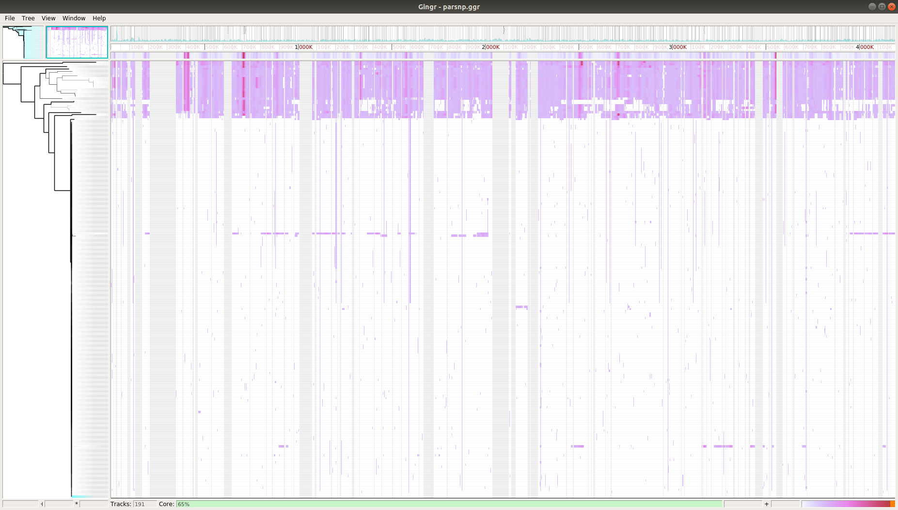

_Does the RT027 Reference match the genomes from the clinic?_

_…Yes_

_Very little to see\, very high match level with all RT027 isolates except 3\. _

### Another Case Study: R. gnavus Isolates from IBD Patients

__14 Genomes:__

Reference: ATCC 29149 \(RefSeq GCF\_008121495\)

ATCC 29149  _de novo _ assembly \(by me\)

ATCC 35913 \(GenBank GCA\_900036035\)

12 Genomes from Hall et al\. \(2017\) \(table at right\)


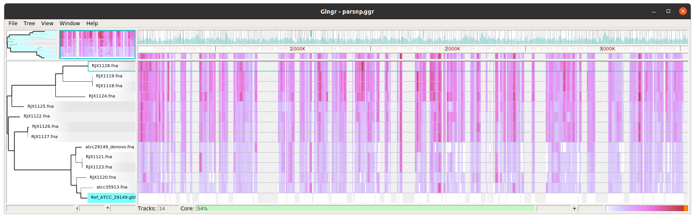

_Game 2 : Spot the 2_  _nd_  _ ATCC 29149 gnome \(supposedly the same as the reference\)_

_Game 1 : Spot the 2 Genomes from Infant Stool \(non\-IBD\)_

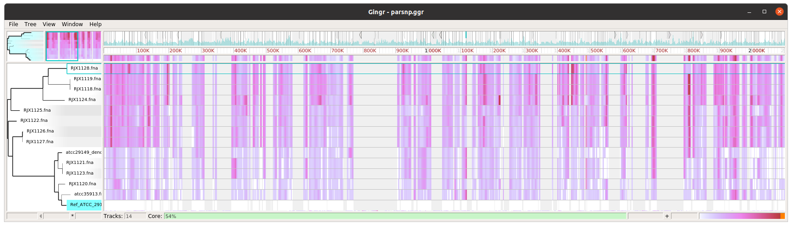

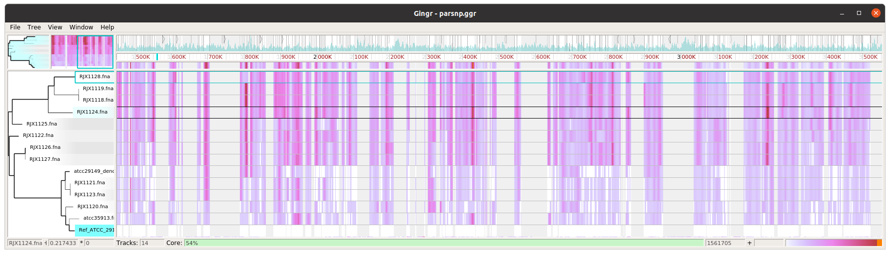

### R. gnavus strain-level phylogenetic signal is a mess

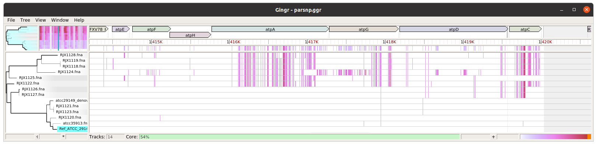

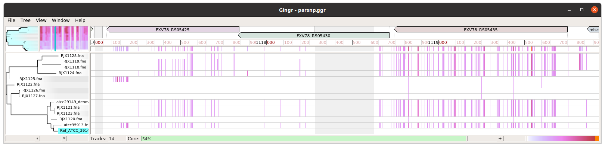

_These two organisms have very different types of genome plasticity\._

### Synteny Comparison: R. gnavus & C. difficile

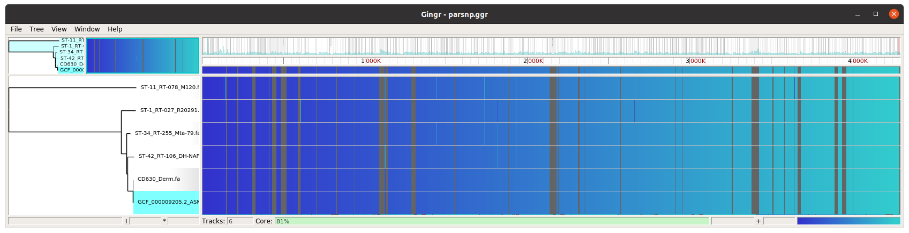

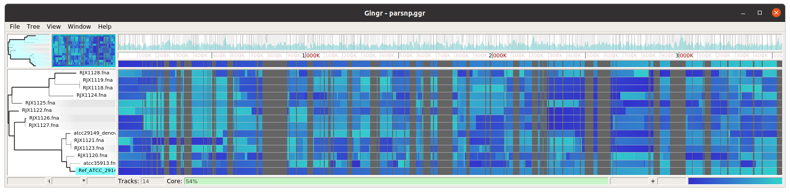

## Conclusions

* _Special Thanks To:_
  * Bryce Kille
  * Yunxi Liu

* The Savidge Lab \(Baylor College of Medicine\)
  * Qinglong Wu
  * Charlie Seto
* Taylor Reiter \(for the  _R\. _  _gnavus_  idea\)

* Whole\-genome alignment will give a detailed comparison specifically of the  _core_  genome
  * Maybe also auxiliary genes \( _pan_ \-genome\)
* Visualization can get you up close and personal with the data
  * \(This statement applies to almost everything\, not just genomes\)
* Strains can differ from one another in weird ways\.
  * Selective mutation at points of interest
  * Gene gain/loss depending on environment
  * Genome\-wide phylogenetic signal vs\. Locus\-specific signal
  * Etc…?

# Appendix: Quick How-to with Gingr (1 of 2)

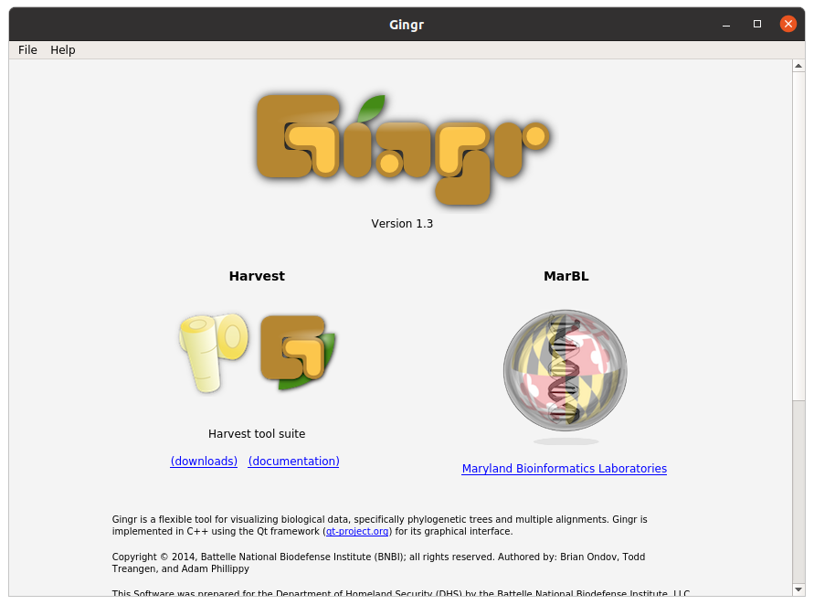

_1\.\) Open the \*\._  _ggr_  _ file created in the _  _parsnp_  _ output folder\._

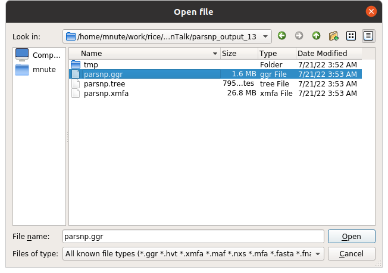

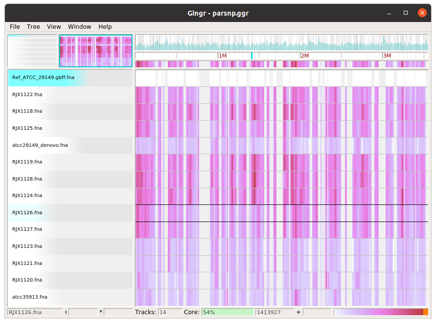

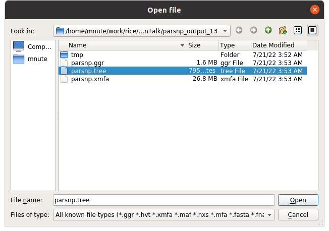

_2\.\) Once it is open\, go back to the “Open” dialogue and open the \*\.tree file in the same folder\._

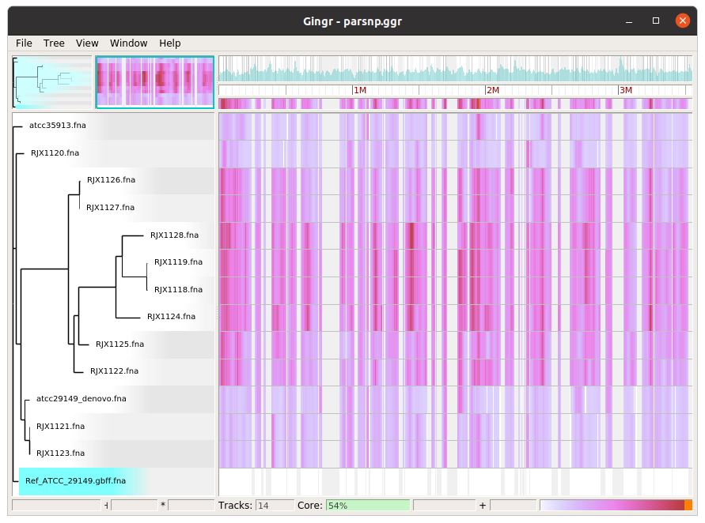

_3\.\) This will give you the standard _  _Gingr_  _ view\. Other options to re\-root the tree or to switch to Synteny view are available under the “Tree” and “View” menus\._

</details>

 <details>
 <summary> 
  

## Run this during lunch talks
 
</summary>
This parsnp quick start guide covers launching an interactive session on NOTS, installing and activating a Conda environment with Parsnp, and verifying the installation. Each step includes a brief description and links to further documentation (where appropriate).

---

### Step-by-Step Instructions

| Step | Command(s) | Description | Reference |
| ---- | ---------- | ----------- | --------- |
| 1 | ```srun --partition=commons --pty --export=ALL --ntasks=1 --reservation=workshop --cpus-per-task=8 --mem=15GB --time=04:00:00 /bin/bash``` | Launch an interactive SLURM job with 1 task, 8 CPUs, 15 GB RAM, 4 h walltime. | [srun docs](https://slurm.schedmd.com/srun.html) |
| 2 | `module load Mamba/23.11.0-0` | Load the Mamba/Conda module for environment management | — |
| 3 | `mamba create --name radsession2 bioconda::parsnp` | Create a Conda env named `radsession2` and install Parsnp from Bioconda. | [Bioconda](https://bioconda.github.io) |
| 4 | `mamba init` | Initialize Conda in your shell startup file (e.g. `.bashrc`). | — |
| 5 | `source /home/<userid>/.bashrc` | Reload your shell so `conda`/`mamba` commands become available. | — |
| 6 | `mamba activate radsession2` | Activate the `radsession2` environment (Parsnp on your PATH). | — |
| 7 | `parsnp -h` | Verify Parsnp is installed by printing its help message. | [Parsnp usage](https://github.com/marbl/parsnp#usage) |

---

### Example Session

```console
$ srun --partition=commons --pty --export=ALL --ntasks=1 --reservation=workshop --cpus-per-task=8 --mem=15GB --time=04:00:00 /bin/bash
# (on NOTS compute node)
$ module load Mamba/23.11.0-0
$ mamba create --name radsession2 bioconda::parsnp
$ mamba init
$ source /home/<userid>/.bashrc
$ mamba activate radsession2
(radsession2) $ parsnp -h
Parsnp v1.5.6
Usage: parsnp -c <config_file> -d <input_dir> -r <reference.fa> [options]
```

Place green sticky note on the back of your laptop once you see the below on your screen, else red stick note:

```console
22:55:13 - INFO - |--Parsnp 2.1.3--|

usage: parsnp [-h] [-r REFERENCE] -d SEQUENCES [SEQUENCES ...] [-g GENBANK [GENBANK ...]] [-o OUTPUT_DIR]
              [-q QUERY] [-c] [--skip-ani-filter] [-U MAX_MUMI_DISTR_DIST | -mmd MAX_MUMI_DISTANCE] [-F]
              [-M] [--use-ani] [--min-ani MIN_ANI] [--min-ref-cov MIN_REF_COV] [--use-mash]
              [--max-mash-dist MAX_MASH_DIST] [-a MIN_ANCHOR_LENGTH] [-m MUM_LENGTH] [-C MAX_CLUSTER_D]
              [-z MIN_CLUSTER_SIZE] [-D MAX_DIAG_DIFF] [-n {mafft,muscle,fsa,prank}] [-u] [--no-partition]
              [--min-partition-size MIN_PARTITION_SIZE] [--extend-lcbs]
              [--extend-ani-cutoff EXTEND_ANI_CUTOFF] [--extend-indel-cutoff EXTEND_INDEL_CUTOFF]
              [--match-score MATCH_SCORE] [--mismatch-penalty MISMATCH_PENALTY]
              [--gap-penalty GAP_PENALTY] [--skip-phylogeny] [--validate-input] [--use-fasttree] [--vcf]
              [--no-maf] [-p THREADS] [--force-overwrite] [-P MAX_PARTITION_SIZE] [-v] [-x] [-i INIFILE]
              [-e] [-V]

    Parsnp quick start for three example scenarios:
    1) With reference & genbank file:
    python Parsnp.py -g <reference_genbank_file1 reference_genbank_file2 ...> -d <seq_file1 seq_file2 ...>  -p <threads>

    2) With reference but without genbank file:
    python Parsnp.py -r <reference_genome> -d <seq_file1 seq_file2 ...> -p <threads>
    

options:
  -h, --help            show this help message and exit

Input/Output:
  -r REFERENCE, --reference REFERENCE
                        (r)eference genome (set to ! to pick random one from sequence dir)
  -d SEQUENCES [SEQUENCES ...], --sequences SEQUENCES [SEQUENCES ...]
                        A list of files containing genomes/contigs/scaffolds. If the file ends in .txt, each line in the file corresponds to the path to an input file.
  -g GENBANK [GENBANK ...], --genbank GENBANK [GENBANK ...]
                        A list of Genbank file(s) (gbk)
  -o OUTPUT_DIR, --output-dir OUTPUT_DIR
  -q QUERY, --query QUERY
                        Specify (assembled) query genome to use, in addition to genomes found in genome dir

Filtering:
  -c, --curated         (c)urated genome directory, use all genomes in dir and ignore MUMi.
  --skip-ani-filter     Skip the filtering step which discards inputs based on the ANI/MUMi distance to the reference.
                        Unlike --curated, this will still filter inputs based on their length compared to the reference
  -U MAX_MUMI_DISTR_DIST, --max-mumi-distr-dist MAX_MUMI_DISTR_DIST, --MUMi MAX_MUMI_DISTR_DIST
                        Max MUMi distance value for MUMi distribution
  -mmd MAX_MUMI_DISTANCE, --max-mumi-distance MAX_MUMI_DISTANCE
                        Max MUMi distance (default: autocutoff based on distribution of MUMi values)
  -F, --fastmum         Fast MUMi calculation
  -M, --mumi_only, --onlymumi
                        Calculate MUMi and exit? overrides all other choices!
  --use-ani             Use ANI for genome filtering
  --min-ani MIN_ANI     Min ANI value required to include genome
  --min-ref-cov MIN_REF_COV
                        Minimum percent of reference segments to be covered in FastANI
  --use-mash            Use mash for genome filtering
  --max-mash-dist MAX_MASH_DIST
                        Max mash distance.

MUM search:
  -a MIN_ANCHOR_LENGTH, --min-anchor-length MIN_ANCHOR_LENGTH, --anchorlength MIN_ANCHOR_LENGTH
                        Min (a)NCHOR length (default = 1.1*(Log(S)))
  -m MUM_LENGTH, --mum-length MUM_LENGTH, --mumlength MUM_LENGTH
                        Mum length
  -C MAX_CLUSTER_D, --max-cluster-d MAX_CLUSTER_D, --clusterD MAX_CLUSTER_D
                        Maximal cluster D value
  -z MIN_CLUSTER_SIZE, --min-cluster-size MIN_CLUSTER_SIZE, --minclustersize MIN_CLUSTER_SIZE
                        Minimum cluster size

LCB alignment:
  -D MAX_DIAG_DIFF, --max-diagonal-difference MAX_DIAG_DIFF, --DiagonalDiff MAX_DIAG_DIFF
                        Maximal diagonal difference. Either percentage (e.g. 0.2) or bp (e.g. 100bp)
  -n {mafft,muscle,fsa,prank}, --alignment-program {mafft,muscle,fsa,prank}, --alignmentprog {mafft,muscle,fsa,prank}
                        Alignment program to use
  -u, --unaligned       Output unaligned regions

Sequence Partitioning:
  --no-partition        Run all query genomes in single parsnp alignment, no partitioning.
  --min-partition-size MIN_PARTITION_SIZE
                        Minimum size of a partition. Input genomes will be split evenly across partitions at least this large.

LCB Extension:
  --extend-lcbs         Extend the boundaries of LCBs with an ungapped alignment
  --extend-ani-cutoff EXTEND_ANI_CUTOFF
                        Cutoff ANI for lcb extension
  --extend-indel-cutoff EXTEND_INDEL_CUTOFF
                        Cutoff for indels in LCB extension region. LCB extension will be at most min(seqs) + cutoff bases
  --match-score MATCH_SCORE
                        Value of match score for extension
  --mismatch-penalty MISMATCH_PENALTY
                        Value of mismatch score for extension (should be negative)
  --gap-penalty GAP_PENALTY
                        Value of gap penalty for extension (should be negative)

Misc:
  --skip-phylogeny      Do not generate phylogeny from core SNPs
  --validate-input      Use Biopython to validate input files
  --use-fasttree        Use fasttree instead of RaxML
  --vcf                 Generate VCF file.
  --no-maf              Do not generage MAF file (XMFA only)
  -p THREADS, --threads THREADS
                        Number of threads to use
  --force-overwrite, --fo
                        Overwrites any results in the output directory if it already exists
  -P MAX_PARTITION_SIZE, --max-partition-size MAX_PARTITION_SIZE
                        Max partition size (limits memory usage)
  -v, --verbose         Verbose output
  -x, --recomb-filter, --xtrafast
                        Run recombination filter (phipack)
  -i INIFILE, --inifile INIFILE, --ini-file INIFILE
  -e, --extend
  -V, --version         show program's version number and exit
```

</details>

<details>
 <summary>
  
 ## Multiple Genome Alignment (hands-on)

</summary>
 <p></p>
========

This tutorial is to go over how to use Parsnp for multiple genome alignment (core). The first dataset is a MERS coronavirus outbreak dataset involving 49 isolates. The second dataset is a selected set of 31 Streptococcus pneumoniae genomes. For reference, both of these datasets should run on modestly equipped laptops in a few minutes or less.

## <a name ="first">Installation</a> 

Have ParSNP installed. Parsnpcan be run on macOS / linux  

1)Download & install Parsnp on MacOS

   `wget https://github.com/marbl/parsnp/releases/download/v1.2/parsnp-OSX64-v1.2.tar.gz`  
   
   `tar -xvf parsnp-OSX64-v1.2.tar.gz`
  
2)Download & install Parsnp on Linux

   `wget https://github.com/marbl/parsnp/releases/download/v1.2/parsnp-Linux64-v1.2.tar.gz`   
   
   `tar -xvf parsnp-Linux64-v1.2.tar.gz`  


**From CONDA**  

ParSNP is available on the bioconda channel.   
To install: 
`conda install parsnp
`

****


**To install Gingr**,   
(Interactive visualization of alignments, trees and variants)  
*For MacOS:   

[gingr-OSX64-v1.3.zip](https://github.com/marbl/gingr/releases/download/v1.3/gingr-OSX64-v1.3.app.zip)  

*For Linux:    

[gingr-Linux64-v1.3.tar.gz](https://github.com/marbl/gingr/releases/download/v1.3/gingr-Linux64-v1.3.tar.gz/)  
   

   1) <a name="part3e1">Example 1: 49 MERS Coronavirus genomes </a>
   
      * Download genomes: 
         * `mkdir parsnp_demo1`
         * `cd parsnp_demo1`
         * `wget https://github.com/marbl/harvest/raw/master/docs/content/parsnp/mers49.tar.gz` [download](https://github.com/marbl/harvest/raw/master/docs/content/parsnp/mers49.tar.gz)
         * `tar -xvf mers49.tar.gz`
    
      * Run parsnp with default parameters 
      
         `parsnp -r ./mers49/England1.fna -d ./mers49 -c`
         
      * Command-line output 

        

      * Visualize with Gingr [download](https://github.com/marbl/harvest/raw/master/docs/content/parsnp/run_mers.gingr1.ggr)
      
        

      * Configure parameters
      
         - 95% of the reference is covered by the alignment. This is <100% mainly due to a 1kbp unaligned region from 26kbp to 27kbp.
         - To force alignment across large collinear regions, use the `-C` maximum distance between two collinear MUMs::
         
            `parsnp -r ./mers49/England1.fna -d ./mers49 -C 2000 -c`
            
      * Visualize again with Gingr :download:`GGR <run_mers.gingr2.ggr>`
      
         - By adjusting the `-C` parameter, this region is no longer unaligned, boosting the reference coverage to 97%.

        
        
      * Zoom in with Gingr for nucleotide view of region
      
         - On closer inspection, a large stretch of N's in Jeddah isolate C7569 was the culprit
         
        
         
      * Inspect Output:
      
         * Multiple alignment: :download:`XMFA <runm1.xmfa>` 
         * SNPs: :download:`VCF <runm1.vcf>`
         * Phylogeny: :download:`Newick <runm1.tree>`
 
   2) <a name="part3e2">Example 2: 31 Streptococcus pneumoniae genomes </a>
   
     --Download genomes:
   * `cd $HOME`
   * `mkdir parsnp_demo2`
   * `cd parsnp_demo2`
   *  `wget https://github.com/marbl/harvest/raw/master/docs/content/parsnp/strep31.tar.gz`
   *  `tar -xvf strep31.tar.gz`
    
     --Run parsnp:
      
    parsnp -r ./strep31/NC_011900.fna -d ./strep31 -p 8

     --Force inclusion of all genomes (-c):
      
    parsnp -r ./strep31/NC_011900.fna -d ./strep31 -p 8 -c

     --Enable recombination detection/filter (-x):
      
    parsnp -r ./strep31/NC_011900.fna -d ./strep31 -p 8 -c -x

     --Inspect Output:
      
         * Multiple alignment: parsnp.xmfa
         * Phylogeny: parsnp.tree


This last step requires you to download software and is to highlight the ability to inspect strain-level differences within genomes assembled from metagenomic samples.

1) Use AliView 

    * Download AliView:

    [https://ormbunkar.se/aliview/downloads/)

    * Download MFA file:

    wget https://obj.umiacs.umd.edu/stamps2019/aliview.input.mfa

    * Open AliView
      
    * Load MFA file:

    File->Open File

</details>
 <details>
 <summary> 
  
## Bonus: Fantastic reference genomes and where to find them (lecture + hands-on) 
</summary>

* NCBI
  * SRA 		 _[https://www\.ncbi\.nlm\.nih\.gov/sra](https://www.ncbi.nlm.nih.gov/sra)_
  * Taxonomy		 _[https://www\.ncbi\.nlm\.nih\.gov/taxonomy](https://www.ncbi.nlm.nih.gov/taxonomy)_
  * RefSeq		 _[https://www\.ncbi\.nlm\.nih\.gov/refseq/](https://www.ncbi.nlm.nih.gov/refseq/)_
* GISAID
  * EpiCoV		 _[https://www\.gisaid\.org/](https://www.gisaid.org/)_
* Internal Sources
* Other Sources

### National Center for Biotechnology Information (NCBI)

_[https://www\.ncbi\.nlm\.nih\.gov/](https://www.ncbi.nlm.nih.gov/)_


__Sequence of the reference genome in fasta format__

__Gene annotation file in GFF3 format__

__Comprehensive record of the sequence including annotations in genbank format__


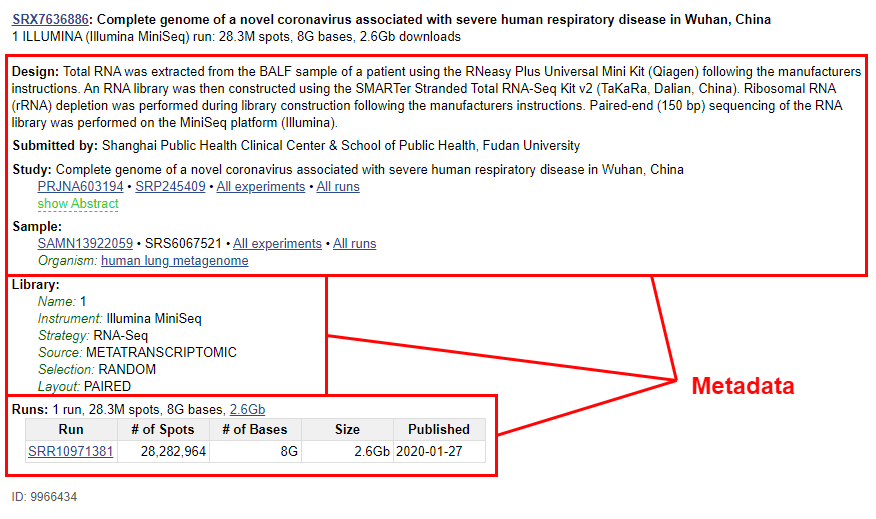

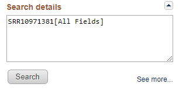

<span style="color:#FF0000"> __Formatted search string__ </span>

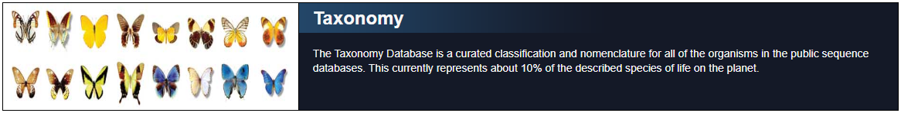

### SARS-CoV-2 sequences currently available in GenBank and the Sequence Read Archive (SRA)

Until Wed May 27 14:55:29 EDT 2020

4\,735 GenBank sequences

1 RefSeq sequence

6\,486 SRA Sequences

_[https://www\.ncbi\.nlm\.nih\.gov/genbank/sars\-cov\-2\-seqs/](https://www.ncbi.nlm.nih.gov/genbank/sars-cov-2-seqs/)_


### NCBI Advanced Search Builder


Refine your search by using Boolean operations

Useful search terms including accession id\, bio project\, organism\, layout \(single vs paired\)\, publication date\, source \(WGS\, Amplicon\, metatranscriptomic\, etc\.\)\, platform \(Illumina vs Nanopore\)\, etc\.

Generating search string that can be used in Entrez API

### Entrez Databases and Retrieval System

Available via  _[http://www\.ncbi\.nlm\.nih\.gov/Entrez/](http://www.ncbi.nlm.nih.gov/Entrez/)_

A part of Biopython package  _[http://biopython\.org/DIST/docs/tutorial/Tutorial\.html](http://biopython.org/DIST/docs/tutorial/Tutorial.html)_

Entrez Programming Utilities Help  _[https://www\.ncbi\.nlm\.nih\.gov/books/NBK25501/](https://www.ncbi.nlm.nih.gov/books/NBK25501/)_

Always tell NCBI who you are by setting  _Entrez\.email _ parameter

NCBI Entrez API allows advanced searches of records in multiple NCBI database as well as retrieving metadata for the records

3 requests per second without an API key\, or 10 requests per second with an API key \(registered account strongly recommended\)

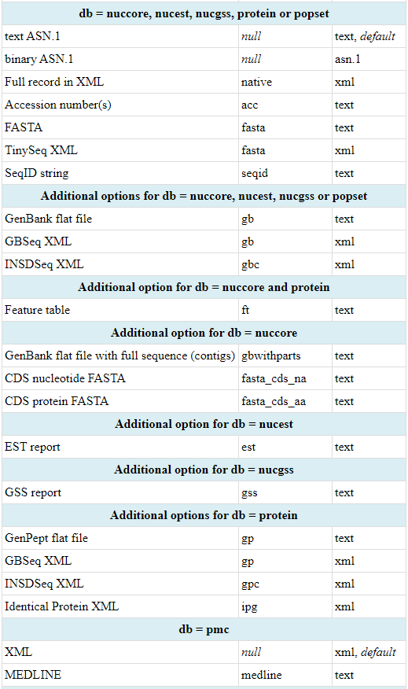

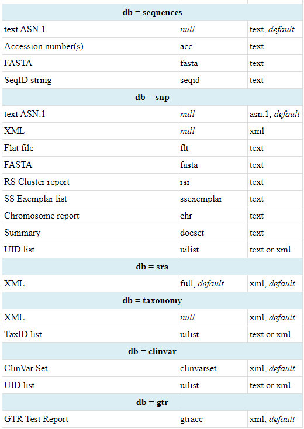

### SRA Toolkit

* Entrez package can be used to retrieve small files
* SRA Toolkit is required to download large read datasets  _[https://trace\.ncbi\.nlm\.nih\.gov/Traces/sra/sra\.cgi?view=software](https://trace.ncbi.nlm.nih.gov/Traces/sra/sra.cgi?view=software)_
  * prefetch
    * prefetch \[options\] \<SRA accession>
  * fastq\-dump
    * fastq\-dump \[options\] \< accession >
  * \-\-split\-3 flag or \-\-split\-files must be set\, split spots into individual reads\. With \-\-split\-3 flag\, output would be 1\,2\, or 3 files\.
    * 1 file means the data is not paired\.
    * 2 file means the reads are paired\-end reads\.
    * 3rd file\, often small\, contains unpaired orphaned reads\, typically ignored\.

</details>

